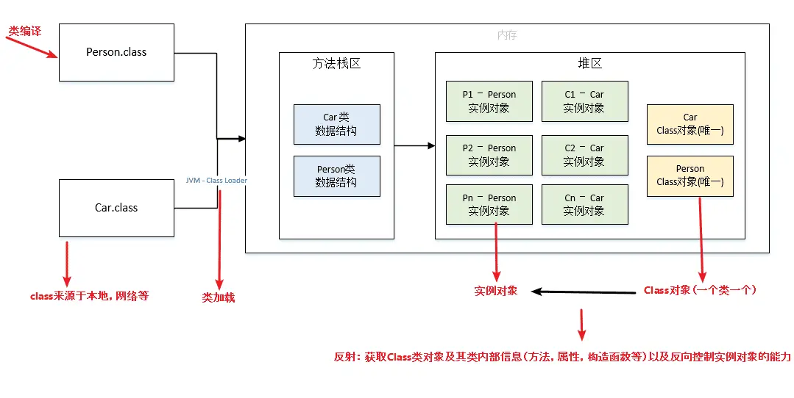
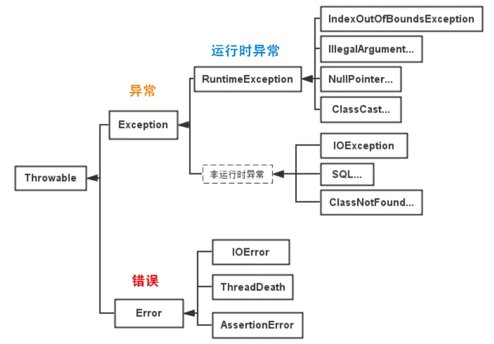

## 1. 基础部分

### 八种基本数据类型

- 数值型：整数类型（byte、short、int、long）和 浮点类型（float、double）
- 字符型：char
- 布尔型：boolean

int 和 float 是32位，long 和 double 都是64位。

### 自动装箱（Boxing）和拆箱（Unboxing）

装箱（Boxing）和拆箱（Unboxing）是将基本数据类型和对应的包装类之间进行转换的过程。

**自动装箱**主要发生在两种情况，一种是赋值时，另一种是在方法调用传入参数的时候。

对象封装有很多好处，可以把属性也就是数据跟处理这些数据的方法结合在一起，Java中绝大部分方法或类都是用来处理类类型对象的，如ArrayList集合类就只能以类作为他的存储对象，泛型只能使用引用类型，而不能使用基本类型。

> **自动装箱的弊端：**
> 
> 在一个循环中进行自动装箱操作的情况，可能会创建多余的对象，影响程序的性能。
>
>```java
>Integer sum = 0; for(int i=1000; i<5000; i++){ sum+=i; }
>
>// 上面的代码sum+=i可以看成sum = sum + i，但是 + 操作符不适用于Integer对象，首先sum进行自动拆箱操作，进行数值相加操作，最后发生自动装箱操作转换成Integer对象。其内部变化如下：
>
>int result = sum.intValue() + i; Integer sum = Integer.valueOf(result);
>```
>
>由于这里声明的 sum 为 Integer 类型，自动装箱实际上由编译器替换为 Integer.valueOf(...) 调用，命中 IntegerCache（默认 -128~127）时会复用缓存对象，但本例中循环值都已超出缓存范围，因此会创建将近 4000 个 Integer 对象，降低程序性能并加重 GC 负担。

**拆箱** 就是把引用类型的值赋值给基本类型。

### 值传递和引用传递的区别

**值传递**传递的是**值的副本**，主要用于基础数据类型，修改参数副本不会影响原变量的值。

**引用传递**传递的是对象引用的副本，两个引用（原引用和副本）指向同一个对象，因此通过副本修改对象内部数据，会影响原对象。但如果修改副本的指向（如重新赋值），不会影响原引用的指向。

### 重载和重写的区别

重载（Overload）是“同类不同参”，重写（Override）是“子类改父类”

### 向上转型和向下转型

- **向上转型**是使用父类类型的引用指向子类对象，通过这种方式，可以在运行时期采用不同的子类实现。
- **向下转型**是将父类引用转回其子类类型，但在执行前需要确认引用实际指向的对象类型以避免 `ClassCastException`。

### 抽象类和普通类的区别

- 实例化：普通类可以直接实例化对象，而抽象类不能被实例化，只能被继承。
- 方法实现：普通类中的方法可以有具体的实现，而抽象类中的方法可以有实现也可以没有实现。
- 非抽象子类继承抽象类，抽象方法必须重写。
- 抽象类不能被实例化。

### 抽象类和接口的区别

- 继承：接口可以多个实现，抽象类只能多继承。
- 接口只有定义，不能有方法的实现。

接口用于定义类的规范，抽象类用来定义和描述类的共同特性和行为。

**设计原则**：

- 优先使用接口：它是对行为的抽象，可以多实现，解耦更彻底。
- 抽象类适合"模板复用"：多个子类有公共代码（字段、方法实现），用抽象类抽取公共部分。
- 经典组合：**抽象类实现接口**（如 AbstractList 实现 List），把公共实现下沉到抽象类，子类只需实现少量方法。

### 非静态内部类和静态内部类的区别

静态内部类可以看作一个外部的普通类。

- 非静态内部类依赖于外部类的实例，而静态内部类不依赖于外部类的实例。
- 非静态内部类可以直接访问外部类的所有成员（包括实例变量和方法）；静态内部类可以直接访问外部类的静态成员，访问外部类的实例成员则必须通过外部类的实例引用。
- 非静态内部类不能定义静态成员（Java 16 之前），而静态内部类可以定义静态成员。
- 非静态内部类在外部类实例化后才能实例化，而静态内部类可以独立实例化。
- 静态内部类和非静态内部类都可以访问外部类的私有成员（因为编译器会为嵌套类提供访问权限）——两者的区别在于静态内部类访问外部类的私有实例成员时必须先拿到外部类实例，而不是像非静态内部类那样能直接访问。

### 非静态内部类如何做到可以直接访问外部方法

**非静态内部类**可以直接访问**外部方法**是因为编译器在生成字节码时会为非静态内部类维护一个**指向外部类实例的引用**。这个引用使得非静态内部类能够访问外部类的实例变量和方法。编译器会在生成非静态内部类的构造方法时，将外部类实例作为参数传入，并在内部类的实例化过程中建立外部类实例与内部类实例之间的联系，从而实现直接访问外部方法的功能。

### final关键字的作用

final关键字主要有以下三个方面的作用：用于修饰类、方法和变量。

- 修饰类：表示这个类不能被继承，是类继承体系中的最终形态。例如：String类就是用final修饰的，保证了String类的不可变性和安全性，防止其他类通过继承来改变String类的行为和特性。
- 修饰方法：用final修饰的方法不能在子类中被重写。比如，java.lang.Object类中的getClass方法就是final的，因为这个方法的行为是由 Java 虚拟机底层实现来保证的，不应该被子类修改。
- 修饰变量：当final修饰基本数据类型的变量时，该变量一旦被赋值就不能再改变。对于引用数据类型，final修饰意味着这个引用变量不能再指向其他对象，但对象本身的内容是可以改变的。

final 的含义就是终极不变，如果用final修饰抽象类，会报编译错误。

### static关键字的作用

static 关键字主要用于修饰类的成员（变量、方法、代码块）和内部类，其核心作用是将成员与类本身关联，而非与类的实例（对象）关联。

### 深拷贝与浅拷贝

- **浅拷贝**是指只复制对象本身和其内部的值类型字段，但不会复制对象内部的引用类型字段，换句话说，浅拷贝只是创建一个新的对象，然后将原对象的字段值复制到新对象中，但如果原对象内部有引用类型的字段，只是将引用复制到新对象中，两个对象指向的是同一个引用对象。
- **深拷贝**是指在复制对象的同时，将对象内部的所有引用类型字段的内容也复制一份，而不是共享引用。换句话说，深拷贝会递归复制对象内部所有引用类型的字段，生成一个全新的对象以及其内部的所有对象。

实现对象深拷贝的方法有以下几种主要方式：

- **实现 Cloneable 接口**，要求对象及其所有引用类型字段都实现 Cloneable 接口，并且重写 clone() 方法。在 clone() 方法中，通过递归克隆引用类型字段来实现深拷贝。
- **使用序列化和反序列化**，通过将对象序列化为字节流，再从字节流反序列化为对象来实现深拷贝。要求对象及其所有引用类型字段都实现 Serializable 接口。
- 手动递归复制

### 泛型

泛型允许类、接口和方法在定义时使用一个或多个**类型参数**，这些类型参数**在使用时可以被指定为具体的类型**，适用于多种不同的数据类型执行相同的代码。

泛型中的类型在使用时指定，不需要强制类型转换（类型安全，编译器会检查类型）。

```java
// list中的元素都是Object类型，所以在取出集合元素时需要进行强制类型转化，很容易出现java.lang.ClassCastException异常。
List list = new ArrayList();
list.add("xxString");
list.add(100d);
list.add(new Person());

// 引入泛型，它将提供类型的约束，提供编译前的检查
List<String> list = new ArrayList<String>();
```

### 对象的创建方式有哪些

- 使用new关键字
- 使用Class类的newInstance()方法：通过 Java 的反射 API，在运行时动态地创建对象。这种方式不需要在编译时知道具体的类。应用场景：框架设计（如 Spring 的 IOC 容器）、动态代理等。
- 使用Constructor类的newInstance()方法：同样是通过反射机制，可以使用Constructor类的newInstance()方法创建对象。
- 使用clone()方法：通过实现 Cloneable 接口并重写 Object 类的 clone() 方法，可以基于一个现有对象（原型）创建一个新的副本对象。
- 使用反序列化：通过 ObjectInputStream 从一个字节流（通常是文件或网络）中重建一个对象。

### new出的对象什么时候回收

通过过关键字new创建的对象，强引用对象，由Java的垃圾回收器（Garbage Collector）负责回收。垃圾回收器的工作是在程序运行过程中自动进行的，它会周期性地检测不再被引用的对象，并将其回收释放内存。

具体来说，Java对象的回收时机是由垃圾回收器根据以下机制来决定的：  

**可达性分析算法**：HotSpot JVM 使用的核心判活算法。从一组 GC Roots（如虚拟机栈中引用的对象、方法区中类静态属性引用的对象、方法区中常量引用的对象、本地方法栈中 JNI 引用的对象等）出发，通过对象之间的引用链进行遍历，如果存在一条引用链到达某个对象，则说明该对象是可达的，反之不可达，不可达的对象将被回收。注意：Java 并不使用引用计数法，因为引用计数无法解决循环引用问题。  
**终结器（Finalizer）**：如果对象重写了finalize()方法，垃圾回收器会在回收该对象之前调用finalize()方法，对象可以在finalize()方法中进行一些清理操作。然而，终结器机制的使用不被推荐，因为它的执行时间是不确定的，可能会导致不可预测的性能问题，finalize() 方法自 Java 9 起已被标记为 @Deprecated。  

### 如何获取私有对象

在 Java 中，私有对象通常指的是类中被声明为 private 的成员变量或方法。由于 private 访问修饰符的限制，这些成员只能在其所在的类内部被访问。

不过，可以通过下面两种方式来间接获取私有对象。

- 使用公共访问器方法（getter 方法）：如果类的设计者遵循良好的编程规范，通常会为私有成员变量提供公共的访问器方法（即 getter 方法），通过调用这些方法可以安全地获取私有对象。
- 反射机制。反射机制允许在运行时检查和修改类、方法、字段等信息，通过反射可以绕过 private 访问修饰符的限制来获取私有对象。


### 反射机制

反射是指在**运行时**获取类的元数据信息（Class 对象，JVM 加载类后存放在方法区/元空间中），从而动态地进行对象的创建、方法调用、字段访问等操作。



>注意：运行时不读 class 文件，class 文件在**类加载阶段**已被解析为方法区的运行时数据结构，反射读的是这份元数据。

反射具有以下特性：

- **运行时类信息访问：** 反射机制允许程序在运行时获取类的完整结构信息，包括类名、包名、父类、实现的接口、构造函数、方法和字段等。
- **动态对象创建：** 可以使用反射API动态地创建对象实例，即使在编译时不知道具体的类名。通常通过 Constructor.newInstance() 方法实现（Class.newInstance() 自 Java 9 起已被标记为 @Deprecated，推荐使用 clazz.getDeclaredConstructor().newInstance()）。
- **动态方法调用：** 可以在运行时动态地调用对象的方法，包括私有方法。这通过Method类的invoke()方法实现，允许你传入对象实例和参数值来执行方法。
- **访问和修改字段值：** 反射还允许程序在运行时访问和修改对象的字段值，即使是私有的。这是通过Field类的get()和set()方法完成的。

反射的应用场景：

- **动态代理**
- **注解**
- **数据库驱动加载：** 在使用 JDBC 连接数据库时使用 Class.forName()通过反射加载数据库的驱动程序。
- **配置文件加载：** Spring 框架的 IOC（动态加载管理 Bean），Spring通过配置文件配置各种各样的bean。

    Spring通过XML配置模式装载Bean的过程：
    - 将程序中所有XML或properties配置文件加载入内存
    - Java类里面解析xml或者properties里面的内容，得到对应实体类的字节码字符串以及相关的属性信息
    - 使用反射机制，根据这个字符串获得某个类的Class实例
    - 动态配置实例的属性

**性能与安全**：反射有方法调用开销（比直接调用慢），且可以绕过访问控制（setAccessible(true) 可访问 private 成员，因此框架才可能注入 private 字段）。JDK 17+ 对 setAccessible 有模块化限制（需 --add-opens）。

### 注解

注解本质上是一种特殊的接口，它继承自 java.lang.annotation.Annotation 接口，所以注解也叫声明式接口，例如，定义一个简单的注解：

```java
public @interface MyAnnotation {
    String value();
}
```

编译后，Java 编译器会将其转换为一个继承自 Annotation 的接口，并生成相应的字节码文件。

根据注解的作用范围，Java 注解可以分为以下几种类型：

- 源码级别注解 ：仅存在于源码中，编译后不会保留 `@Retention(RetentionPolicy.SOURCE)`。
- 类文件级别注解 ：保留在 .class 文件中，但运行时不可见 `@Retention(RetentionPolicy.CLASS)`。
- 运行时注解 ：保留在 .class 文件中，并且可以通过反射在运行时访问 `@Retention(RetentionPolicy.RUNTIME)`。

只有运行时注解可以通过反射机制进行解析。

当注解被标记为 RUNTIME 时，Java 编译器会在生成的 .class 文件中保存注解信息。这些信息存储在字节码的属性表（Attribute Table）中，具体包括以下内容：

- RuntimeVisibleAnnotations ：存储运行时可见的注解信息。
- RuntimeInvisibleAnnotations ：存储运行时不可见的注解信息。
- RuntimeVisibleParameterAnnotations 和 RuntimeInvisibleParameterAnnotations ：存储方法参数上的注解信息。

通过工具（如 javap -v）可以查看 .class 文件中的注解信息。

### 异常体系



Java 的异常体系主要基于 Throwable 及其子类。Throwable 有两个重要的子类：Error 和 Exception，它们分别代表了不同类型的异常情况。

- Error (错误)： 表示运行环境的错误，错误是程序无法处理的严重问题，如虚拟机错误、动态链接库失效等。程序不应该尝试捕获这类错误。例如，OutOfMemoryError、StackOverflowError 等。
- Exception (异常)： 表示程序本身可以处理的异常情况。异常分为两大类：
    - 非运行时异常（受检异常，Checked Exception）： 这类异常在编译时就必须被捕获或者声明抛出。它们通常是外部错误，如文件不存在 (FileNotFoundException)、类未找到 (ClassNotFoundException) 等。非运行时异常强制程序员处理这些可能出现的问题，增强了程序的健壮性。
    - 运行时异常（非受检异常，Unchecked Exception 或 RuntimeException）： 这类异常特指 RuntimeException 及其子类。它与 Error 一起构成了 Java 中的非受检异常家族。运行时异常由程序逻辑错误导致，如空指针访问 (NullPointerException)、数组越界 (ArrayIndexOutOfBoundsException) 等。运行时异常是不需要在编译时强制捕获或声明的。

### Object类有哪些方法

Object 类是 Java 中所有类的根类，除 `Object` 本身外，所有类都直接或间接继承自它。它主要提供对象的**基本操作、类型判断、对象复制以及线程同步**等能力。

Object 类常用的方法包括：

- `getClass()`： 获取对象在运行时对应的 `Class` 对象，可以进一步通 **对象身份（引用）** 进行比较，即只有两个引用指向同一个对象时才返回 `true`。子类可以根据实际业务需求重写该方法，例如 `String` 就是根据字符串内容判断是否相等。

- `toString()`： 返回对象的字符串表示形式。`Object` 默认返回类似 `类名@哈希值` 的字符串，实际开发中通常会重写该方法，用于输出对象的属性信息，方便调试和日志记录。

- `clone()`： 创建当前对象的一个副本。`Object` 提供的是浅拷贝机制，使用时通常需要实现 `Cloneable` 接口，否则调用时可能抛出 `CloneNotSupportedException`。实际开发中通常更推荐使用拷贝构造、工厂方法等更加明确的对象复制方式。

- `wait()`： 使当前线程进入等待状态，同时释放当前对象的监视器锁，直到其他线程调用该对象的 `notify()` 或 `notifyAll()`，或者等待被中断。调用该方法时，当前线程必须持有对象的监视器锁。

- `wait(long timeout)`： 让当前线程最多等待指定的毫秒数。如果在等待期间收到 `notify()`、`notifyAll()` 或被中断，也可能提前结束等待。

- `wait(long timeout, int nanos)`： `wait()` 的更精确版本，在指定毫秒数的基础上增加纳秒级的等待时间。

- `notify()`： 唤醒一个正在该对象监视器上等待的线程。具体唤醒哪一个线程由 JVM 决定。调用该方法时，当前线程必须持有对象的监视器锁。

- `notifyAll()`： 唤醒所有正在该对象监视器上等待的线程。调用该方法时，当前线程同样必须持有对象的监视器锁。

- `finalize()`： 在对象被垃圾回收前尝试执行的清理方法。但该方法已经在 **Java 9 中被标记为 `@Deprecated`，并且不推荐使用**。现代 Java 应使用 `try-with-resources`、`AutoCloseable` 等机制显式释放资源。

可以将 `Object` 的方法按照功能分为以下几类：

```text
Object
│
├── 类型信息
│   └── getClass()
│
├── 对象比较
│   ├── equals()
│   └── hashCode()
│
├── 对象表示
│   └── toString()
│
├── 对象复制
│   └── clone()
│
├── 线程同步
│   ├── wait()
│   ├── wait(long)
│   ├── wait(long, int)
│   ├── notify()
│   └── notifyAll()
│
└── 对象生命周期
    └── finalize()  // 已废弃，不推荐使用
```

### == 和 equals 的区别

- `==`：比较的是"值"。对于基本类型比较数值是否相等；对于引用类型比较的是**内存地址**（是否指向同一个对象）。
- `equals()`：Object 中的默认实现等价于 `==`（比较地址），但大多数类（String、Integer、包装类、集合）都重写了它，改为**比较内容**。

```java
String a = new String("abc");
String b = new String("abc");
a == b;            // false，两个不同的堆对象
a.equals(b);       // true，内容相同
```

**重写 equals 必须重写 hashCode**：HashMap/HashSet 依赖 hashCode 定位桶，如果两个对象 equals 相等但 hashCode 不同，会导致同一个 key 存进不同桶，出现重复数据。

### hashCode与 equals 约定

1. 两个对象 equals 相等 → hashCode **必须相等**（否则集合中出现重复元素）。
2. 两个对象 hashCode 相等 → equals **不一定**相等（哈希冲突，靠 equals 进一步判断）。
3. equals 相等的对象，其 hashCode 不能变（所以 hashCode 不能依赖可变字段）。

一个常见的错误：只重写 equals 不重写 hashCode，HashSet<User> 中两个内容相同的 User 会被当成两个元素


**hashCode 设计**：`Objects.hash(字段1, 字段2)` 或 `31 * 结果 + 字段.hashCode()`

**为什么使用31：** 奇素数，分布均匀；`31 * i` 可被 JVM 优化为 `(i << 5) - i`，移位 + 减法性能高。

### String、StringBuilder、StringBuffer 的区别

- **String**：不可变（final 修饰类）。**JDK 8 及以前底层是 char[]，JDK 9 起（JEP 254）改为 byte[] + coder**（紧凑字符串：Latin-1 编码的字符串每个字符只占 1 字节，节省约一半内存）。任何"修改"都会生成新对象。好处：可缓存 hashCode、可安全共享（线程安全）、适合做常量池/类加载参数。
- **StringBuilder**：可变，非线程安全，单线程下拼接性能最高。
- **StringBuffer**：可变，线程安全（方法加了 synchronized），多线程下用，性能略低。

### Integer 缓存与自动装箱

- `Integer.valueOf()` 会使用 **IntegerCache 缓存 -128~127** 的对象，超出范围才 new 新对象。
- 自动装箱调用 `valueOf()`，自动拆箱调用 `intValue()`。

```java
Integer a = 100, b = 100;
a == b;              // true，都在缓存范围内
Integer c = 200, d = 200;
c == d;              // false，超出缓存范围，是两个对象
```

> 面试延伸：Long、Short、Byte、Character 也有类似缓存（Long 也是 -128~127，Character 是 0~127），只有 Float/Double 没有。

**通配符（PECS 原则）**：

- `? extends T`：上界通配符，只能"读"（拿出来的元素一定是 T），不能"写"。适用：生产者 Producer。
- `? super T`：下界通配符，只能"写"（可以放 T 及其子类），读出来是 Object。适用：消费者 Consumer。

```java
List<? extends Number> producers = new ArrayList<Integer>(); // 可读不可写
Number n = producers.get(0);
// producers.add(1); // 编译报错

List<? super Integer> consumers = new ArrayList<Number>(); // 可写不可读
consumers.add(1);
// Integer i = consumers.get(0); // 编译报错，读出来是 Object
```


### final、finally、finalize 的区别

- **final**：修饰符。修饰类（不可继承）、修饰方法（不可重写）、修饰变量（不可变——引用不能变，但引用指向的对象内部可变）。
- **finally**：异常处理的一部分，try/catch 后的**必定执行**块，通常用于释放资源（关闭流、连接）。
- **finalize**：Object 的方法，垃圾回收器回收对象前调用，JDK 9 起已弃用（执行时机不确定、可能影响 GC 性能，资源清理应使用 try-with-resources 或显式 close）。

**finally 与 return 的执行顺序（面试陷阱）**：

```java
// 结论1：finally 在 return 之前执行，但 finally 中修改返回值不生效（返回值已暂存）
public static int test() {
    int a = 1;
    try {
        return a;   // 先把 a=1 暂存到返回值槽
    } finally {
        a = 2;      // 修改的是局部变量，返回值仍是 1
    }
}
// 结果：1

// 结论2：finally 中如果也有 return，会覆盖 try 中的 return（不推荐这样写）
// 结论3：try 中有 System.exit(0) 时 finally 不执行
```

### try-with-resources（Java 7+）

自动关闭实现了 AutoCloseable 的资源，比传统 finally 手动关闭更简洁、更安全（不用处理"关闭本身抛异常"的嵌套问题）。

```java
// 传统写法（易漏、嵌套 try 繁琐）
FileInputStream in = null;
try {
    in = new FileInputStream("a.txt");
    // ...
} finally {
    if (in != null) in.close();  // 如果上面抛异常，这里可能 NPE；close 异常还会覆盖原异常
}

// try-with-resources：资源自动关闭，多个资源用分号分隔
try (FileInputStream in = new FileInputStream("a.txt");
     BufferedInputStream bis = new BufferedInputStream(in)) {
    // ...
} // 自动调用 close()，且关闭异常会以 suppressed 形式附加到主异常

// 注意：变量是 final 的，作用域在 try 块内
```

**底层原理**：编译后等价于 try-finally，但多了一个细节——如果 try 块抛异常且 close() 也抛异常，close 的异常会被**抑制（suppressed）**，附加在主异常上（通过 Throwable.addSuppressed），保证主异常不被掩盖。

### Future 与 completedFuture

在 CompletableFuture 之前，Java 用 Future 表示一个异步任务的结果

```java
ExecutorService executor = Executors.newSingleThreadExecutor();
Future<String> future = executor.submit(() -> {
    Thread.sleep(3000);
    return "外卖到了";
});

// 痛点1：只能轮询检查
while (!future.isDone()) {
    Thread.sleep(500); // 傻等
}

// 痛点2：获取结果会阻塞当前线程
String result = future.get(); // 必须阻塞等待

// 痛点3：无法串联多个异步任务
// 拿到结果后想继续处理？很难！
```

CompletableFuture 实现了 Future 接口，但提供了 50+ 个方法，让你能像写同步代码一样写异步代码。

1. 非阻塞回调
```java
CompletableFuture.supplyAsync(() -> {
    Thread.sleep(3000);
    return "外卖到了";
}).thenAccept(result -> {
    System.out.println(result); // 3秒后自动打印，不阻塞主线程
});

System.out.println("我先干别的去"); // 立即执行
```

2. 链式组合（流水线处理）
```java
CompletableFuture.supplyAsync(() -> "取外卖")
    .thenApply(address -> "去" + address + "取")   // 转换
    .thenApply(msg -> msg + "，然后回家")           // 继续转换
    .thenAccept(System.out::println);              // 最终消费
```

3. 合并多个异步任务
```java
CompletableFuture<String> order = CompletableFuture.supplyAsync(() -> "下单");
CompletableFuture<String> cook = CompletableFuture.supplyAsync(() -> "做饭");
CompletableFuture<String> deliver = CompletableFuture.supplyAsync(() -> "配送");

// 等所有任务都完成
CompletableFuture.allOf(order, cook, deliver).join();

// 或者任意一个完成就继续
CompletableFuture.anyOf(order, cook, deliver).thenAccept(System.out::println);
```

4. 异常处理（更优雅）
```java
CompletableFuture.supplyAsync(() -> {
    if (Math.random() > 0.5) throw new RuntimeException("厨房着火");
    return "美食";
}).exceptionally(ex -> {
    System.out.println("出错了：" + ex.getMessage());
    return "泡面"; // 默认兜底
}).thenAccept(System.out::println);
```

5. 手动控制完成时机
```java
CompletableFuture<String> future = new CompletableFuture<>();

// 在另一个线程中手动完成
new Thread(() -> {
    Thread.sleep(2000);
    future.complete("结果来了");
}).start();

// 主线程可以继续干别的事，2秒后自动拿到结果
future.thenAccept(System.out::println);
```

### 序列化和反序列化的实现

- 标记接口 Serializable：这是所有可序列化Java类的“通行证”。它是一个空接口，不包含任何方法，仅仅作为标记，告诉JVM这个类的对象可以被序列化。如果一个类没有实现它，在序列化时就会抛出NotSerializableException异常。
- 序列化流 ObjectOutputStream：用于执行序列化操作。它的核心方法是 writeObject(Object obj)，能将传入的对象转换为字节流并写入到与之关联的输出流中（如文件流）。
- 反序列化流 ObjectInputStream：用于执行反序列化操作。它的核心方法是 readObject()，能从与之关联的输入流中读取字节序列，并将其重构为原始的Java对象。

```java
public class User implements Serializable {
    // ... 其他代码

    private void writeObject(ObjectOutputStream out) throws IOException {
        out.defaultWriteObject(); // 先执行默认序列化
        // 在此添加自定义逻辑，例如加密 password
        out.writeObject("加密后的密码"); 
    }

    private void readObject(ObjectInputStream in) throws IOException, ClassNotFoundException {
        in.defaultReadObject(); // 先执行默认反序列化
        // 在此添加自定义逻辑，例如解密 password
        String encryptedPwd = (String) in.readObject();
        // this.password = decrypt(encryptedPwd); 
    }
}
```

**serialVersionUID（必问）**：序列化机制会给每个可序列化类生成一个版本号（serialVersionUID），反序列化时用它校验"序列化时的类"和"反序列化时的类"是否兼容：

```java
public class User implements Serializable {
    private static final long serialVersionUID = 1L; // 显式声明
    // ...
}
```

- **如果不声明**：JVM 会根据类结构（字段、方法、接口等）自动生成一个 UID。一旦类结构发生任何变化（如新增/删除字段、改方法签名），自动生成的 UID 就会变，反序列化时抛出 `InvalidClassException`。
- **如果显式声明**：即使类结构变了，只要 UID 不变，反序列化就能兼容（新增字段用默认值补齐，删除字段直接忽略）——这也是**向后兼容**的关键。
- **实际开发规范**：凡是实现 Serializable 的类（DTO、Entity、消息体），**必须显式声明 serialVersionUID**，否则类一改就线上报错。

**序列化的其他注意点**：

- 静态变量不会被序列化（它属于类，不属于对象）；transient 修饰的字段不会被序列化。
- 序列化不会调用构造器：反序列化通过反射直接创建对象（不执行构造函数），所以构造器中的初始化逻辑不会在反序列化时执行。
- 子类实现 Serializable 而父类没有：父类的字段不会被序列化（且父类必须有**无参构造器**，否则反序列化报错）。
- 单例类实现 Serializable 会破坏单例（反序列化会产生新对象），解决办法：重写 readResolve() 返回原单例。

## 设计模式

### 单例模式

1. 懒汉式
2. 饿汉式
3. 双重检查锁
```java
public class SingleTon {

    // volatile 关键字修饰变量 防止指令重排序
    private static volatile SingleTon instance = null;
    private SingleTon(){}
     
    public static  SingleTon getInstance(){
        if(instance == null){ // 第一次检查（不加锁）
            synchronized(SingleTon.class){
                if(instance == null){ // 第二次检查（加锁）
                    instance = new SingleTon();
                }
            }
        }
        return instance;
    }
}
```

4. 静态内部类（推荐：懒加载 + 无线程安全问题，无锁性能最好）

```java
public class Singleton {
    private Singleton() {}

    // 静态内部类只有在 getInstance() 被调用时才加载（类加载机制保证线程安全）
    private static class Holder {
        private static final Singleton INSTANCE = new Singleton();
    }

    public static Singleton getInstance() {
        return Holder.INSTANCE;
    }
}
```

5. 枚举式（最推荐：**天然防反射、防序列化破坏**）

```java
public enum Singleton {
    INSTANCE; // 枚举常量本身就是单例
    public void doSomething() { }
}
```

**五种实现对比与推荐**：

| 实现 | 线程安全 | 懒加载 | 防反射 | 防序列化破坏 |
|---|---|---|---|---|
| 懒汉式 | ❌ | ✅ | ❌ | ❌ |
| 饿汉式 | ✅ | ❌ | ❌ | ❌ |
| 双重检查锁 | ✅ | ✅ | ❌ | ❌ |
| 静态内部类 | ✅ | ✅ | ❌ | ❌ |
| 枚举 | ✅ | ✅（类加载时机） | ✅ | ✅ |

**为什么反射能破坏单例**：`Constructor.newInstance()` 可以调用 private 构造器创建新实例（setAccessible(true)）。**为什么序列化能破坏单例**：反序列化不调用构造器，直接创建新对象；解决方法是实现 `readResolve()` 返回已有单例。**枚举为什么不怕**：JVM 规范保证枚举实例只能有一个，反射创建枚举会抛 `IllegalArgumentException: Cannot reflectively create enum objects`，枚举的序列化也是特殊的（只存枚举名，反序列化用 valueOf 返回现有实例）。

> 推荐结论：**项目中最常用静态内部类（性能最好）；要求绝对安全（防反射/防序列化）时用枚举**。Spring 容器中的单例 Bean 用的是"注册式单例"（容器内唯一），与上述代码级单例不同。

### 代理模式和适配器模式区别

- 适配器模式（Adapter）：解决接口不兼容的问题。它充当“转换器”，让原本因接口不匹配而无法一起工作的两个类能够协同工作。
- 代理模式（Proxy）：解决访问控制的问题。它充当“中间人”，在不改变原接口的前提下，控制对目标对象的访问，或在访问前后添加额外的功能。

### 责任链模式

将多个处理器串成链，请求沿链传递，直到被某个处理器处理或抵达链尾，从而解耦发送者与接收者。

### 策略模式

策略模式定义一组算法并封装成独立策略，让客户端根据需要动态互换，从而将算法定义与使用分离。

### 工厂模式（简单工厂 / 工厂方法 / 抽象工厂）

**简单工厂**：一个工厂类，根据参数（如 type）用 if/switch 创建不同产品。缺点：新增产品要改工厂类，违背开闭原则。

```java
// 产品接口与具体产品
public interface Product {
    void use();
}
public class ProductA implements Product {
    @Override public void use() { System.out.println("使用产品 A"); }
}
public class ProductB implements Product {
    @Override public void use() { System.out.println("使用产品 B"); }
}

// 简单工厂：根据参数用 if/switch 创建不同产品
public class SimpleFactory {
    public static Product create(String type) {
        if ("A".equals(type)) return new ProductA();
        if ("B".equals(type)) return new ProductB();
        throw new IllegalArgumentException("未知产品类型: " + type);
    }
}
// 使用：Product p = SimpleFactory.create("A"); // 新增产品 C 需修改 create()，违背开闭原则
```

**工厂方法**：定义创建对象的接口（抽象工厂类），让子类决定实例化哪个类。每个产品对应一个具体工厂。

```java
// 抽象工厂：定义"工厂方法" create()，由子类决定实例化哪个类
public interface ProductFactory {
    Product create();
}
// 具体工厂：每个产品对应一个具体工厂，新增产品只需新增工厂类，无需修改已有代码
public class ProductAFactory implements ProductFactory {
    @Override public Product create() { return new ProductA(); }
}
public class ProductBFactory implements ProductFactory {
    @Override public Product create() { return new ProductB(); }
}
// 使用：ProductFactory factory = new ProductAFactory(); Product p = factory.create();
```

**抽象工厂**：围绕一个"产品族"创建相关对象，如创建一套 UI 组件（Windows 风格/ Mac 风格）。

```java
// 抽象产品
public interface Button { void render(); }
public interface TextBox { void render(); }

// 具体产品（Windows 风格 / Mac 风格）
public class WinButton implements Button {
    @Override public void render() { System.out.println("Windows 按钮"); }
}
public class WinTextBox implements TextBox {
    @Override public void render() { System.out.println("Windows 输入框"); }
}
public class MacButton implements Button {
    @Override public void render() { System.out.println("Mac 按钮"); }
}
public class MacTextBox implements TextBox {
    @Override public void render() { System.out.println("Mac 输入框"); }
}

// 抽象工厂：定义一整套"产品族"的创建接口
public interface UIFactory {
    Button createButton();
    TextBox createTextBox();
}
// 具体工厂：保证同一套组件风格一致，切换工厂即可整套换肤
public class WinFactory implements UIFactory {
    @Override public Button createButton() { return new WinButton(); }
    @Override public TextBox createTextBox() { return new WinTextBox(); }
}
public class MacFactory implements UIFactory {
    @Override public Button createButton() { return new MacButton(); }
    @Override public TextBox createTextBox() { return new MacTextBox(); }
}
// 使用：UIFactory factory = new WinFactory(); // 换为 new MacFactory() 即整套换成 Mac 风格
```

**Spring 中的体现**：BeanFactory 就是工厂模式的典范，`getBean()` 根据名称/类型创建或获取对象，屏蔽了对象创建的细节。

### 建造者模式（Builder）

将复杂对象的**构建过程**与**表示**分离，通过链式调用逐步设置属性，最后 build() 生成对象。

```java
User user = User.builder()
    .name("张三")
    .age(18)
    .build();
```

**适用场景**：对象字段多（>4 个）、参数有可选性、构造器重载爆炸。**典型应用**：StringBuilder（append 链式）、Lombok @Builder、MyBatis 的 Configuration/SqlSessionFactoryBuilder、OkHttp 的 Request.Builder。

### 装饰器模式

**动态地给对象添加职责**，不改变对象本身，通过包装（组合）实现功能增强。与继承相比，装饰器更灵活（避免类爆炸）。

**典型应用：Java I/O 流**——`new BufferedInputStream(new FileInputStream("a.txt"))` 就是一层层"装饰"：FileInputStream 负责读文件，BufferedInputStream 为其添加缓冲功能。每个流只做好一件事，自由组合。

```java
InputStream in = new BufferedInputStream(            // 装饰：加缓冲
                     new DataInputStream(            // 装饰：加基本类型读取
                         new FileInputStream("a"))); // 被装饰对象：读文件
```

**与代理模式的区别**：装饰器侧重"增强功能"（对客户端透明），代理侧重"控制访问"（代理决定是否调用目标）。

### 观察者模式

定义对象间**一对多**的依赖关系，被观察者状态变化时，自动通知所有观察者。解耦了"事件产生方"与"事件处理方"。

**典型应用**：

- Spring 事件机制：`ApplicationEventPublisher.publishEvent()` 发布事件，`@EventListener` 注解的方法自动接收并处理。
- GUI 监听器（点击事件）、消息队列的发布订阅思想。

```java
// Spring 用法
@Component
public class OrderService {
    @Autowired private ApplicationEventPublisher publisher;
    public void createOrder(Order order) {
        // ...业务逻辑
        publisher.publishEvent(new OrderCreatedEvent(order)); // 发事件，不关心谁处理
    }
}
// 监听方：@EventListener public void onOrderCreated(OrderCreatedEvent e) {...}
```

### 模板方法模式

在父类中定义**算法的骨架**（模板方法），把一些步骤延迟到子类中实现，子类可以重写特定步骤但不改变整体流程。

**典型应用**：

- JdbcTemplate：`execute()` 定义了"获取连接 → 执行 SQL → 处理结果 → 释放资源"的骨架，把"SQL 执行"和"结果映射"留给回调（RowMapper）。
- AbstractQueuedSynchronizer（AQS）：定义了 acquire/release 的骨架流程，把 tryAcquire/tryRelease 留给子类（ReentrantLock、Semaphore 等）。
- HttpServlet：doGet/doPost 是钩子方法，service() 是模板方法。

### Spring / MyBatis 中用了哪些设计模式（高价值汇总题）

| 设计模式 | 框架中的体现 |
|---|---|
| 工厂模式 | BeanFactory / FactoryBean、MyBatis 的 SqlSessionFactory |
| 单例模式 | Spring 容器中的单例 Bean（默认作用域） |
| 代理模式 | Spring AOP（JDK Proxy / CGLIB）、MyBatis 的 MapperProxy |
| 模板方法 | JdbcTemplate、RestTemplate、MyBatis 的 BaseExecutor |
| 观察者模式 | Spring 事件机制（ApplicationEvent / @EventListener） |
| 适配器模式 | Spring MVC 的 HandlerAdapter（统一各种 Controller）、AOP 的 AdvisorAdapter |
| 装饰器模式 | Spring 的 TransactionAwareCacheDecorator、IO 流 |
| 策略模式 | Resource 资源访问、Bean 实例化策略（InstantiationStrategy）、AOP 的 Advice 选择 |
| 责任链模式 | Spring MVC 拦截器链、MyBatis 的拦截器（Plugin 代理链） |
| 建造者模式 | MyBatis 的 Configuration、SqlSessionFactoryBuilder、Lombok @Builder |

## I/O 面试题

### BIO/NIO/AIO 区别

- BIO（blocking IO）：**同步阻塞**，线程调用 read() 后原地等待，直到数据到达内核并拷贝到程序内存，期间线程无法做任何事。
- NIO（non-blocking IO）核心是 Reactor模式，一个Selector（选择器）线程会负责管理成百上千个Channel，可以构建**多路复用、同步非阻塞** IO 程序，线程发起读请求后立即返回，通过循环不断轮询内核数据是否就绪，期间线程可以处理其他轻量任务。
- AIO（Asynchronous IO）是 Java 1.7 引入的，对 NIO 的扩展，提供了**异步非阻塞**的 IO 操作方式，所以人们叫它 AIO（Asynchronous IO）。异步 IO 是基于事件和回调机制实现的，线程发起读请求后直接去做别的事，等内核把数据完全准备好并拷贝到用户内存后，主动回调通知线程来取。

```java
import java.io.InputStream;
import java.net.ServerSocket;
import java.net.Socket;

public class BIOServer {
    public static void main(String[] args) throws Exception {
        ServerSocket serverSocket = new ServerSocket(8080);
        System.out.println("BIO Server 启动在 8080");

        while (true) {
            // 【阻塞点 1】: accept() 会一直阻塞，直到有客户端连接
            Socket socket = serverSocket.accept();
            System.out.println("新客户端连接：" + socket.getRemoteSocketAddress());

            // 每个连接新建一个线程处理（为了演示，直接用内部类）
            new Thread(() -> {
                try {
                    byte[] data = new byte[1024];
                    InputStream inputStream = socket.getInputStream();
                    while (true) {
                        // 【阻塞点 2】: read() 会一直阻塞，直到客户端发来数据或关闭连接
                        int len = inputStream.read(data);
                        if (len == -1) break;
                        System.out.println("收到数据：" + new String(data, 0, len));
                    }
                } catch (Exception e) {
                    e.printStackTrace();
                }
            }).start();
        }
    }
}
```

```java
import java.net.InetSocketAddress;
import java.nio.ByteBuffer;
import java.nio.channels.*;
import java.util.Iterator;

public class NIOServer {
    public static void main(String[] args) throws Exception {
        // 1. 创建 ServerSocketChannel 并设置为非阻塞
        ServerSocketChannel serverChannel = ServerSocketChannel.open();
        serverChannel.configureBlocking(false); // 【关键】非阻塞
        serverChannel.socket().bind(new InetSocketAddress(8080));

        // 2. 创建 Selector（多路复用器）
        Selector selector = Selector.open();
        // 将 ServerSocketChannel 注册到 Selector，关注 OP_ACCEPT 事件
        serverChannel.register(selector, SelectionKey.OP_ACCEPT);

        System.out.println("NIO Server 启动在 8080，使用单线程轮询");

        while (true) {
            // 【阻塞点】: select() 会阻塞，直到有感兴趣的事件发生（但可以设置超时）
            // 注意：这个阻塞是空闲时的阻塞，不会因为某个连接不读写就卡死
            selector.select();

            Iterator<SelectionKey> keyIterator = selector.selectedKeys().iterator();
            while (keyIterator.hasNext()) {
                SelectionKey key = keyIterator.next();
                keyIterator.remove(); // 必须手动移除，否则重复处理

                if (key.isAcceptable()) {
                    // 有新的连接请求
                    ServerSocketChannel ssc = (ServerSocketChannel) key.channel();
                    SocketChannel clientChannel = ssc.accept(); // 此时非阻塞，因为已经确认有事件
                    clientChannel.configureBlocking(false);
                    // 将新连接注册到 Selector，关注 OP_READ 事件（可读）
                    clientChannel.register(selector, SelectionKey.OP_READ);
                    System.out.println("新连接接入：" + clientChannel.getRemoteAddress());

                } else if (key.isReadable()) {
                    // 有数据可读（不需要轮询等待，内核已经告诉我们可以读了）
                    SocketChannel clientChannel = (SocketChannel) key.channel();
                    ByteBuffer buffer = ByteBuffer.allocate(1024);
                    // 【非阻塞读】: 此时 read 会立即返回，因为 Selector 已经确认有数据
                    int len = clientChannel.read(buffer);
                    if (len == -1) {
                        clientChannel.close();
                    } else {
                        buffer.flip();
                        System.out.println("收到数据：" + new String(buffer.array(), 0, len));
                    }
                }
            }
        }
    }
}
```

```java
import java.net.InetSocketAddress;
import java.nio.ByteBuffer;
import java.nio.channels.AsynchronousServerSocketChannel;
import java.nio.channels.AsynchronousSocketChannel;
import java.nio.channels.CompletionHandler;

public class AIOServer {
    public static void main(String[] args) throws Exception {
        // 创建异步服务端通道
        AsynchronousServerSocketChannel serverChannel = AsynchronousServerSocketChannel.open();
        serverChannel.bind(new InetSocketAddress(8080));
        System.out.println("AIO Server 启动在 8080");

        // 接受客户端连接（异步，立即返回）
        serverChannel.accept(null, new CompletionHandler<AsynchronousSocketChannel, Void>() {
            @Override
            public void completed(AsynchronousSocketChannel clientChannel, Void attachment) {
                // 当连接成功建立时，此方法被回调
                System.out.println("新连接接入：" + clientChannel.getRemoteAddress());

                // 【重要】必须再次调用 accept() 循环监听下一个连接，否则只接受一个
                serverChannel.accept(null, this);

                // 开始异步读取数据
                ByteBuffer buffer = ByteBuffer.allocate(1024);
                // 【发起异步读】: 第三个参数是回调处理器
                clientChannel.read(buffer, buffer, new CompletionHandler<Integer, ByteBuffer>() {
                    @Override
                    public void completed(Integer result, ByteBuffer attachment) {
                        // 【回调】: 当内核把数据拷贝到 Buffer 后，自动调用此方法
                        attachment.flip();
                        System.out.println("收到数据：" + new String(attachment.array(), 0, result));
                        // 继续异步读取下一条数据（保持长连接监听）
                        clientChannel.read(attachment, attachment, this);
                    }

                    @Override
                    public void failed(Throwable exc, ByteBuffer attachment) {
                        System.out.println("读取失败：" + exc.getMessage());
                    }
                });

                System.out.println("【注意】: 读操作已发起，用户线程继续执行，不阻塞！");
            }

            @Override
            public void failed(Throwable exc, Void attachment) {
                System.out.println("连接接受失败：" + exc.getMessage());
            }
        });

        // 让主线程不退出（否则进程结束）
        System.out.println("主线程继续执行其他业务逻辑...");
        Thread.sleep(Integer.MAX_VALUE);
    }
}
```


## 集合面试题

### Java中的集合有哪些

Java集合框架根接口是 java.util.Collection（单列集合） 和 java.util.Map（双列集合）。

**Collection体系**

（1）List

- ArrayList：数组实现，查询快（O(1)），增删慢（尤其是中间位置，O(n)）。最常用，默认容量10，扩容1.5倍。
- LinkedList：双向链表实现，增删快（O(1)），查询慢（O(n)）。同时实现了 Deque 接口，可做栈或队列。

> LinkedList 插入比 ArrayList 快的前提是已经持有目标节点的引用，如果要在任意位置插入/删除，仍需先 O(n) 遍历链表找到位置。

（2）Set

- HashSet：底层是 HashMap（只使用 Key），存储无序，允许 null，O(1) 复杂度。判断相等依赖 hashCode() 和 equals()。
- LinkedHashSet：继承 HashSet，底层是 LinkedHashMap，维护插入顺序（链表记录顺序），遍历比 HashSet 慢但有序。
- TreeSet：底层是 红黑树（TreeMap），自动排序（自然排序或定制 Comparator），O(log n)，不允许 null（因需要比较）。

（3）Queue/Deque

- ArrayDeque：循环数组实现，双端队列，比 Stack 和 LinkedList 做队列性能更好，推荐作为栈/队列使用。
- PriorityQueue：二叉堆（数组） 实现，优先级队列，按优先级出队，不是FIFO，不允许 null，O(log n)。
- ConcurrentLinkedQueue：CAS + 链表，高并发下的无界非阻塞队列。

**Map体系**

- HashMap：数组 + 链表 + 红黑树（JDK 8+）。无序，允许一个 null Key。最常用，初始容量16，负载因子0.75，扩容2倍。链表长度 > 8 且数组长度 > 64 时树化。
- LinkedHashMap：继承 HashMap，内部加了一条双向链表维护插入顺序或访问顺序（accessOrder）。常用于实现 LRU 缓存。
- TreeMap：红黑树实现，Key 自动排序（Comparable 或 Comparator），O(log n)，不允许 null Key（需比较）。
- Hashtable：遗留类（JDK 1.0），线程安全（synchronized），不允许 null Key/Value，已被淘汰，替代品是 ConcurrentHashMap。
- Properties：继承 Hashtable，专门用于读取 .properties 配置文件，Key/Value 都是 String。

### ArrayList 源码详解（扩容机制）

**数据结构**：Object[] 数组（JDK 8 起：懒加载，首次 add 时才创建容量为 10 的数组）。

**扩容机制（高频必问）**：

```text
1. add() 时检查是否需要扩容：size + 1 > elementData.length
2. 扩容：newCapacity = oldCapacity + (oldCapacity >> 1)  // 即 1.5 倍
3. 如果 1.5 倍后仍不够，直接用所需最小容量（应对一次 addAll 大量元素）
4. 用 Arrays.copyOf / System.arraycopy 拷贝到新数组（native 方法，快）
5. 极端情况：容量上限为 Integer.MAX_VALUE - 8（超过会 OOM）
```

**为什么扩容是 1.5 倍**：避免频繁扩容（1.5 倍扩容均摊下来每次 add 是 O(1) 摊还复杂度），同时避免一次性扩太多浪费内存。面试延伸：HashMap 是 2 倍扩容（因为要配合 `(n-1) & hash` 定位），ArrayList 是 1.5 倍（纯数组拷贝，无散列需求）。

**删除元素**：`remove(index)` 通过 System.arraycopy 把后面元素前移一位，并把尾部元素置 null（帮助 GC），最后 size--。

**与 LinkedList 对比（必背）**：

- ArrayList：随机访问 O(1)，尾部增删 O(1)，中间增删 O(n)（数组搬移）。
- LinkedList：头尾增删 O(1)，随机访问 O(n)（要从头遍历）。
- 实际生产中，LinkedList 的"增删快"优势在需要先 O(n) 定位时并不明显，且每个节点有额外对象开销，**大部分场景 ArrayList 是更优选择**。

### LinkedHashMap 实现 LRU 缓存

LinkedHashMap 继承 HashMap，额外维护一条**双向链表**记录顺序：默认按**插入顺序**遍历；构造参数 accessOrder=true 时按**访问顺序**，配合重写 removeEldestEntry() 即可实现 LRU 缓存：

```java
// 手写一个最简单的 LRU 缓存（线程不安全版）
class LRUCache<K, V> extends LinkedHashMap<K, V> {
    private final int capacity;

    public LRUCache(int capacity) {
        super(capacity, 0.75f, true); // accessOrder=true：按访问顺序
        this.capacity = capacity;
    }

    @Override
    protected boolean removeEldestEntry(Map.Entry<K, V> eldest) {
        return size() > capacity; // 容量满时淘汰最久未访问的
    }
}
```

**原理**：每次 get/put 访问到某个 key 时，该 Entry 会被移动到双向链表尾部；链表头部永远是最久未访问的。重写 removeEldestEntry 在插入后判断是否超过容量，超过则删除头节点。**注意**：LinkedHashMap 本身非线程安全，生产用 `Collections.synchronizedMap` 或 Caffeine/Guava Cache。

**Redis 的 LRU 与之区别（面试延伸）**：Redis 的 LRU 是"近似 LRU"（随机采样淘汰），不维护精确访问顺序，用少量内存换取性能。

### HashMap 源码级详解（高频必问）

**数据结构**：JDK 8 起为 数组 + 链表 + 红黑树（JDK 7 只有数组 + 链表，头插法）。

**核心参数**：初始容量 16、负载因子 0.75、扩容 2 倍；链表长度 > 8 **且** 数组长度 > 64 时树化；树中节点数 < 6 时退化为链表。

**put 流程**：

```text
1. 计算 hash：h = key.hashCode() ^ (h >>> 16)  // 扰动函数，让高16位也参与寻址
2. 定位桶：index = (n - 1) & hash               // 等价于 hash % n（n 为 2 的幂）
3. 桶为空 → 直接 new Node 放入
4. 桶不为空 → 比较 hash 和 equals：
   - key 已存在 → 覆盖旧值，返回旧值
   - key 不存在 → 尾插法追加到链表尾部
5. 链表长度达到 8 且数组长度达到 64 → 链表转红黑树
6. size 超过 threshold（容量 × 负载因子）→ 触发扩容 resize()
```

**为什么容量必须是 2 的幂**：`(n - 1) & hash` 能完美散列，且扩容时元素要么留在原位、要么移到"原位 + 旧容量"，重排高效。

**为什么 JDK 8 改尾插**：JDK 7 头插法在**并发扩容**时，两个线程同时 rehash 同一链表可能形成**环形链表**，导致下次 get 死循环。JDK 8 改尾插 + 扩容时对链表做高低位拆分（lo/hi 两条链），从根源上规避了环。

**扩容机制（resize）**：容量变为原来的 2 倍，遍历旧数组每个桶，将元素按 `hash & oldCap` 是否为 0 拆成两条链表（低位链留在原位，高位链移动到"原位 + oldCap"），避免重新计算每个元素的 hash。

**为什么树化阈值是 8**：基于泊松分布，负载因子 0.75 下链表长度达到 8 的概率低于千万分之一，正常情况下几乎不会触发树化，8 是空间与时间的平衡点。

**为什么负载因子是 0.75**：0.75 时空间利用率与查询效率（链表长度期望）达到平衡，过大（如 1）空间利用率高但链表变长查询变慢，过小（如 0.5）则频繁扩容浪费空间。

**允许一个 null key**：null key 的 hash 固定为 0，存放在 table[0] 桶。

**HashMap 为什么线程不安全**：并发 put 可能丢数据（size++ 非原子）、JDK7 并发扩容可能死循环（已修复）、并发扩容时数据错乱。多线程场景用 ConcurrentHashMap。

### fail-fast 与 fail-safe

- **fail-fast（快速失败）**：集合在迭代过程中，如果被其他线程修改（modCount 变化），立即抛出 `ConcurrentModificationException`，不继续迭代。ArrayList、HashMap 等非并发集合都是 fail-fast。
- **fail-safe（安全失败）**：迭代的是**原集合的快照**，迭代过程中修改原集合不影响迭代，也不会抛异常。CopyOnWriteArrayList、ConcurrentHashMap 的迭代器是 fail-safe。

```java
List<String> list = new ArrayList<>(List.of("a", "b", "c"));
for (String s : list) {
    if (s.equals("a")) {
        list.remove(s); // 抛出 ConcurrentModificationException
    }
}
// 并发修改正确姿势：使用迭代器的 remove() 或 CopyOnWriteArrayList
```


**JUC包**

- ConcurrentHashMap：分段锁（JDK 7）+ CAS + synchronized（JDK 8），高并发下线程安全且性能极高，面试必问。
- CopyOnWriteArrayList ArrayList	写时复制，写操作加锁，读操作无锁，适合读多写少的场景。
- CopyOnWriteArraySet	HashSet	底层基于 CopyOnWriteArrayList，同上述特性。

### ConcurrentHashMap 源码详解

**JDK 7 实现（分段锁）**：底层是 Segment 数组，每个 Segment 继承 ReentrantLock，锁粒度是"段"（默认 16 个 Segment）。put 时只需锁住目标 Segment，不同 Segment 可并发写，理论并发度 = 段数。但跨段操作（如 size()、containsValue()）需要加所有段锁（先无锁尝试，失败再逐段加锁）。

**JDK 8 实现（CAS + synchronized）**：放弃分段锁，与 HashMap 相同的 数组 + 链表 + 红黑树 结构。锁粒度细化为**桶头节点**，put 流程：

```text
1. 计算 hash，定位桶
2. 桶为空 → CAS 直接插入（无锁）
3. 桶不为空 → synchronized 锁住桶头节点，再插入/更新
4. 链表长度 > 8 且数组长度 > 64 → 树化
5. 触发扩容时，其他线程可通过 helpTransfer() 协助扩容（多线程并发迁移）
```

**为什么 JDK 8 性能更高**：锁粒度从"段"细化到"桶"，并发度从 16 提升到"桶的数量"；CAS 无锁插入 + synchronized 只锁头节点，读写竞争更小。

**get 为什么不加锁**：Node 的 value 和 next 都是 volatile 修饰，读线程能直接看到最新写入，无需加锁。

**size() 的实现（LongAdder 思想）**：通过 baseCount + CounterCell[] 分散累加计数，避免每次修改都竞争同一个计数器；求 size 时先无锁累加 baseCount 与 CounterCell 数组，若两次结果一致直接返回，否则加锁重算。

**不允许 null key/value**：并发场景下无法用 null 表示"不存在"，会产生歧义（如 `containsKey()` 语义被破坏）。

**与 Hashtable 对比**：Hashtable 所有方法用 synchronized 锁整个表，并发度极低，已被 ConcurrentHashMap 取代。

## 并发面试题

### JAVA内存模型JMM

JMM 是专门解决多线程并发问题的一套规则。简单说，就是规定了多线程环境下，线程怎么访问共享变量才能不出错，核心是处理 **可见性、原子性、有序性** 这三个问题。

volatile 关键字保证可见性。

synchronized 或者 Lock 锁保证原子性。

volatile 或者 synchronized 就能通过内存屏障阻止这种重排序，保证有序性。

JMM 的核心思路是：定义主内存（大家共享的内存）和工作内存（每个线程自己的缓存），规定变量必须从主内存加载到工作内存才能操作，改完再写回主内存。

### volatile 深入：可见性、有序性与内存屏障

volatile 保证**可见性**和**有序性**，**不保证原子性**（i++ 仍是线程不安全的）。

**原理（内存屏障）**：volatile 变量读写前后会插入内存屏障（Memory Barrier），禁止指令重排序，并强制将工作内存中的修改刷回主内存：

- 写 volatile：写后插入 StoreStore 屏障 + StoreLoad 屏障，保证写操作立即刷新到主内存，且之前的所有普通写操作都不会被重排到写之后。
- 读 volatile：读前插入 LoadLoad 屏障 + LoadStore 屏障，保证读到的一定是最新值（从主内存读取，而不是工作内存中的缓存）。

**典型应用**：

```java
// 1. 双重检查锁中的标志位（防止指令重排序导致拿到未初始化完成的对象）
private static volatile Singleton instance;

// 2. 状态标志：多线程读、单线程写
volatile boolean running = true;
// 其他线程 while (running) {...}，主线程修改 running 后能立即被看到

// 3. CAS 循环配合 volatile：AtomicInteger 内部的 value 就是 volatile 的
```

### happens-before 规则

JMM 定义了一组"先行发生"规则：**如果操作 A happens-before 操作 B，那么 A 的结果对 B 可见**（包括内存可见性和有序性）。核心规则：

1. **程序次序规则**：一个线程内，按代码书写顺序，前面的操作先行发生于后面的操作。
2. **管程锁定规则**：解锁（unlock）先行发生于后面对同一个锁的加锁（lock）。synchronized 块外能看到块内的所有修改。
3. **volatile 变量规则**：对 volatile 变量的写先行发生于后面对该变量的读。
4. **线程启动规则**：Thread.start() 先行发生于该线程的所有操作（线程内能看到 start 之前的所有修改）。
5. **线程终止规则**：线程的所有操作先行发生于其他线程检测到该线程终止（join() 返回 / isAlive() 为 false）。
6. **线程中断规则**：interrupt() 调用先行发生于被中断线程检测到中断事件（isInterrupted() / InterruptedException）。
7. **对象终结规则**：对象构造完成先行发生于 finalize() 方法的执行。
8. **传递性**：如果 A happens-before B，B happens-before C，则 A happens-before C。

**面试串联**：回答"为什么 DCL 单例要用 volatile"时，就是规则 1 + 规则 3：`new Singleton()` 的"分配内存、初始化对象、赋值引用"三步可能被重排，volatile 通过写屏障禁止了"赋值引用"跑到"初始化对象"前面，保证其他线程不会拿到一个半初始化状态的对象。

### Java多线程

使用 Java 多线程需要注意以下几点：

- 首先是线程安全问题。多个线程同时操作共享数据时，可能出现错误。需要用synchronized关键字、Lock锁等方式，保证同一时间只有一个线程操作共享数据。
- 其次是线程间通信。线程需要协作时，比如一个线程生产数据，另一个线程消费数据，要通过 wait()、notify() 等方法控制，避免出现一方没准备好，另一方就操作的情况，否则可能导致数据错误或线程无限等待。
- 然后是线程的创建和销毁成本。频繁创建和销毁线程会消耗系统资源，影响性能。可以用线程池管理线程，提前创建好一定数量的线程，重复使用，减少资源消耗。

### JAVA中的线程和操作系统的线程区别

要分两种情况回答：平台线程（Platform Thread） 和 虚拟线程（Virtual Thread）

- 平台线程：这是 Java 长期以来默认的线程实现。JVM 在 Linux 上通过 pthread_create 创建线程，一个 Java 平台线程对应一个操作系统线程，是严格的 1:1 线程模型，线程的调度、上下文切换都由操作系统内核负责，开销较大，一个线程默认栈空间约 1MB，所以不能无限创建。
- 虚拟线程：Java 21 正式发布（JEP 444），是 JVM 在用户态自行调度的轻量级线程，采用 M:N 模型，大量虚拟线程会被映射到少量载体平台线程（Carrier Thread）上执行。虚拟线程由 JVM 的 ForkJoinPool 调度，创建成本极低（几百字节起步，可动态扩缩），单 JVM 可以轻松跑上百万个虚拟线程，特别适合 IO 密集型的高并发场景。

### 保证数据的一致性有哪些方案

- 事务管理：使用数据库事务来确保一组数据库操作要么全部成功提交，要么全部失败回滚。通过ACID（原子性、一致性、隔离性、持久性）属性，数据库事务可以保证数据的一致性。
- 锁机制：使用锁来实现对共享资源的互斥访问。在 Java 中，可以使用 synchronized 关键字、ReentrantLock 或其他锁机制来控制并发访问，从而避免并发操作导致数据不一致。
- 版本控制：通过乐观锁的方式，在更新数据时记录数据的版本信息，从而避免同时对同一数据进行修改，进而保证数据的一致性。

### 线程的创建方式有哪些

- 继承Thread类
- 实现Runnable接口
- 实现Callable接口与FutureTask
- 使用线程池（Executor框架）

### 如何停止一个线程

- 异常法停止：线程调用 interrupt() 方法后，在线程的 run 方法中通过 Thread.currentThread().isInterrupted() 判断当前线程的中断状态（注意不要用静态方法 Thread.interrupted()，它会清除中断标志），如果是中断状态则抛出异常，达到中断线程的效果。
- 在沉睡中停止：先将线程sleep，然后调用interrupt标记中断状态，interrupt会将阻塞状态的线程中断。会抛出中断异常，达到停止线程的效果
- stop()暴力停止：线程调用stop()方法会被暴力停止，方法已弃用，该方法会有不好的后果：强制让线程停止有可能使一些请理性的工作得不到完成。
- 使用return停止线程：调用interrupt标记为中断状态后，在run方法中判断当前线程状态，如果为中断状态则return，能达到停止线程的效果。

### block 和 waitting 的区别

- 线程进入BLOCKED状态通常是因为试图获取一个对象的锁（monitor lock），但该锁已经被另一个线程持有。
- 线程进入WAITING状态是因为它正在等待另一个线程执行某些操作，例如调用Object.wait()方法、Thread.join()方法或 LockSupport.park() 方法。在这种状态下，线程将不会消耗CPU资源，并且不会参与锁的竞争。
- 唤醒机制：当一个线程被阻塞等待锁时，一旦锁被释放，线程将有机会重新尝试获取锁。如果锁此时未被其他线程获取，那么线程可以从BLOCKED状态变为RUNNABLE状态。线程在WAITING状态中需要被显式唤醒。例如，如果线程调用了Object.wait()，那么它必须等待另一个线程调用同一对象上的Object.notify()或Object.notifyAll()方法才能被唤醒。

所以，BLOCKED和WAITING两个状态最大的区别有两个：
- BLOCKED 是锁竞争失败后被动触发的状态，WAITING 是人为主动触发的状态
- BLOCKED 的唤醒是自动触发的，而 WAITING 状态必须要通过特定的方法来主动唤醒

### notify 和 notifyAll 的区别

同样是唤醒等待的线程，同样最多只有一个线程能获得锁，同样不能控制哪个线程获得锁。

区别在于：

notify：唤醒一个线程，其他线程依然处于wait的等待唤醒状态，如果被唤醒的线程结束时没调用notify，其他线程就永远没人去唤醒，只能等待超时，或者被中断
notifyAll：所有线程退出wait的状态，开始竞争锁，但只有一个线程能抢到，这个线程执行完后，其他线程又会有一个幸运儿脱颖而出得到锁

### 线程间的通信方式有哪些

Object 类的 wait()、notify() 和 notifyAll() 方法。这是 Java 中最基础的线程间通信方式，基于对象的监视器（锁）机制。

- wait()：使当前线程进入等待状态，直到其他线程调用该对象的 notify() 或 notifyAll() 方法。
- notify()：唤醒在此对象监视器上等待的单个线程。
- notifyAll()：唤醒在此对象监视器上等待的所有线程。

Lock 和 Condition 接口。Lock 接口提供了比 synchronized 更灵活的锁机制，Condition 接口则配合 Lock 实现线程间的等待 / 通知机制。

- await()：使当前线程进入等待状态，直到被其他线程唤醒。
- signal()：唤醒一个等待在该 Condition 上的线程。
- signalAll()：唤醒所有等待在该 Condition 上的线程。

volatile 关键字。volatile 关键字用于保证变量的可见性，即当一个变量被声明为 volatile 时，它会保证对该变量的写操作会立即刷新到主内存中，而读操作会从主内存中读取最新的值。

CountDownLatch 是一个同步辅助类，它允许一个或多个线程等待其他线程完成操作。

- CountDownLatch(int count)：构造函数，指定需要等待的线程数量。
- countDown()：减少计数器的值。
- await()：使当前线程等待，直到计数器的值为 0。

### JUC包

线程池相关：

- ThreadPoolExecutor：最核心的线程池类，用于创建和管理线程池。通过它可以灵活地配置线程池的参数，如核心线程数、最大线程数、任务队列等，以满足不同的并发处理需求。
- Executors：线程池工厂类，提供了一系列静态方法来创建不同类型的线程池，如newFixedThreadPool（创建固定线程数的线程池）、newCachedThreadPool（创建可缓存线程池）、newSingleThreadExecutor（创建单线程线程池）等，方便开发者快速创建线程池。

并发集合类：

- ConcurrentHashMap：线程安全的哈希映射表，用于在多线程环境下高效地存储和访问键值对。JDK 1.7 采用分段锁（Segment）实现；JDK 1.8 起已废弃分段锁，改为基于 CAS + synchronized 锁桶头节点的方式，锁粒度更细，并发度更高，在高并发场景下比传统的 Hashtable 性能更好。
- CopyOnWriteArrayList：线程安全的列表，在对列表进行修改操作时，会创建一个新的底层数组，将修改操作应用到新数组上，而读操作仍然可以在旧数组上进行，从而实现了读写分离，提高了并发读的性能，适用于读多写少的场景。

同步工具类：

- CountDownLatch：允许一个或多个线程等待其他一组线程完成操作后再继续执行。它通过一个计数器来实现，计数器初始化为线程的数量，每个线程完成任务后调用countDown方法将计数器减一，当计数器为零时，等待的线程可以继续执行。常用于多个线程完成各自任务后，再进行汇总或下一步操作的场景。
- CyclicBarrier：让一组线程互相等待，直到所有线程都到达某个屏障点后，再一起继续执行。与CountDownLatch不同的是，CyclicBarrier可以重复使用，当所有线程都通过屏障后，计数器会重置，可以再次用于下一轮的等待。适用于多个线程需要协同工作，在某个阶段完成后再一起进入下一个阶段的场景。
- Semaphore：信号量，用于控制同时访问某个资源的线程数量。它维护了一个许可计数器，线程在访问资源前需要获取许可，如果有可用许可，则获取成功并将许可计数器减一，否则线程需要等待，直到有其他线程释放许可。常用于控制对有限资源的访问，如数据库连接池、线程池中的线程数量等。

**CountDownLatch vs CyclicBarrier 对比（必背）**：

| 对比点 | CountDownLatch | CyclicBarrier |
|---|---|---|
| 等待对象 | 一个/多个线程**等**其他线程完成（计数器减到 0） | 一组线程**互相等**，全部到达屏障后才一起放行 |
| 计数方向 | 递减（countDown 减到 0） | 递增/重置（到达指定数量后重置） |
| 可重用性 | ❌ 一次性（用完即废，如需再用要新建） | ✅ 可循环使用（屏障重置） |
| 使用场景 | 主线程等待多个子任务完成后汇总 | 多线程分阶段协同，每阶段同步一次（如并发分页拉取） |
| 是否有动作 | 无 | 支持 barrierAction：全部到达后执行一个额外动作（如汇总日志） |

原子类：

- AtomicInteger：原子整数类，提供了对整数类型的原子操作，如自增、自减、比较并交换等。通过硬件级别的原子指令来保证操作的原子性和线程安全性，避免了使用锁带来的性能开销，在多线程环境下对整数进行计数、状态标记等操作非常方便。
- AtomicReference：原子引用类，用于对对象引用进行原子操作。可以保证在多线程环境下，对对象的更新操作是原子性的，即要么全部成功，要么全部失败，不会出现数据不一致的情况。常用于实现无锁数据结构或需要对对象进行原子更新的场景。

### AQS

AQS 全称为 AbstractQueuedSynchronizer，是 Java 中的一个抽象类，位于 java.util.concurrent.locks 包下。AQS 是一个用于构建锁、同步器、协作工具类的框架（模板）。

AQS 核心思想是：如果被请求的共享资源空闲，那么就将当前请求资源的线程设置为有效的工作线程，将共享资源设置为锁定状态；如果共享资源被占用，就需要一定的阻塞等待唤醒机制来保证锁分配。这个机制主要用的是 CLH 队列的变体（双向 FIFO 队列）实现的，将暂时获取不到锁的线程封装成 Node 加入到队列中，通过自旋 + LockSupport.park/unpark 实现阻塞与唤醒。

**AQS 的三个核心要素（必问）**：

1. **volatile int state**：同步状态，0 表示无锁，>0 表示被占用（ReentrantLock 中 state 还记录重入次数）。修改 state 使用 CAS 保证原子性（如 `compareAndSetState(0, 1)`）。
2. **CLH 变体双向队列**：获取锁失败的线程会被封装成 Node 节点入队，前一个节点释放锁时用 unpark 唤醒后一个节点（公平锁场景）。
3. **模板方法模式**：AQS 定义好骨架流程（acquire / release），把 `tryAcquire` / `tryRelease` / `tryAcquireShared` / `tryReleaseShared` / `isHeldExclusively` 留给子类实现，不同的子类通过覆写这些方法实现不同的同步语义。

```java
// AQS 获取锁骨架（acquire 是模板方法，tryAcquire 由子类实现）
public final void acquire(int arg) {
    if (!tryAcquire(arg) &&                          // 子类实现：尝试获取锁
        acquireQueued(addWaiter(Node.EXCLUSIVE), arg)) // 失败则入队并阻塞
        selfInterrupt();
}
```

**独占模式 vs 共享模式**：

- **独占模式**（EXCLUSIVE）：同一时刻只有一个线程能获取，如 ReentrantLock。
- **共享模式**（SHARED）：多个线程可以同时获取，如 Semaphore、CountDownLatch、ReentrantReadWriteLock 的读锁。

**基于 AQS 构建的组件（背下来，面试常让举例）**：

| 组件 | 独占/共享 | state 的含义 |
|---|---|---|
| ReentrantLock | 独占 | 0=无锁，n=重入 n 次 |
| Semaphore | 共享 | 剩余许可数 |
| CountDownLatch | 共享 | 剩余待计数 |
| ReentrantReadWriteLock | 独占+共享 | 高 16 位读锁数，低 16 位写锁数 |
| ThreadPoolExecutor（Worker） | 独占 | 0=空闲，1=占用 |

**面试高频追问**：AQS 为什么用双向队列不用单向？（需要支持取消排队/中断时的节点删除，以及公平锁需要找前驱节点判断队头）——补充：CLH 原版是单向自旋，AQS 改造成双向 + 阻塞唤醒。

### 乐观锁与悲观锁

乐观锁认为没人与它竞争，悲观锁认为总有人与它竞争。

- 悲观锁适合写操作多的场景，先加锁可以保证写操作时数据正确。
- 乐观锁适合读操作多的场景，不加锁的特点能够使其读操作的性能大幅提升。

### CAS自旋锁

CAS全称 Compare And Swap（比较与交换），是一种无锁算法。在不使用锁（没有线程被阻塞）的情况下实现多线程之间的变量同步。java.util.concurrent包中的原子类就是通过CAS来实现了乐观锁。

CAS算法涉及到三个操作数：

- 需要读写的内存值 V
- 进行比较的值 A
- 要写入的新值 B

当且仅当 V 的值等于 A 时，CAS通过原子方式用新值B来更新V的值（“比较+更新”整体是一个原子操作），否则不会执行任何操作。一般情况下，“更新”是一个不断重试的操作。自旋锁避免了线程切换的开销，但是需要占用处理器时间。如果锁被占用的时间很短，自旋等待的效果就会非常好。反之，如果锁被占用的时间很长，那么自旋的线程只会白浪费处理器资源。

CAS虽然很高效，但是它也存在三大问题，这里也简单说一下：

- ABA问题。CAS需要在操作值的时候检查内存值是否发生变化，没有发生变化才会更新内存值。但是如果内存值原来是A，后来变成了B，然后又变成了A，那么CAS进行检查时会发现值没有发生变化，但是实际上是有变化的。ABA问题的解决思路就是在变量前面添加版本号，每次变量更新的时候都把版本号加一，这样变化过程就从“A－B－A”变成了“1A－2B－3A”。
- JDK从1.5开始提供了AtomicStampedReference类来解决ABA问题，具体操作封装在compareAndSet()中。compareAndSet()首先检查当前引用和当前标志与预期引用和预期标志是否相等，如果都相等，则以原子方式将引用值和标志的值设置为给定的更新值。
- 循环时间长开销大。CAS操作如果长时间不成功，会导致其一直自旋，给CPU带来非常大的开销。
- 只能保证一个共享变量的原子操作。对一个共享变量执行操作时，CAS能够保证原子操作，但是对多个共享变量操作时，CAS是无法保证操作的原子性的。


### 无锁 VS 偏向锁 VS 轻量级锁 VS 重量级锁

这四种锁是指锁的状态，专门针对synchronized的，synchronized是悲观锁，在操作同步资源之前需要给同步资源先加锁，这把锁就是存在Java对象头里的。

- 无锁：没有对资源进行锁定，所有的线程都能访问并修改同一个资源，但同时只有一个线程能修改成功。无锁的特点就是修改操作在循环内进行，线程会不断的尝试修改共享资源。如果没有冲突就修改成功并退出，否则就会继续循环尝试。如果有多个线程修改同一个值，必定会有一个线程能修改成功，而其他修改失败的线程会不断重试直到修改成功。上面我们介绍的CAS原理及应用即是无锁的实现。无锁无法全面代替有锁，但无锁在某些场合下的性能是非常高的。

- 偏向锁：指一段同步代码一直被一个线程所访问，那么该线程会自动获取锁，降低获取锁的代价。在大多数情况下，锁总是由同一线程多次获得，不存在多线程竞争，所以出现了偏向锁。其目标就是在只有一个线程执行同步代码块时能够提高性能。

- 轻量级锁：当锁是偏向锁的时候，被另外的线程所访问，偏向锁就会升级为轻量级锁，其他线程会通过自旋的形式尝试获取锁，不会阻塞，从而提高性能。

- 重量级锁：等待锁的线程都会进入阻塞状态。

**补充（加分点）**：偏向锁在 JDK 15 起被废弃（JEP 374：默认禁用偏向锁，保留 -XX:+UseBiasedLocking 参数可临时开启），JDK 18 起彻底移除该参数。原因：偏向锁只在"单线程反复获取同一把锁"的场景下才有收益，而现在应用的锁竞争模式和 JVM 特性（JEP 352 等）使其收益已不显著，还增加了复杂度（撤销偏向锁需要 Stop-The-World）。**现在面试回答锁升级，建议说"JDK 15 前：无锁 → 偏向锁 → 轻量级锁 → 重量级锁"；JDK 15+：偏向锁默认关闭，实际为 无锁 → 轻量级锁 → 重量级锁**。


### 公平锁 VS 非公平锁

- 公平锁是指多个线程按照申请锁的顺序来获取锁，线程直接进入队列中排队，队列中的第一个线程才能获得锁。公平锁的优点是等待锁的线程不会饿死。缺点是整体吞吐效率相对非公平锁要低，等待队列中除第一个线程以外的所有线程都会阻塞，CPU唤醒阻塞线程的开销比非公平锁大。

- 非公平锁是多个线程加锁时直接尝试获取锁，获取不到才会到等待队列的队尾等待。但如果此时锁刚好可用，那么这个线程可以无需阻塞直接获取到锁，所以非公平锁有可能出现后申请锁的线程先获取锁的场景。非公平锁的优点是可以减少唤起线程的开销，整体的吞吐效率高，因为线程有几率不阻塞直接获得锁，CPU不必唤醒所有线程。缺点是处于等待队列中的线程可能会饿死，或者等很久才会获得锁。

### synchronized 与 ReentrantLock 的区别

**实现层面**：

- synchronized：JVM 关键字，基于 Monitor（monitorenter/monitorexit 字节码指令），锁信息存在**对象头 Mark Word** 中，支持锁升级（无锁 → 偏向锁 → 轻量级锁 → 重量级锁）。异常自动释放锁。
- ReentrantLock：JDK 工具类（java.util.concurrent.locks），基于 **AQS（AbstractQueuedSynchronizer）** + LockSupport（park/unpark）实现。必须手动 lock()/unlock()，**必须在 finally 中释放锁**。

**功能对比**：

| 维度 | synchronized | ReentrantLock |
|---|---|---|
| 可重入 | ✅ | ✅ |
| 可中断 | ❌（阻塞中不可中断） | ✅ lockInterruptibly() |
| 超时获取 | ❌ | ✅ tryLock(3, TimeUnit.SECONDS) |
| 公平锁 | ❌（只能非公平） | ✅ 构造参数传入 true |
| 多个条件队列 | ❌（只有一个 wait set） | ✅ 可 newCondition() 多个 |
| 非块结构加锁 | ❌ | ✅ 一个方法 lock，另一个方法 unlock |
| 性能 | JDK 6 优化后与 Lock 差距很小 | 高并发复杂场景更灵活 |

**Condition 与 wait/notify 对比**：Condition 的 await()/signal() 对应 wait()/notify()，但一个 Lock 可以创建多个 Condition，实现"精确唤醒指定类型的线程"（如生产者-消费者模型中分别唤醒生产者/消费者），而 synchronized 只能全体唤醒。

**选择建议**：能用 synchronized 就用 synchronized（简单、不易出错、JDK 持续优化）；需要可中断、超时、公平、多条件队列时再用 ReentrantLock。

### 死锁

**定义**：两个或多个线程互相持有对方需要的锁，且都不释放，导致所有线程永久阻塞。

**产生死锁的四个必要条件**（全部满足才会死锁，破坏任何一个即可预防）：

1. **互斥**：资源同一时刻只能被一个线程占用。
2. **占有并等待**：持有资源的同时还在等待其他资源。
3. **不可剥夺**：已持有的资源不能被强行抢走，只能自己释放。
4. **循环等待**：线程 A 等 B 的资源，B 等 A 的资源，形成环路。

```java
// 经典死锁例子
Thread A: synchronized(lockA) { synchronized(lockB) {...} }
Thread B: synchronized(lockB) { synchronized(lockA) {...} }
```

**排查方法**：`jps` 找到进程 PID → `jstack <PID>` 输出中搜索 `"Found one Java-level deadlock"`，即可看到死锁线程与各自持有的锁。

**避免策略**：按固定顺序获取锁（全局排序）、使用 tryLock 超时失败后释放已持有的锁、破坏循环等待条件。

### 线程池

手动创建 ThreadPoolExecutor 需要指定 7 个核心参数，理解这些参数才能用好。比如创建一个适合处理 IO 密集型任务的线程池（IO 密集型任务线程数可以多些，一般是 CPU 核心数的 2 倍）：

```java
ThreadPoolExecutor threadPool = new ThreadPoolExecutor(
    corePoolSize, // 核心线程数 线程池长期维持的最小线程数
    corePoolSize * 2, // 最大线程数 线程池能容纳的最多线程数
    60L, // 空闲线程存活时间 超过核心线程数的空闲线程 多久后销毁
    TimeUnit.SECONDS, // 存活时间单位
    new ArrayBlockingQueue<>(100), // 任务阻塞队列 核心线程忙时 新任务存这里
    Executors.defaultThreadFactory(), // 线程创建工厂 用于设置线程名 优先级等
    new ThreadPoolExecutor.AbortPolicy() // 拒绝策略 队列满且线程数达最大时 如何处理新任务
);
```

比如拒绝策略有四种，除了默认的 AbortPolicy（直接抛异常），还有 CallerRunsPolicy（让提交任务的主线程自己执行，缓解压力）、DiscardPolicy（直接丢弃新任务）、DiscardOldestPolicy（丢弃队列里最旧的任务，再提交新任务），要根据业务选择，比如核心业务不能丢任务，就别用 Discard 相关策略。

**线程池执行任务的完整流程（必背，常让口述）**：

```
提交任务 → ① 核心线程数是否已满？
              ├─ 否：创建核心线程执行任务
              └─ 是：② 任务队列是否已满？
                     ├─ 否：任务放入队列等待
                     └─ 是：③ 线程数是否达到最大线程数？
                            ├─ 否：创建非核心线程执行任务
                            └─ 是：④ 执行拒绝策略
```

口诀：**先核心线程 → 再任务队列 → 再非核心线程 → 最后拒绝策略**。注意：是先入队列、满了才创建非核心线程，不是"队列和最大线程一起判断"。

提交任务时，submit 和 execute 的区别在于 submit 能提交 Callable 有返回值，还能通过 Future 捕获任务执行中的异常，而 execute 只能提交 Runnable，异常会直接抛出，比如：

```java
// submit捕获异常
Future<?> future = threadPool.submit(() -> {
    int i = 1 / 0; // 模拟异常
});
try {
    future.get();
} catch (ExecutionException e) {
    System.out.println("任务执行异常: " + e.getCause()); // 捕获到算术异常
}
```

还有线程池的使用原则：不能创建后不关闭，否则会导致线程泄露，JVM 无法退出；任务队列的容量要合理设置，太大可能导致内存溢出，太小容易触发拒绝策略；线程数要根据任务类型调整。

**核心线程数计算（面试加分公式）**：

- **CPU 密集型**：线程数 ≈ CPU 核心数 + 1（多出来的 1 个用于处理缺页中断等偶发阻塞）。因为 CPU 密集任务几乎不阻塞，线程再多只会增加上下文切换开销。
- **IO 密集型**：线程数 ≈ CPU 核心数 × 2，或更精确的公式：`线程数 = CPU 核心数 × (1 + 等待时间/计算时间)`（如 1 + IO_WAIT/CPU_TIME）。因为 IO 密集型任务大部分时间在等待 IO（磁盘/网络/数据库），等待期间可以让其他线程占用 CPU。
- 可以用 `Runtime.getRuntime().availableProcessors()` 获取可用核心数动态计算，而不是写死。

ScheduledThreadPool：可以设置定期的执行任务，它支持定时或周期性执行任务，比如每隔 10 秒钟执行一次任务，我通过这个实现类设置定期执行任务的策略。
FixedThreadPool：它的核心线程数和最大线程数是一样的，所以可以把它看作是固定线程数的线程池，它的特点是线程池中的线程数除了初始阶段需要从 0 开始增加外，之后的线程数量就是固定的，就算任务数超过线程数，线程池也不会再创建更多的线程来处理任务，而是会把超出线程处理能力的任务放到任务队列中进行等待。需要特别注意的是：它使用的是无界的 LinkedBlockingQueue（容量 Integer.MAX_VALUE），在任务消费速度跟不上生产速度时，队列会无限堆积，最终可能导致 OOM——这也是阿里手册禁止直接使用 Executors.newFixedThreadPool() 的主要原因。
CachedThreadPool：可以称作可缓存线程池，它的特点在于线程数理论上没有上限（maximumPoolSize 被设置为 Integer.MAX_VALUE），当线程闲置 60 秒后会被回收。它使用 SynchronousQueue 作为工作队列，容量为 0，只负责对任务进行中转和传递，每来一个任务若无空闲线程就会立即创建新线程。在高并发瞬时大量任务提交的场景下，CachedThreadPool 会快速创建成百上千的线程，很可能直接把系统资源耗尽导致 OOM，这也是阿里手册禁止使用它的核心原因，生产环境请手动 new ThreadPoolExecutor 并显式约束最大线程数。
SingleThreadExecutor：它会使用唯一的线程去执行任务，原理和 FixedThreadPool 是一样的，只不过这里线程只有一个，如果线程在执行任务的过程中发生异常，线程池也会重新创建一个线程来执行后续的任务。这种线程池由于只有一个线程，所以非常适合用于所有任务都需要按被提交的顺序依次执行的场景，而前几种线程池不一定能够保障任务的执行顺序等于被提交的顺序，因为它们是多线程并行执行的。
SingleThreadScheduledExecutor：它实际和 ScheduledThreadPool 线程池非常相似，它只是 ScheduledThreadPool 的一个特例，内部只有一个线程。

## Java 新特性面试题

### Java 8：Stream 流式编程

**特性**：Stream 是数据渠道，不存储数据，只负责对集合数据进行**惰性求值**的处理流水线。

**惰性求值（核心）**：中间操作（filter/map/distinct/sorted 等）只是"登记"了操作，**不会立即执行**；只有遇到**终止操作**（collect/forEach/count/reduce）时才会真正遍历执行。

```java
List<String> names = list.stream()
    .filter(s -> s.length() > 3)      // 中间操作：惰性，不执行
    .map(String::toUpperCase)          // 中间操作：惰性，不执行
    .collect(Collectors.toList());     // 终止操作：此时才触发全流程
```

**短路操作**：limit()、findFirst()、anyMatch() 等终止操作一旦满足条件就提前结束遍历，不用处理完整个集合，可以显著优化性能（如"找到第一个满足条件的就返回"）。

**常用操作**：

```java
list.stream()
    .filter(x -> x > 10)                                  // 过滤
    .map(x -> x * 2)                                      // 转换（一对一）
    .flatMap(l -> l.stream())                             // 扁平化（一对多）
    .distinct()                                           // 去重
    .sorted(Comparator.reverseOrder())                    // 排序
    .limit(5)                                             // 截取前5个
    .skip(2)                                              // 跳过前2个
    .collect(Collectors.toList());

// 分组 / 分区 / 拼接
Collectors.groupingBy(User::getDeptId);        // 按部门分组 → Map<Long, List<User>>
Collectors.partitioningBy(u -> u.getAge() > 18); // 分区 → Map<Boolean, List<User>>
Collectors.joining(", ");                      // 元素拼接
Collectors.toMap(User::getId, u -> u);         // 转 Map（注意 key 冲突需传合并函数）
```

**reduce（归约）**：`reduce(0, (a, b) -> a + b)` 把流中所有元素组合成一个值。

**parallelStream 的坑**：并行流默认使用共享的 `ForkJoinPool.commonPool()`（线程数 = CPU 核数 - 1），如果多个并行流同时使用会互相抢占线程；且并行流不保证顺序，处理有状态操作（如累加计数器）时线程不安全。大数据量 + 无状态操作才考虑并行。

**Stream 与 for 循环**：常规数据量下 for 循环通常更快（Stream 有对象创建开销），Stream 的价值在于**声明式、可读、易并行**，而不是性能。面试答"Stream 性能更好"是错的。

### Java 8：Lambda 与函数式接口

- Lambda 本质是**函数式接口的匿名实现类**的语法糖。
- 函数式接口：**只有一个抽象方法**的接口，用 `@FunctionalInterface` 标注。

**四大内置函数式接口**：

| 接口 | 方法 | 用途 |
|---|---|---|
| Function<T, R> | R apply(T t) | 输入 T，输出 R（转换） |
| Predicate<T> | boolean test(T t) | 输入 T，输出 boolean（判断） |
| Consumer<T> | void accept(T t) | 输入 T，无输出（消费） |
| Supplier<T> | T get() | 无输入，输出 T（生产） |

**方法引用**：`ClassName::method`，如 `System.out::println`、`User::getName`、`String::length`。

**变量捕获**：Lambda 只能引用**实际不可变（effectively final）**的局部变量，因为 Lambda 是闭包，需要拷贝变量值，若变量会变则无法保证一致性。

### Java 8：Optional

- 用于优雅处理空值，**避免 NPE**，强迫开发者显式处理"可能为 null"的情况。

```java
Optional.ofNullable(user)
    .map(User::getAddress)              // 中间值也可能为空，继续传递
    .map(Address::getCity)
    .orElse("未知");                     // 任一环节为空时兜底

// orElse 与 orElseGet 的区别：orElse(expr) 无论是否有值都会执行 expr，orElseGet(supplier) 只有为空时才执行
// 空值抛异常：orElseThrow(() -> new BizException("用户不存在"));
```

**反模式**：不要用 Optional 作为字段类型、方法参数、集合元素（序列化不友好）；Optional 只是返回值的容器。

### Java 9~21：新特性速览

- **var（Java 10）**：局部变量类型推断，`var list = new ArrayList<String>();`（不能用于字段、方法参数、返回类型）。
- **文本块（Java 15 正式）**：`"""..."""` 多行字符串，适合写 SQL/JSON。
- **Record（Java 16 正式）**：不可变数据载体，自动生成构造器、equals/hashCode/toString。适合 DTO、VO。
- **Sealed Class（Java 17 正式）**：密封类，限制继承的类集合，与 switch 模式匹配配合使用。
- **Switch 表达式（Java 14 正式）**：switch 可以作为表达式返回值，无需 break，用 `->` 语法。
- **模式匹配 instanceof（Java 16 正式）**：`if (obj instanceof String s)` 直接绑定变量，省去强转。
- **虚拟线程（Java 21 正式，JEP 444）**：M:N 轻量级线程，百万级并发 IO 场景首选（"线程和操作系统线程区别"一节已有详解）。
- **模式匹配 for switch（Java 21 正式）**：switch 可直接对类型做模式匹配，配合 sealed class 实现穷举检查。

```java
// Record + Sealed + switch 模式匹配组合（Java 21）
sealed interface Shape permits Circle, Rect {}
record Circle(double r) implements Shape {}
record Rect(double w, double h) implements Shape {}

double area(Shape s) {
    return switch (s) {           // 穷举性：编译器能检查是否覆盖所有子类
        case Circle c -> Math.PI * c.r() * c.r();
        case Rect r -> r.w() * r.h();
    };
}
```

## JVM虚拟机

### JVM内存模型

JVM 运行时内存共分为 **虚拟机栈、堆、元空间、程序计数器、本地方法栈** 五个部分。还有一部分内存叫直接内存，属于操作系统的本地内存，也是可以直接操作的。

JVM的内存结构主要分为以下几个部分：

- **堆**：是 JVM 中最大的一块内存区域，被所有线程共享，在虚拟机启动时创建，用于存放对象实例。从内存回收角度，堆被划分为新生代和老年代，新生代又分为 Eden 区和两个 Survivor 区（From Survivor 和 To Survivor）。如果在堆中没有内存完成实例分配，并且堆也无法扩展时会抛出 OutOfMemoryError 异常。
- **虚拟机栈**：每个线程都有自己独立的 Java 虚拟机栈，生命周期与线程相同。每个方法在执行时都会创建一个栈帧，用于存储局部变量表、操作数栈、动态链接、方法出口等信息。可能会抛出 StackOverflowError 和 OutOfMemoryError 异常。
- **本地方法栈**：与 Java 虚拟机栈类似，主要为虚拟机使用到的 Native 方法服务，在 HotSpot 虚拟机中和 Java 虚拟机栈合二为一。本地方法执行时也会创建栈帧，同样可能出现 StackOverflowError 和 OutOfMemoryError 两种错误。
- **程序计数器**：可以看作是当前线程所执行的字节码的行号指示器，用于存储当前线程正在执行的 Java 方法的 JVM 指令地址，是唯一一个在 Java 虚拟机规范中没有规定任何 OutOfMemoryError 情况的区域，生命周期与线程相同。
- **元空间**：在 JDK 1.8 及以后的版本中，方法区被元空间取代，使用本地内存，用于存储已被虚拟机加载的类信息、常量、静态变量等数据。虽然方法区被描述为堆的逻辑部分，但有 “非堆” 的别名。方法区可以选择不实现垃圾收集，内存不足时会抛出 OutOfMemoryError 异常。

- 运行时常量池：是方法区的一部分，用于存放编译期生成的各种字面量和符号引用，具有动态性，运行时也可将新的常量放入池中。当无法申请到足够内存时，会抛出 OutOfMemoryError 异常。
- 直接内存：不属于 JVM 运行时数据区的一部分，通过 NIO 类引入，是一种堆外内存，可以显著提高 I/O 性能。直接内存的使用受到本机总内存的限制，若分配不当，可能导致 OutOfMemoryError 异常。

栈中存储的不是对象，而是对象的引用。

### 堆分为哪几部分

- **新生代**：新生代分为 Eden Space 和 Survivor Space。Eden 区是新生代中最大的区域（默认 Eden:S0:S1 = 8:1:1），大多数新创建的对象首先存放在这里。当 Eden 区满时，会触发一次 Minor GC（新生代垃圾回收）。在Survivor Spaces中，通常分为两个相等大小的区域，称为S0（Survivor 0）和S1（Survivor 1）。在每次Minor GC后，存活下来的对象会被移动到其中一个Survivor空间，以继续它们的生命周期。这两个区域轮流充当对象的中转站，帮助区分短暂存活的对象和长期存活的对象。
- **老年代**: 存放过一次或多次Minor GC仍存活的对象会被移动到老年代。老年代中的对象生命周期较长，因此Major GC（也称为Full GC，涉及老年代的垃圾回收）发生的频率相对较低，但其执行时间通常比Minor GC长。老年代的空间通常比新生代大，以存储更多的长期存活对象。
- **元空间**：从Java 8开始，永久代（Permanent Generation）被元空间取代，用于存储类的元数据信息，如类的结构信息（如字段、方法信息等）。元空间并不在Java堆中，而是使用本地内存，这解决了永久代容易出现的内存溢出问题。
- 大对象：在 G1 垃圾收集器中，任何超过 Region 一半大小的对象都会被认定为 Humongous Object，直接分配在一组连续的 Humongous Region 中；这些 Region 在 G1 的逻辑上属于老年代的一部分（但有独立的分配策略），避免大对象在年轻代频繁被复制移动而带来的开销。传统的分代 GC（如 Parallel / CMS）中，超过 -XX:PretenureSizeThreshold 的大对象也会直接分配到老年代，原因同样是避免在 Eden 和 Survivor 之间反复复制。


### 强软弱虚

- 强引用：永不回收（OOM也不回收）
- 软引用：内存不足时回收（OOM之前）
- 弱引用：下一次GC时 (无论内存是否够) ThreadLocal、WeakHashMap
- 虚引用：无法通过它获取对象，用于追踪内存回收、堆外内存释放

```java
Object obj = new Object(); // 这就是强引用
obj = null; // 手动置空，GC才有可能回收
```

```java
// 模拟大对象
Object heavyObj = new Object();
SoftReference<Object> softRef = new SoftReference<>(heavyObj);

heavyObj = null; // 去除强引用

// 当内存不足时，softRef.get() 会返回 null
Object cachedObj = softRef.get(); 
if (cachedObj == null) {
    // 重新构建对象（因为已经被回收了）
}
```

```java
Object obj = new Object();
WeakReference<Object> weakRef = new WeakReference<>(obj);

obj = null; // 去掉强引用
// 此时调用 System.gc()，weakRef.get() 极大概率返回 null
```

### ThreadLocal

它的核心作用用一句话概括就是：让每个线程拥有自己独立的变量副本，互不干扰。

ThreadLocalMap的Key是弱引用（WeakReference），但Value是强引用，当外部不再引用ThreadLocal对象时（比如方法执行完），Key会在下次GC时被回收，变成null。但Value由于是强引用，且链是 Thread -> ThreadLocalMap -> Entry(value)，如果当前线程一直存活（比如Web应用中的线程池），那么过时的Value就永远无法被回收，导致内存泄漏。
**最佳实践**：每次使用完ThreadLocal，务必在finally块中调用remove()方法！

### 内存泄漏与内存溢出

内存泄露：内存泄漏是指程序在运行过程中不再使用的对象仍然被引用，而无法被垃圾收集器回收，从而导致可用内存逐渐减少。虽然在Java中，垃圾回收机制会自动回收不再使用的对象，但如果有对象仍被不再使用的引用持有，垃圾收集器无法回收这些内存，最终可能导致程序的内存使用不断增加。

内存泄露常见原因：

静态集合：使用静态数据结构（如HashMap或ArrayList）存储对象，且未清理。
事件监听：未取消对事件源的监听，导致对象持续被引用。
线程：未停止的线程可能持有对象引用，无法被回收。
内存溢出：内存溢出是指Java虚拟机（JVM）在申请内存时，无法找到足够的内存，最终引发OutOfMemoryError。这通常发生在堆内存不足以存放新创建的对象时。

内存溢出常见原因：

大量对象创建：程序中不断创建大量对象，超出JVM堆的限制。
持久引用：大型数据结构（如缓存、集合等）长时间持有对象引用，导致内存累积。
线程过多：每个线程都需要独立的栈空间，线程数过多时申请栈内存失败可能抛出 OutOfMemoryError: unable to create new native thread（注意：深度递归触发的是 StackOverflowError，并不属于 OOM，二者是不同的 Error）。

### 类初始化和类加载

在Java中创建对象的过程包括以下几个步骤：

- 类加载检查：虚拟机遇到一条 new 指令时，首先将去检查这个指令的参数是否能在常量池中定位到一个类的符号引用，并且检查这个符号引用代表的类是否已被加载过、解析和初始化过。如果没有，那必须先执行相应的类加载过程。
- 分配内存：在类加载检查通过后，接下来虚拟机将为新生对象分配内存。对象所需的内存大小在类加载完成后便可确定，为对象分配空间的任务等同于把一块确定大小的内存从 Java 堆中划分出来。
- 初始化零值：内存分配完成后，虚拟机需要将分配到的内存空间都初始化为零值（不包括对象头），这一步操作保证了对象的实例字段在 Java 代码中可以不赋初始值就直接使用，程序能访问到这些字段的数据类型所对应的零值。
- 进行必要设置，比如对象头：初始化零值完成之后，虚拟机要对对象进行必要的设置，例如这个对象是哪个类的实例、如何才能找到类的元数据信息、对象的哈希码、对象的 GC 分代年龄等信息。这些信息存放在对象头中。另外，根据虚拟机当前运行状态的不同，如是否启用偏向锁等，对象头会有不同的设置方式。
- 执行 init 方法：在上面工作都完成之后，从虚拟机的视角来看，一个新的对象已经产生了，但从 Java 程序的视角来看，对象创建才刚开始——构造函数，即class文件中的方法还没有执行，所有的字段都还为零，对象需要的其他资源和状态信息还没有按照预定的意图构造好。所以一般来说，执行 new 指令之后会接着执行方法，把对象按照程序员的意愿进行初始化，这样一个真正可用的对象才算完全被构造出来。

### 对象的生命周期

创建：对象通过关键字new在堆内存中被实例化，构造函数被调用，对象的内存空间被分配。
使用：对象被引用并执行相应的操作，可以通过引用访问对象的属性和方法，在程序运行过程中被不断使用。
销毁：当对象不再被引用时，通过垃圾回收机制自动回收对象所占用的内存空间。垃圾回收器会在适当的时候检测并回收不再被引用的对象，释放对象占用的内存空间，完成对象的销毁过程。

### 类加载器

启动类加载器（Bootstrap Class Loader）：这是最顶层的类加载器，负责加载 Java 的核心类库。在 Java 8 及之前加载 jre/lib/rt.jar 中的类，从 Java 9 起 rt.jar 已被 JEP 220 移除，核心类库存放在 $JAVA_HOME/lib/modules 的模块化运行时镜像中（如 java.base 模块）。它由 C++ 编写，是 JVM 的一部分，在 Java 层面没有对应的 ClassLoader 对象（通过 getClassLoader() 获取时返回 null），无法被 Java 程序直接引用。
平台类加载器 / 扩展类加载器：
Java 8 及以前称为 Extension Class Loader（扩展类加载器），负责加载 jre/lib/ext 或由 java.ext.dirs 系统属性指定目录下的 jar 包和类库。
Java 9 起通过 JEP 220 替换为 Platform Class Loader（平台类加载器），jre/lib/ext 目录和 java.ext.dirs 属性都已被移除。平台类加载器负责加载 JDK 中一些除核心模块外的平台类（如 java.sql、java.xml 等）。
在 Java 层面，它的 parent 字段实际为 null，但在委派逻辑上仍会先交给 Bootstrap ClassLoader 处理。
应用程序类加载器（Application Class Loader，也叫 System Class Loader）：负责加载用户类路径（ClassPath）和模块路径上的类，是开发者平时默认使用的类加载器。可以通过 ClassLoader.getSystemClassLoader() 获取。它的父加载器是 Platform Class Loader（Java 8 下为 Extension Class Loader）。
自定义类加载器（Custom Class Loader）：开发者可以根据需求定制类的加载方式，比如从网络加载 class 文件、数据库、甚至是加密的文件中加载类等。自定义类加载器可以用来扩展 Java 应用程序的灵活性和安全性，是 Java 动态性的一个重要体现。
这些类加载器之间的关系形成了双亲委派模型，其核心思想是当一个类加载器收到类加载的请求时，首先不会自己去尝试加载这个类，而是把这个请求委派给父类加载器去完成，每一层次的类加载器都是如此，因此所有的加载请求最终都应该传送到顶层的启动类加载器中。

只有当父加载器反馈自己无法完成这个加载请求（它的搜索范围中没有找到所需的类）时，子加载器才会尝试自己去加载。

**双亲委派的好处**：避免类被重复加载（同一条加载链路上类只会被加载一次）；保证核心类不被篡改（如用户写的 java.lang.String 不会被加载，防止破坏 JDK 核心类库）。

**双亲委派的破坏（高级面试点）**：

| 场景 | 破坏方式 | 典型例子 |
|---|---|---|
| SPI 机制 | 顶层接口在启动类加载器（如 JDBC 的 java.sql.Driver），但实现类在应用 classpath（MySQL 驱动 jar），顶层加载器加载不到实现，需要"向下委派" | JDBC DriverManager：通过 ServiceLoader 加载驱动，线程上下文类加载器（TCCL）加载 MySQL 驱动 |
| 容器隔离 | 同一个 JVM 部署多个应用，每个应用需要自己版本的类库，不能共享 | Tomcat：每个 Webapp 一个 WebAppClassLoader，优先自己加载（先破坏再委派） |
| 热部署/热替换 | 需要加载新版类并卸载旧版类 | OSGi、Spring Boot DevTools |

**线程上下文类加载器（Thread Context ClassLoader, TCCL）**：每个线程都有一个，默认是应用类加载器。SPI 的核心思路：**父加载器（JDK 核心）反向委托子加载器（应用 classpath）加载实现类**，由当前线程的 TCCL 完成加载。JDBC 4.0 起更简单——DriverManager 初始化时通过 `ServiceLoader.load(Driver.class)` 自动发现驱动类。

**Tomcat 的类加载顺序（面试加分）**：WebAppClassLoader 先加载自己的 /WEB-INF/classes 和 /WEB-INF/lib（优先自己），找不到再委派父加载器——这就是"先破坏后委派"，保证每个应用隔离。

### 类加载过程

- 加载：通过类的全限定名（包名 + 类名），获取到该类的.class文件的二进制字节流，将二进制字节流所代表的静态存储结构，转化为方法区运行时的数据结构，在内存中生成一个代表该类的java.lang.Class对象，作为方法区这个类的各种数据的访问入口
- 连接：验证、准备、解析 3 个阶段统称为连接。
    - 验证：确保class文件中的字节流包含的信息，符合当前虚拟机的要求，保证这个被加载的class类的正确性，不会危害到虚拟机的安全。验证阶段大致会完成以下四个阶段的检验动作：文件格式校验、元数据验证、字节码验证、符号引用验证
    - 准备：为类中的静态字段分配内存，并设置默认的初始值，比如int类型初始值是0。被final修饰的static字段不会设置，因为final在编译的时候就分配了
    - 解析：解析阶段是虚拟机将常量池的「符号引用」直接替换为「直接引用」的过程。符号引用是以一组符号来描述所引用的目标，符号可以是任何形式的字面量，只要使用的时候可以无歧义地定位到目标即可。直接引用可以是直接指向目标的指针、相对偏移量或是一个能间接定位到目标的句柄，直接引用是和虚拟机实现的内存布局相关的。如果有了直接引用， 那引用的目标必定已经存在在内存中了。
- 初始化：初始化是整个类加载过程的最后一个阶段，初始化阶段简单来说就是执行类的类构造器方法 <clinit>()，要注意的是这里的 <clinit>() 并不是开发者写的构造函数（那个是实例构造器 <init>()），而是编译器自动收集类中所有静态变量的赋值语句和静态代码块合并生成的。
- 使用：使用类或者创建对象
- 卸载：一个类要被JVM卸载，条件非常苛刻，需要同时满足以下三点：
    - 该类所有的实例都已经被回收：这是最显而易见的前提。如果堆中还存在这个类的任何一个实例对象，那么定义这个对象的Class对象肯定不能被卸载。
    - 加载该类的ClassLoader已经被回收：这是最关键也是最难满足的条件。类与其加载器是双向绑定的共生关系。一个类由哪个类加载器加载，这个信息是存储在Class对象里的。要卸载一个类，必须先卸载加载它的类加载器。
    - 类对应的java.lang.Class对象没有任何地方被引用：不能在任何地方通过反射（如静态字段、全局变量）、静态变量、JNI等途径引用到这个Class对象。一旦这个Class对象还存在强引用，GC就不会回收它，那么这个类也就不会被卸载。

### 垃圾回收

垃圾回收（Garbage Collection, GC）是自动管理内存的一种机制，它负责自动释放不再被程序引用的对象所占用的内存，这种机制减少了内存泄漏和内存管理错误的可能性。垃圾回收可以通过多种方式触发，具体如下：

- 内存不足时：当JVM检测到堆内存不足，无法为新的对象分配内存时，会自动触发垃圾回收。
- 手动请求：虽然垃圾回收是自动的，开发者可以通过调用 System.gc() 或 Runtime.getRuntime().gc() 建议 JVM 进行垃圾回收。不过这只是一个建议，并不能保证立即执行。
- JVM参数：启动 Java 应用时可以通过 JVM 参数来调整垃圾回收的行为，比如：-Xmx（最大堆大小）、-Xms（初始堆大小）等。
- 分代触发条件：不同区域达到各自的触发条件时也会引发 GC。例如 Eden 区空间不足时触发 Minor GC；老年代空间不足、或 Minor GC 后晋升对象无法放入老年代时触发 Major GC / Full GC；元空间/方法区（Metaspace）达到阈值时也会触发 Full GC；在 G1 中，当堆占用率达到 -XX:InitiatingHeapOccupancyPercent（默认 45%）时会启动并发标记周期。

### 垃圾判断方法

在Java中，判断对象是否为垃圾（即不再被使用，可以被垃圾回收器回收）主要依据两种主流的垃圾回收算法来实现：引用计数法和可达性分析算法。

引用计数法（Reference Counting）

- 原理：为每个对象分配一个引用计数器，每当有一个地方引用它时，计数器加1；当引用失效时，计数器减1。当计数器为0时，表示对象不再被任何变量引用，可以被回收。
- 缺点：不能解决循环引用的问题，即两个对象相互引用，但不再被其他任何对象引用，这时引用计数器不会为0，导致对象无法被回收。

可达性分析算法（Reachability Analysis）

从一组称为 GC Roots（垃圾收集根）的对象出发，向下追溯它们引用的对象，以及这些对象引用的其他对象，以此类推。如果一个对象到 GC Roots 没有任何引用链相连（即从 GC Roots 到这个对象不可达），那么这个对象就被认为是不可达的，可以被回收。GC Roots 对象主要包括：
虚拟机栈（栈帧中的本地变量表）中引用的对象；
方法区中类静态属性引用的对象；
方法区中常量引用的对象（例如字符串常量池里的引用）；
本地方法栈中 JNI（Java Native Interface）引用的对象；
所有被同步锁（synchronized）持有的对象；
反映 JVM 内部情况的 JNIHandles 全局引用（如基本数据类型对应的 Class 对象、常驻异常对象、系统类加载器等）。

### 垃圾回收方法

- 标记-清除算法：标记-清除算法分为“标记”和“清除”两个阶段，首先通过可达性分析，标记出所有需要回收的对象，然后统一回收所有被标记的对象。标记-清除算法有两个缺陷，一个是效率问题，标记和清除的过程效率都不高，另外一个就是，清除结束后会造成大量的碎片空间。有可能会造成在申请大块内存的时候因为没有足够的连续空间导致再次 GC。
- 复制算法：为了解决碎片空间的问题，出现了“复制算法”。复制算法的原理是，将内存分成两块，每次申请内存时都使用其中的一块，当内存不够时，将这一块内存中所有存活的对象复制到另一块上，然后再把已使用的内存整个清理掉。复制算法解决了空间碎片的问题。但是也带来了新的问题。因为每次在申请内存时，都只能使用一半的内存空间。内存利用率严重不足。
- 标记-整理算法：复制算法在 GC 之后存活对象较少的情况下效率比较高，但如果存活对象比较多时，会执行较多的复制操作，效率就会下降。而老年代的对象在 GC 之后的存活率就比较高，所以就有人提出了“标记-整理算法”。标记-整理算法的“标记”过程与“标记-清除算法”的标记过程一致，但标记之后不会直接清理。而是将所有存活对象都移动到内存的一端。移动结束后直接清理掉剩余部分。
- 分代回收算法：分代收集是将内存划分成了新生代和老年代。分配的依据是对象的生存周期，或者说经历过的 GC 次数。对象创建时，一般在新生代申请内存，当经历一次 GC 之后如果对还存活，那么对象的年龄 +1。当年龄超过一定值(默认是 15，可以通过参数 -XX:MaxTenuringThreshold 来设定)后，如果对象还存活，那么该对象会进入老年代。

### 垃圾回收器

- Serial 收集器（复制算法）：新生代单线程收集器，标记和清理都是单线程，优点是简单高效，适合客户端模式或单核环境。
- ParNew 收集器（复制算法）：新生代并行收集器，实际上是 Serial 的多线程版本，历史上主要用来与 CMS 配合使用。注意：ParNew 在 JDK 9 已被 deprecated，JDK 14 随 CMS 移除后基本退出历史舞台。
- Parallel Scavenge 收集器（复制算法）：新生代并行收集器，追求高吞吐量（吞吐量 = 用户线程时间 /（用户线程时间 + GC 线程时间））。适合后台计算等对交互响应要求不高的场景。
- Serial Old 收集器（标记-整理算法）：老年代单线程收集器，Serial 的老年代版本。
- Parallel Old 收集器（标记-整理算法）：老年代并行收集器，吞吐量优先，Parallel Scavenge 的老年代版本。
- CMS（Concurrent Mark Sweep）收集器（标记-清除算法）：老年代低延迟收集器，目标是最短回收停顿时间，大部分阶段与用户线程并发执行。CMS 已在 JDK 9（JEP 291）被 deprecated，JDK 14（JEP 363）正式从 HotSpot 中移除，线上 JDK 14+ 已无法再使用 CMS，下面章节对 CMS 的讨论仅作为历史知识点。
- G1（Garbage First）收集器（整体基于标记-整理，局部采用复制）：JDK 7 引入，JDK 9 起成为服务端默认 GC，面向大堆、兼顾吞吐与停顿时间。G1 将整个堆划分成若干 Region，弱化了传统分代边界，每次只选择回收收益最高的若干 Region（Collection Set），不会产生物理意义上的内存碎片。
- ZGC（Z Garbage Collector）：JDK 11 作为实验特性引入，JDK 15 正式可用，JDK 21（JEP 439）引入分代 ZGC。基于染色指针 + Load Barrier，停顿时间可稳定控制在 1ms 以内（与堆大小无关），适用于超大堆（TB 级）和低延迟场景。
- Shenandoah 收集器：由 Red Hat 开发，JDK 12 引入、JDK 15 正式。和 ZGC 类似同样追求低停顿，采用 Brooks Pointer 实现并发整理，也适合大堆低延迟场景。

### minorGC、majorGC、fullGC的区别

垃圾回收机制是自动管理内存的重要组成部分。根据其作用范围和触发条件的不同，可以将GC分为三种类型：Minor GC（也称为Young GC）、Major GC（有时也称为Old GC）、以及Full GC。以下是这三种GC的区别和触发场景：

Minor GC (Young GC)

作用范围：只针对年轻代进行回收，包括Eden区和两个Survivor区（S0和S1）。
触发条件：当Eden区空间不足时，JVM会触发一次Minor GC，将Eden区和一个Survivor区中的存活对象移动到另一个Survivor区或老年代（Old Generation）。
特点：通常发生得非常频繁，因为年轻代中对象的生命周期较短，回收效率高，暂停时间相对较短。
Major GC

作用范围：通常指仅回收老年代的 GC（例如 CMS 的老年代 GC、G1 的 Mixed GC 在部分文献里也归为此类）；要同时回收新生代 + 老年代 + 方法区，那是 Full GC 的范畴。
触发条件：当老年代空间不足时，或者系统检测到年轻代对象晋升到老年代的速度过快，可能会触发Major GC。
特点：相比Minor GC，Major GC发生的频率较低，但每次回收可能需要更长的时间，因为老年代中的对象存活率较高。
Full GC

作用范围：对整个 Java 堆（年轻代 + 老年代）进行回收，并且通常会伴随方法区/元空间的类卸载（是否真正回收元空间取决于 GC 器的实现与触发条件）。需要注意：元空间使用本地内存（Native Memory），并不在堆内，不能简单说"Full GC 会回收元空间"，更准确的说法是 Full GC 期间 JVM 可能对元空间中无用的类元数据进行卸载。

触发条件：

直接调用System.gc()或Runtime.getRuntime().gc()方法时，虽然不能保证立即执行，但JVM会尝试执行Full GC。

空间分配担保失败：Minor GC 前 JVM 会先检查老年代连续空间是否大于"新生代所有对象之和"或"历次晋升对象的平均大小"，如果都不满足则触发 Full GC；Minor GC 后存活对象无法全部放入老年代时也会触发 Full GC，对整个堆内存进行回收。

当永久代（Java 8 之前的版本）或元空间（Java 8 及以后的版本）空间不足时，JVM 会在抛 OOM 前先尝试 Full GC，借机卸载无用类、回收元空间。

CMS 在并发收集过程中出现 Concurrent Mode Failure（老年代被并发标记/清理速度跟不上分配速度时填满）或 Promotion Failed（晋升时老年代连续空间不足），都会回退为 Full GC（Serial Old）。

特点：Full GC是最昂贵的操作，因为它需要停止所有的工作线程（Stop The World），遍历整个堆内存来查找和回收不再使用的对象，因此应尽量减少Full GC的触发。

### JVM 调优与线上排查

**常用 JVM 参数**：

```text
-Xms2g -Xmx2g                # 初始堆 / 最大堆（生产建议设成一样，避免扩容抖动）
-Xmn512m                     # 新生代大小（老年代 = 堆 - 新生代）
-XX:SurvivorRatio=8          # Eden:S0:S1 = 8:1:1
-XX:MaxTenuringThreshold=15  # 晋升老年代的最大年龄
-XX:+UseG1GC                 # 使用 G1 收集器
-XX:MaxGCPauseMillis=200     # G1 目标停顿时间（默认200ms）
-XX:+HeapDumpOnOutOfMemoryError -XX:HeapDumpPath=/data/dump/  # OOM 时自动导出堆快照
-XX:MetaspaceSize=256m       # 元空间大小
-Xss512k                     # 线程栈大小（默认1M，线程数多时可调小）
```

**排查命令（JDK 自带工具）**：

| 命令 | 用途 |
|---|---|
| jps | 查看 Java 进程 PID |
| jstat -gcutil <pid> 1000 | 每秒查看 GC 情况（YGC/FGC 次数、耗时、各区使用率） |
| jmap -heap <pid> | 查看堆内存配置与使用情况 |
| jmap -histo <pid> | 查看堆中对象实例数与占用大小（找大对象） |
| jmap -dump:format=b,file=heap.hprof <pid> | 导出堆快照（大堆慎用，会 STW） |
| jstack <pid> | 查看线程栈（找死锁、线程阻塞、CPU 占用高的线程） |
| jinfo <pid> | 查看 JVM 启动参数 |
| jcmd <pid> help | 综合诊断命令 |

**线上排查案例：CPU 100%**：

```text
1. top -Hp <pid>           # 找到 CPU 占用最高的线程号（十进制）
2. printf "%x\n" <tid>     # 转成十六进制
3. jstack <pid> | grep <十六进制tid> -A 30   # 定位到具体代码行
常见原因：死循环、频繁 Full GC（结合 jstat 确认）、正则回溯、序列化/加解密热点
```

**线上排查案例：OOM**：

```text
1. 启动时加 -XX:+HeapDumpOnOutOfMemoryError 自动导出 dump 文件
2. 用 MAT（Memory Analyzer）打开 hprof
3. 看 Dominator Tree（支配树）：找"占用堆最大"的对象和它的引用链（GC Roots 路径）
4. 定位到业务代码：缓存无界增长？静态集合未清理？线程池任务堆积？大对象过多？
```

**堆内存设置原则**：

- 堆不宜过大（大堆 Full GC 停顿时间长），也不宜过小（频繁 GC）；经验值：**堆大小为物理内存的 1/4~1/2**，且 Xms = Xmx 避免启动后反复扩容。
- 新生代占比 1/3 左右比较平衡（新生代过大会频繁复制，过小会导致对象过早晋升老年代）。
- 避免频繁 Full GC：减少大对象、控制内存缓存上限、及时释放 ThreadLocal、避免 System.gc()。

## Spring面试题

Spring框架核心特性包括：

IoC容器：Spring通过控制反转实现了对象的创建和对象间的依赖关系管理。开发者只需要定义好Bean及其依赖关系，Spring容器负责创建和组装这些对象。
AOP：面向切面编程，允许开发者定义横切关注点，例如事务管理、安全控制等，独立于业务逻辑的代码。通过AOP，可以将这些关注点模块化，提高代码的可维护性和可重用性。
事务管理：Spring提供了一致的事务管理接口，支持声明式和编程式事务。开发者可以轻松地进行事务管理，而无需关心具体的事务API。
MVC框架：Spring MVC是一个基于Servlet API构建的Web框架，采用了模型-视图-控制器（MVC）架构。它支持灵活的URL到页面控制器的映射，以及多种视图技术

### IoC 与 AOP

Spring IoC和AOP 区别：

IoC：即控制反转的意思，它是一种创建和获取对象的技术思想，依赖注入(DI)是实现这种技术的一种方式。传统开发过程中，我们需要通过new关键字来创建对象。使用IoC思想开发方式的话，我们不通过new关键字创建对象，而是通过IoC容器来帮我们实例化对象。 通过IoC的方式，可以大大降低对象之间的耦合度。
AOP：是面向切面编程，能够将那些与业务无关，却为业务模块所共同调用的逻辑封装起来，以减少系统的重复代码，降低模块间的耦合度。Spring AOP 基于动态代理：如果被代理对象实现了接口，Spring AOP 默认会使用 JDK Proxy 创建代理对象；如果没有实现接口，则会使用 CGLIB 生成被代理对象的子类作为代理。注意：自 Spring Boot 2.0 起，默认配置 spring.aop.proxy-target-class=true，即无论是否实现接口都优先使用 CGLIB，如需切回 JDK 动态代理需手动设为 false。
在 Spring 框架中，IOC 和 AOP 结合使用，可以更好地实现代码的模块化和分层管理。例如：

通过 IOC 容器管理对象的依赖关系，然后通过 AOP 将横切关注点统一切入到需要的业务逻辑中。
使用 IOC 容器管理 Service 层和 DAO 层的依赖关系，然后通过 AOP 在 Service 层实现事务管理、日志记录等横切功能，使得业务逻辑更加清晰和可维护。

### AOP实现原理

Spring AOP的实现依赖于动态代理技术。动态代理是在运行时动态生成代理对象，而不是在编译时。它允许开发者在运行时指定要代理的接口和行为，从而实现在不修改源码的情况下增强方法的功能。

Spring AOP支持两种动态代理：

- 基于JDK的动态代理：使用java.lang.reflect.Proxy类和java.lang.reflect.InvocationHandler接口实现。这种方式需要代理的类实现一个或多个接口。
- 基于CGLIB的动态代理：当被代理的类没有实现接口时，Spring会使用CGLIB库生成一个被代理类的子类作为代理。CGLIB（Code Generation Library）是一个第三方代码生成库，通过继承方式实现代理。

### AOP 通知类型与执行顺序

**五种通知（Advice）**：

| 通知 | 注解 | 执行时机 |
|---|---|---|
| 前置通知 | @Before | 目标方法执行前 |
| 后置通知 | @After | 目标方法执行后（无论是否抛异常都执行，类似 finally） |
| 返回通知 | @AfterReturning | 目标方法正常返回后（可拿到返回值） |
| 异常通知 | @AfterThrowing | 目标方法抛异常后 |
| 环绕通知 | @Around | 包裹整个方法，可控制目标方法是否执行、修改参数/返回值/异常 |

**@Around 与 ProceedingJoinPoint**：@Around 里通过 `proceed()` 手动调用目标方法，是最强大的通知，可以完全接管方法调用（事务、缓存、限流等都用它实现）。

```java
@Around("execution(* com.demo.service.*.*(..))")
public Object around(ProceedingJoinPoint pjp) throws Throwable {
    long start = System.currentTimeMillis();
    try {
        return pjp.proceed();          // 执行目标方法
    } finally {
        System.out.println("耗时: " + (System.currentTimeMillis() - start) + "ms");
    }
}
```

**同一切面内多个通知的执行顺序**（面试细节）：@Around 前部分 → @Before → 目标方法 → @AfterReturning/@AfterThrowing → @After → @Around 后部分。

**切点表达式（Pointcut）**：`execution(修饰符 返回类型 包.类.方法(参数))`，如 `execution(* com.demo.service.*.*(..))` 匹配 service 包下所有方法；也可用注解切点 `@annotation(com.demo.annotation.Cache)`。

### @Autowired 注入原理

**@Autowired 是 Spring 提供的依赖注入注解，默认按类型（byType）注入**，其实现核心是 **AutowiredAnnotationBeanPostProcessor**（一个 BeanPostProcessor，在属性填充阶段工作）：

```text
1. 扫描 Bean 中标注 @Autowired 的字段/方法（在 postProcessProperties 阶段）
2. 按字段类型从容器中查找候选 Bean
3. 找到唯一一个 → 直接注入
4. 找到多个（类型相同）→ 按名称（字段名）匹配；仍失败则注入失败
5. 找不到 → 默认报错（required=true）；可以 required=false 允许为空
```

**与 @Resource 的区别（常考）**：

| 维度 | @Autowired | @Resource |
|---|---|---|
| 来源 | Spring | JDK 标准（javax.annotation） |
| 默认策略 | 按类型（byType） | 按名称（byName） |
| 多实现处理 | 需配 @Qualifier 指定 | name 属性直接指定 |

**循环依赖与 @Autowired 的关系**：@Autowired 默认支持字段/setter 注入的循环依赖（依赖 Spring 三级缓存），但**构造器注入的循环依赖无法解决**——这也是阿里规范推荐构造器注入却要避免循环依赖的原因。

### BeanFactory 与 ApplicationContext 的区别

| 维度 | BeanFactory | ApplicationContext |
|---|---|---|
| 定位 | 最底层的 IoC 容器接口，最基础 | BeanFactory 的子接口，功能增强版 |
| 加载时机 | 懒加载：getBean() 时才创建 Bean | 预加载：启动时立即初始化单例 Bean |
| 扩展能力 | 基础：创建/获取 Bean | 增加：国际化（MessageSource）、事件发布（ApplicationEventPublisher）、资源加载（ResourceLoader）、AOP 集成、Environment 管理 |
| 实现 | XmlBeanFactory（已废弃） | ClassPathXmlApplicationContext、AnnotationConfigApplicationContext |
| 实际使用 | 几乎不用，Spring 内部使用 | 开发中默认使用 |

**Spring Boot 中的应用**：SpringApplication.run() 内部创建的是 AnnotationConfigApplicationContext（通过 refresh() 完成 Bean 的定义加载、实例化、初始化全流程）。

### Spring Boot 启动流程（简化版）

```text
1. SpringApplication.run()：创建应用上下文
2. 环境准备：加载 application.yml、系统属性、环境变量（Environment 就绪）
3. 创建 ApplicationContext（Servlet 应用 → AnnotationConfigServletWebServerApplicationContext）
4. 执行自动配置：@EnableAutoConfiguration 导入所有自动配置类（见上一节）
5. refresh() 容器：
   ① BeanFactory 准备与注册
   ② BeanDefinition 加载（扫描 @Component/@Configuration + 自动配置类）
   ③ BeanPostProcessor 注册（@Autowired、AOP、事务的基石）
   ④ 单例 Bean 实例化（预加载）
   ⑤ 内嵌 Tomcat 启动（Servlet 容器初始化）
6. 启动完成：执行 ApplicationRunner / CommandLineRunner 回调
```

### 动态代理是什么

Java的动态代理是一种在运行时动态创建代理对象的机制，主要用于在不修改原始类的情况下对方法调用进行拦截和增强。

Java动态代理主要分为两种类型：

- 基于接口的代理（JDK动态代理）： 这种类型的代理要求目标对象必须实现至少一个接口。Java动态代理会创建一个实现了相同接口的代理类，然后在运行时动态生成该类的实例。这种代理的实现核心是java.lang.reflect.Proxy类和java.lang.reflect.InvocationHandler接口。每一个动态代理类都必须实现InvocationHandler接口，并且每个代理类的实例都关联到一个handler。当通过代理对象调用一个方法时，这个方法的调用会被转发为由InvocationHandler接口的invoke()方法来进行调用。

- 基于类的代理（CGLIB动态代理）： CGLIB（Code Generation Library）是一个强大的高性能的代码生成库，它可以在运行时动态生成一个目标类的子类。CGLIB代理不需要目标类实现接口，而是通过继承的方式创建代理类。因此，如果目标对象没有实现任何接口，可以使用CGLIB来创建动态代理。

### 动态代理和静态代理的区别

代理是一种常用的设计模式，目的是：为其他对象提供一个代理以控制对某个对象的访问，将两个类的关系解耦。代理类和委托类都要实现相同的接口，因为代理真正调用的是委托类的方法。

区别：

- 静态代理：由程序员创建或者是由特定工具创建，在代码编译时就确定了被代理的类是一个静态代理。静态代理通常只代理一个类；
- 动态代理：在代码运行期间，由 JVM 根据目标对象自动生成代理类，不需要为每个被代理类手写代理类。JDK 动态代理基于接口（要求目标对象实现接口），CGLIB 动态代理基于继承（通过生成目标类的子类作为代理，不要求目标对象实现接口）。

### spring是如何解决循环依赖的

循环依赖指的是两个类中的属性相互依赖对方，循环依赖问题在Spring中主要有三种情况：

第一种：通过构造方法进行依赖注入时产生的循环依赖问题。
第二种：通过setter方法进行依赖注入且是在多例（原型）模式下产生的循环依赖问题。
第三种：通过 setter 方法或字段（Field）进行依赖注入且是在单例模式下产生的循环依赖问题。

只有【第三种方式】的循环依赖问题被 Spring 解决了，其他两种方式在遇到循环依赖问题时，Spring都会产生异常。

### spring三级缓存

三者都是 Map 类型的缓存，但 value 的类型不同：

- 一级缓存（Singleton Objects）：Map<String, Object> 存储的是已经完全初始化好的 bean，即完全准备好可以使用的 bean 实例。键是 bean 的名称，值是 bean 的实例。对应 DefaultSingletonBeanRegistry 类中的 singletonObjects 属性。
- 二级缓存（Early Singleton Objects）：Map<String, Object> 存储的是早期的 bean 引用，即已经实例化但还未完全初始化的 bean（可能是原始对象，也可能是为解决 AOP 循环依赖而提前生成的代理对象）。这些 bean 已经被实例化，但可能还没有完成属性注入等操作。对应 DefaultSingletonBeanRegistry 类中的 earlySingletonObjects 属性。
- 三级缓存（Singleton Factories）：Map<String, ObjectFactory<?>> 注意 value 不是 bean 实例本身，而是一个 ObjectFactory 工厂函数。当一个 bean 正在创建过程中被其他 bean 依赖时，就会调用这个工厂的 getObject() 方法生成早期引用（必要时会提前生成代理），从而解决循环依赖与 AOP 协同的问题。对应 DefaultSingletonBeanRegistry 类中的 singletonFactories 属性。

### bean的生命周期

Spring 只帮我们管理单例模式 Bean 的完整生命周期，对于 prototype 的 Bean，Spring 在创建好交给使用者之后，则不会再管理后续的生命周期。

Bean作用域（Scope）定义了Bean的生命周期和可见性。不同的作用域影响着 Spring 如何管理这些Bean。

- Singleton（单例）：在整个应用程序中只存在一个 Bean 实例。默认作用域，Spring 容器中只会创建一个 Bean 实例，并在容器的整个生命周期中共享该实例。
- Prototype（原型）：每次请求时都会创建一个新的 Bean 实例。每次从容器中获取该 Bean 时都会创建一个新实例，适用于状态非常瞬时的 Bean。
- Request（请求）：每个 HTTP 请求都会创建一个新的 Bean 实例。仅在 Spring Web 应用程序中有效，每个 HTTP 请求都会创建一个新的 Bean 实例，适用于 Web 应用中需求局部性的 Bean。
- Session（会话）：Session 范围内只会创建一个 Bean 实例。该 Bean 实例在用户会话范围内共享，仅在 Spring Web 应用程序中有效，适用于与用户会话相关的 Bean。
- Application：当前 ServletContext 中只存在一个 Bean 实例。仅在 Spring Web 应用程序中有效，该 Bean 实例在整个 ServletContext 范围内共享，适用于应用程序范围内共享的 Bean。
- WebSocket（Web套接字）：在 WebSocket 范围内只存在一个 Bean 实例。仅在支持 WebSocket 的应用程序中有效，该 Bean 实例在 WebSocket 会话范围内共享，适用于 WebSocket 会话范围内共享的 Bean。
- Custom scopes（自定义作用域）：Spring 允许开发者定义自定义的作用域，通过实现 Scope 接口来创建新的 Bean 作用域。

### Bean 的完整生命周期（回调链路）

上面讲了作用域，这里补完整的创建 → 销毁回调链路（单例 Bean）：

```text
实例化（构造器）
  → 属性填充（依赖注入，populateBean）
  → Aware 回调：BeanNameAware → BeanFactoryAware → ApplicationContextAware
  → BeanPostProcessor.postProcessBeforeInitialization
  → 初始化：@PostConstruct → InitializingBean.afterPropertiesSet() → init-method
  → BeanPostProcessor.postProcessAfterInitialization（★ AOP 代理在此创建）
  → 就绪，可以使用
  → 容器关闭：@PreDestroy → DisposableBean.destroy() → destroy-method
```

**面试关键点**：

- **AOP 代理在 postProcessAfterInitialization 阶段生成**：所以循环依赖 + AOP 时需要三级缓存提前暴露代理（这就是三级缓存存在的原因）。
- **BeanPostProcessor 是 Spring 扩展的基石**：@Autowired、@Resource 注入、AOP、事务都通过它实现。

### Spring 事务（高频必问）

**实现原理**：基于 AOP（动态代理）+ TransactionInterceptor，声明式事务 @Transactional 本质是给目标方法包了一层代理，在方法执行前开启事务、异常时回滚、正常时提交。

**7 种传播行为**（事务在方法调用链上的传递策略）：

| 传播行为 | 说明 |
|---|---|
| REQUIRED（默认） | 有事务就加入，没有就新建。**最常用** |
| SUPPORTS | 有事务就加入，没有就以非事务方式执行 |
| MANDATORY | 必须有事务，否则抛异常 |
| REQUIRES_NEW | 必须新建事务，挂起外层事务（内层回滚不影响外层） |
| NOT_SUPPORTED | 以非事务方式执行，挂起当前事务 |
| NEVER | 必须没有事务，有则抛异常 |
| NESTED | 嵌套事务（Savepoint 机制），内层回滚只回滚内层，外层可继续 |

```java
// 典型场景：A 调 B，B 标注 REQUIRES_NEW
// A 回滚 → B 已提交的数据不回滚；B 回滚 → 不影响 A（除非 A 也捕获了异常）
```

**5 种隔离级别**：

| 隔离级别 | 脏读 | 不可重复读 | 幻读 |
|---|---|---|---|
| READ_UNCOMMITTED | ✅可能 | ✅可能 | ✅可能 |
| READ_COMMITTED | ❌ | ✅可能 | ✅可能 |
| REPEATABLE_READ（MySQL 默认） | ❌ | ❌ | ⚠️InnoDB 靠 MVCC+间隙锁解决 |
| SERIALIZABLE | ❌ | ❌ | ❌（性能最差） |

**@Transactional 失效场景（必背）**：

1. **自调用**：同类内部 this 调用，绕过代理，事务不生效（最常考！解决：注入自身/拆到别的类/AopContext.currentProxy()）。
2. **方法非 public**：Spring 默认只对 public 方法代理。
3. **异常被 catch 吞掉**：方法内部 try-catch 住了异常，事务感知不到，不会回滚。
4. **抛出受检异常**：默认只对 RuntimeException（Error）回滚，受检异常需显式指定 `rollbackFor = Exception.class`。
5. **类没有被 Spring 管理**：没加 @Service/@Component 等注解。
6. **数据库引擎不支持事务**：如 MyISAM（应使用 InnoDB）。

### Spring MVC 请求处理流程

```text
① 请求到达 DispatcherServlet（前端控制器，所有请求的入口）
② HandlerMapping 根据 URL 找到对应的 Handler（Controller 方法）和拦截器链
③ HandlerAdapter 适配并调用 Controller 方法（参数解析、数据绑定、校验）
④ 返回 ModelAndView（或 @ResponseBody 直接序列化 JSON 返回）
⑤ 拦截器 postHandle 执行
⑥ ViewResolver 解析视图名 → 渲染视图（JSP/Thymeleaf 等）
⑦ 拦截器 afterCompletion 执行，响应返回客户端
```

**核心组件**：DispatcherServlet（前端控制器）、HandlerMapping（URL 映射）、HandlerAdapter（方法适配调用）、ViewResolver（视图解析）、HandlerInterceptor（拦截器）。

**拦截器与过滤器区别**：

| 维度 | Filter | Interceptor |
|---|---|---|
| 归属 | Servlet 规范 | Spring MVC |
| 时机 | 请求进入 Servlet 前 | DispatcherServlet 分发后 |
| 作用对象 | 所有 URL | 只对 Controller 方法 |
| 获取 Spring Bean | 不能 | 可以（本身是 Bean） |

### Spring Boot 自动配置原理

**@SpringBootApplication** 是三个注解的组合：

```text
@SpringBootConfiguration  ≈ @Configuration（标记配置类）
@EnableAutoConfiguration    核心：开启自动配置
@ComponentScan              扫描当前包及子包的组件
```

**@EnableAutoConfiguration 的原理**：

```text
1. @EnableAutoConfiguration 导入 AutoConfigurationImportSelector
2. 该 Selector 读取所有 jar 包中 META-INF/spring/org.springframework.boot.autoconfigure.AutoConfiguration.imports
   （Spring Boot 2.7 前是 META-INF/spring.factories）
3. 得到所有自动配置类（如 RedisAutoConfiguration、DataSourceAutoConfiguration）
4. 逐类通过 @Conditional 条件注解判断是否生效（如类路径上存在 RedisTemplate 才生效）
5. 生效的配置类通过 @Bean 注册组件（默认装配）→ 用户自定义 Bean 优先（@ConditionalOnMissingBean）
```

**常用条件注解**：

| 注解 | 条件 |
|---|---|
| @ConditionalOnClass / OnMissingClass | 类路径是否存在某个类 |
| @ConditionalOnBean / OnMissingBean | 容器中是否存在某个 Bean |
| @ConditionalOnProperty | 配置文件中的属性（如 spring.redis.host 存在） |
| @ConditionalOnWebApplication | 是否是 Web 应用 |

**面试核心**：自动配置 = 约定优于配置。Spring Boot 通过"导入选择器 + 条件注解 + 配置绑定（@ConfigurationProperties）"实现"引入依赖即自动可用"，而用户通过 @Bean / 配置文件覆盖默认配置（@ConditionalOnMissingBean 保证用户自定义优先）。