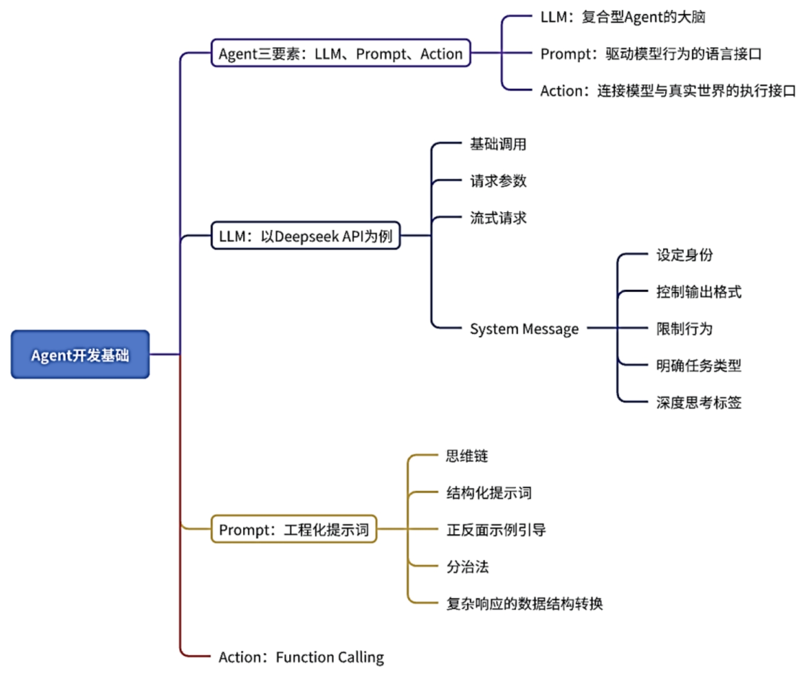

### agent 与 workflow 的区别

LLM、Prompt、Action

ModelAPI：基础调用、参数配置、流式响应、system message

提示词工程：思维链、结构化提示、正反示例引导、分治策略

Prompt是Agent与LLM沟通的桥梁，决定了模型“如何理解”和“如何回应”输入。它不仅是一段文本，更是一种对模型行为的控制语言。

Few-shot Prompting通过在提示词中提供多个示范问答对，引导模型模仿示例的格式和风格，从而提升输出的准确性和一致性。这种方法特别适合分类、意图识别、格式转换等任务。

类似Few-shot的提示设计只是提示词工程中的一种优化策略，除此之外，还有结构化输出模板（让模型输出更规整易解析）​、正反示例引导（通过对比强化行为偏好）​、角色设定与语境构建（通过设定身份、语气来控制模型风格）等多种手段，它们都是提升Agent表现、增强模型可控性的关键方法。

Action是让模型从“说”走向“做”的关键机制。LLM本身无法访问互联网、数据库或本地环境，其生成结果仅基于上下文预测。而通过Action，Agent可调用外部工具(tool)或函数(function)，执行真正的任务操作

Agent会先将用户输入转换为合适的Prompt，通过调用LLM API获取模型响应，随后根据模型的输出判断是否触发对应的Action来完成任务，这就是Function Calling（函数调用）技术。

Function Calling（函数调用）

agent是自主角色，workflow 则是相当于把决策流程写好。

什么时候用 Workflow，什么时候用 Agent？Anthropic 给了一个非常实用的建议：从最简单的方案开始，只在明确需要时才增加复杂度。

### workflow 编排模式

- 第一种叫「Prompt Chaining」（提示链），就是把一个大任务拆成多个小步骤，前一步的输出作为后一步的输入，像流水线一样串起来。
- 第二种叫「Routing」（路由），先用一个 LLM 做分类判断，然后根据分类结果把请求分发到不同的处理分支，前面客服系统的例子就是典型的路由模式。
- 第三种叫「Parallelization」（并行化），把可以同时进行的子任务并行执行，最后汇总结果，这在需要多维度分析的场景下特别有用，比如同时从多个数据源检索信息。
- 第四种叫「Orchestrator-Workers」（编排者-工人），一个中央编排者负责分配任务，多个 Worker 各自完成子任务，适合任务可以分解但子任务之间相互独立的场景。

### skills

MCP能否让agent统一标准function call，skills 告诉agent什么场景下调用函数。

skills 不仅告诉 agent 怎么想，还告诉agent怎么做，通过 allowed-tools 字段声明它需要使用哪些工具。

### 大模型微调

- 全量微调
- 参数高效微调，比如流行的 LoRA 技术
- 指令微调

### RAG

为什么需要RAG？
- 大模型的知识是有时效性的。
- 大模型不知道公司的私有数据。
- 大模型会出现幻觉。

RAG 更准确的定位是：一种让大模型基于真实、可更新的知识来回答问题的技术方案。它和微调、Prompt Engineering 等技术是互补的，而不是替代关系。

两大阶段：索引阶段（离线）+ 查询阶段（在线）

索引阶段：文档加载、文档切割、向量化、存入向量数据库

查询阶段：问题向量化、相似度检索、构造增强prompt、大模型生成回答

(1)向量化：使用向量化模型将文本或问题转换为可用于相似度计算的高维向量，构建语义可计算表示。
(2)长文本切割：将长文档合理切分成适合检索和生成使用的文本单元，保证上下文完整性与检索粒度的平衡。
(3)向量存储：将向量化后的文本片段高效存储在向量数据库中（如Milvus、Chroma、PGVector等）​，支持快速向量检索和过滤。
(4)相似匹配：通过计算查询向量与存储向量的相似度，检索出与问题最相关的内容，为生成模型提供高质量上下文增强。

RAGAS召回评估
CRAG自我矫正

本章将系统介绍Agent的设计范式，围绕“原子化”与“链路可控”两大理念，阐述现代复合型Agent的完整开发流程。首先，从框架设计入手，解析ReAct、Supervisor与Hierarchical三类常见架构；随后转向通信设计，介绍SSE、WebSocket两种主要模式，并比较它们在不同场景下的适配性与取舍；接着，探讨状态设计中的状态管理与上下文跟踪实现方法；在渲染设计中，重点剖析组件原子化与渲染管道隔离；接着，扩展到工作流优化范式，涵盖意图识别、Human-in-the-Loop、自回归机制、记忆机制和安全边界等关键能力；最后聚焦成本优化策略，涉及Prompt token消耗优化、上下文与工具缓存，以及不同粒度模型的合理调度，提供系统性的降本思路。通过本章的学习，读者不仅能够串联前面所学知识点，还能全面掌握复合型Agent的核心设计方法与优化技巧，从而在复杂智能体的构建中具备独当一面的能力。
