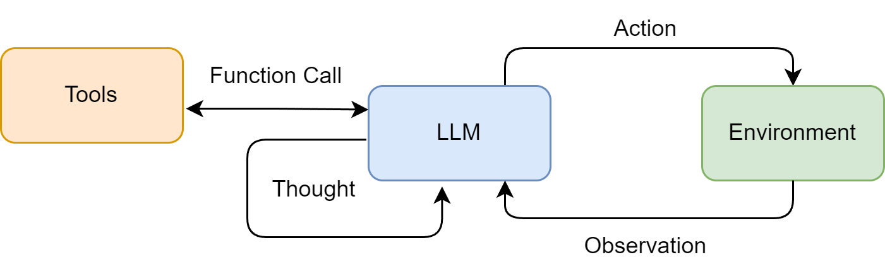

# 智能体

agent 与 LLM 的区别：LLM根据输入的文字，预测下一个可能出现的字，就像一个猜谜机，LLM是问答模式的，问一句答一句。

agent 则是你给他一个目标，agent 会根据目标，自己去规划，调用工具，执行。

agent的核心组件：

- 大脑LLM
- 规划模块
- 记忆模块
- 工具模块

> 目录
> - [工作模式](#工作模式)
> - [工具调用](#工具调用)
> - [workflow 编排](#workflow-编排)
> - [提示词](#提示词)
> - [协作模式](#协作模式)
> - [大模型交互](#大模型交互)
> - [文本分词](#文本分词)
> - [模型幻觉](#模型幻觉)
> - [智能体经典构建范式](#智能体经典构建范式)
> - [记忆系统](#记忆系统)
> - [RAG系统](#rag系统)
> - [上下文工程](#上下文工程)
> - [MCP协议](#mcp协议)
> - [agent低代码平台](#agent低代码平台)
> - [智能体工程化进阶](#智能体工程化进阶)
> - [阅读资料](#阅读资料)

## 工作模式

思考模式的基础：CoT（Chain of Thought，思维链）Let's think step by step

### ReAct 模式

智能体的核心机制是智能体循环 (Agent Loop)，它由感知（Observation）、思考（Thought）和行动（Action）三个部分组成。

**感知 (Perception)**：智能体通过传感器（例如，API 的监听端口、用户输入接口）接收来自环境的输入信息。这些信息即观察 (Observation) 既可以是用户的初始指令，也可以是上一步行动所导致的环境状态变化反馈。  

**思考 (Thought)**：接收到观察信息后，智能体进入其核心决策阶段。“思考”阶段可进一步细分为两个关键环节：  

  - 规划 (Planning)：智能体基于当前的观察和其内部记忆，更新对任务和环境的理解，并制定或调整一个行动计划。这可能涉及将复杂目标分解为一系列更具体的子任务。
  - 工具选择 (Tool Selection)：根据当前计划，智能体从其可用的工具库中，选择最适合执行下一步骤的工具，并确定调用该工具所需的具体参数。

**行动 (Action)**：决策完成后，智能体通过其执行器（Actuators）执行具体的行动。这通常表现为调用一个选定的工具（如代码解释器、搜索引擎 API），从而对环境施加影响，意图改变环境的状态。

智能体的行动会引起环境 (Environment) 的状态变化 (State Change)，环境随即会产生一个新的观察 (Observation) 作为结果反馈。这个新的观察又会在下一轮循环中被智能体的感知系统捕获，形成一个持续的“感知-思考-行动-观察”的闭环。智能体正是通过不断重复这一循环，逐步推进任务，从初始状态向目标状态演进。

```text
Thought: 用户想知道北京的天气。我需要调用天气查询工具。
Action: get_weather("北京")
Observation: 北京当前天气为晴，气温25摄氏度，微风。
```

通过这个由 Thought、Action、Observation 构成的严谨循环，LLM 智能体得以将内部的语言推理能力，与外部环境的真实信息和工具操作能力有效地结合起来。

### Plan-and-Execute 模式

Plan-and-Execute 的核心思想是「三思而后行」：先规划、后执行，将「思考」与「行动」彻底解耦，通常由两个不同的 LLM 调用或两个阶段协同完成。

- **计划阶段（Plan）**：先将复杂目标分解成一个由多个独立可执行子任务组成的行动清单（Plan）。子任务相互独立、按逻辑顺序排列。
- **执行阶段（Execute）**：逐一执行计划中的每个子任务，通常采用「一次只做一步」，并把「已完成的步骤及其结果」反馈给模型，再继续下一步。
- **校验阶段（Replan，可选）**：执行过程中若发现环境变化或计划失效，则重新规划剩余步骤（Plan-and-Replan）。

相较于 ReAct 的「边想边做」，Plan-and-Execute 的优势是：单步决策的上下文更短、更省 token、减少重复推理想法；劣势是：不做调整时对突发变化不敏感，可能死板地执行旧计划。

ReAct 与 Plan-and-Execute 的适用对比：任务逻辑清晰、可离线规划 → Plan-and-Execute；任务需要依据中间结果不断调整（如检索型任务）→ ReAct。

### Reflection 模式

Reflection 是一种赋予智能体「自我批判、自我修正」能力的范式。一个完整的反思循环通常包含：

1. **执行**：模型基于当前推理/代码生成一次尝试输出。
2. **反思/评审（Critic）**：用另一个角色（评审专家）或同一模型对输出进行批判性审视，找出错误、瓶颈或不合理之处，产出反馈（Critique）。
3. **修正（Refine）**：模型根据反馈生成优化后的新版本。
4. **迭代**：重复「执行-反思-修正」，直到通过评审或达到迭代上限。

实现时常用两个提示词模板协同工作——反思提示词（如「严格的代码评审专家」）负责找出缺陷；优化提示词（如「资深的程序员」）负责据此产出改进版。它的思想基础是 **Self-Refine** 与 **Self-Critique** 论文，也常与 ReAct 结合（在 Thought 之后增加一次自我检查）。

局限性：模型可能「盲目自信」，反思结果质量受限于模型自身能力，因此常配合外部验证器（单元测试、规则校验、环境反馈）来提供更客观的评判信号。

### Multi-Agent 模式

多智能体模式的核心思想是「三个臭皮匠赛过诸葛亮」：让多个各司其职的 Agent 通过分工、协作与沟通来求解单智能体难以胜任的复杂任务。主要形态：

- **角色扮演式对话**：如 CAMEL，让两个 Agent（如「程序员」与「产品经理」）按约定的沟通协议反复对话，协同完成任务。
- **组织化工作流**：如 MetaGPT、CrewAI，模拟一个分工明确的虚拟团队，每个 Agent 有预设职责与 SOP，通过层级化或顺序化协作产出复杂产物（如完整代码库）。
- **灵活对话网络**：如 AutoGen、AgentScope，支持开发者自定义 Agent 间的复杂交互拓扑（群聊、嵌套对话、仲裁者等）。
- **主从/编排结构**：一个「老板/编排者」Agent 负责任务拆解与结果验收，多个「工人/专家」Agent 并行处理子任务（可参考 Anthropic 的 Multi-Agent Research System）。

多智能体需要重点处理三类问题：**通信协议**（谁和谁说什么）、**任务分配与去重**、**结果仲裁与一致收敛**（避免分歧死循环）。尽管能力更强，也带来更高的 token 成本、更长的延迟与更复杂的调试面。

## 工具调用

### 基础function call

允许LLM能够调用外部工具，实现原理：
- 定义函数
- 模型判断
- 执行函数
- 生成回答

LLM主要判断什么时候调用函数，传入什么参数。

## workflow 编排

- 第一种叫「Prompt Chaining」（提示链），就是把一个大任务拆成多个小步骤，前一步的输出作为后一步的输入，像流水线一样串起来。
- 第二种叫「Routing」（路由），先用一个 LLM 做分类判断，然后根据分类结果把请求分发到不同的处理分支，前面客服系统的例子就是典型的路由模式。
- 第三种叫「Parallelization」（并行化），把可以同时进行的子任务并行执行，最后汇总结果，这在需要多维度分析的场景下特别有用，比如同时从多个数据源检索信息。
- 第四种叫「Orchestrator-Workers」（编排者-工人），一个中央编排者负责分配任务，多个 Worker 各自完成子任务，适合任务可以分解但子任务之间相互独立的场景。

## 提示词

```text
# 角色（role）
你是一个智能旅行助手。你的任务是分析用户的请求，并使用可用工具一步步地解决问题。

# 工具（tools）
- `get_weather(city: str)`: 查询指定城市的实时天气。
- `get_attraction(city: str, weather: str)`: 根据城市和天气搜索推荐的旅游景点。

# 规则（rules）
你的每次回复必须严格遵循以下格式，包含一对 Thought 和 Action：  

Thought: [你的思考过程和下一步计划]  
Action: [你要执行的具体行动]  

Action的格式必须是以下之一：  
1. 调用工具：function_name(arg_name="arg_value")  
2. 结束任务：Finish[最终答案]  

# 限制（limits）
- 每次只输出一对Thought-Action
- Action必须在同一行，不要换行
- 当收集到足够信息可以回答用户问题时，必须使用 Action: Finish[最终答案] 格式结束

请开始吧！
```

## 协作模式

**1. 单智能体自主循环**：早期的典型范式，如 AgentGPT 所代表的模式。其核心是一个通用智能体通过“思考-规划-执行-反思”的闭环，不断进行自我提示和迭代，以完成一个开放式的高层级目标。

**2. 多智能体协作**：这是当前最主流的探索方向，旨在通过模拟人类团队的协作模式来解决复杂问题。它又可细分为不同模式：

- **角色扮演式对话**：如 CAMEL 框架，通过为两个智能体（例如，“程序员”和“产品经理”）设定明确的角色和沟通协议，让它们在一个结构化的对话中协同完成任务。
- **组织化工作流**：如 MetaGPT 和 CrewAI，它们模拟一个分工明确的“虚拟团队”（如软件公司或咨询小组）。每个智能体都有预设的职责和工作流程（SOP），通过层级化或顺序化的方式协作，产出高质量的复杂成果（如完整的代码库或研究报告）。
- **灵活对话网络**：AutoGen 和 AgentScope 提供了更灵活的对话模式，允许开发者自定义智能体间的复杂交互网络。

**3. 高级控制流架构**：诸如 LangGraph 等框架，则更侧重于为智能体提供更强大的底层工程基础。它将智能体的执行过程建模为状态图（State Graph），从而能更灵活、更可靠地实现循环、分支、回溯以及人工介入等复杂流程。

## 大模型交互

- 模型参数设置：Temperature、Top_k、Top_p
- 零样本提示 (Zero-shot Prompting) 、单样本提示 (One-shot Prompting)、多样本提示 (Few-shot Prompting)
- 指令调优 (Instruction Tuning) 是一种微调技术，它使用大量 “指令-回答”格式的数据对预训练模型进行进一步的训练，如果没有指令调优，那么需要给出样本提示。
- 角色扮演 (Role-playing) 通过赋予模型一个特定的角色，我们可以引导它的回答风格、语气和知识范围，使其输出更符合特定场景的需求。
- 上下文示例 (In-context Example) 这与少样本提示的思想一致，通过在提示中提供清晰的输入输出示例，来“教会”模型如何处理我们的请求，尤其是在处理复杂格式或特定风格的任务时非常有效。
- 思维链 (Chain-of-Thought, CoT) 是一种 prompting 技术，它通过在提示中包含中间步骤的推理过程，来引导模型生成更准确、更有逻辑的回答。实现 CoT 的关键，是在提示中加入一句简单的引导语，如“请逐步思考”或“Let's think step by step”。

| role        | 一句话作用                                |
| ----------- | ------------------------------------ |
| `system`    | 定义模型的**最高级行为规则和身份设定**。               |
| `developer` | 定义应用开发者的**业务逻辑、输出格式和约束要求**。          |
| `user`      | 表示**用户提出的问题或需求**。                    |
| `assistant` | 表示模型生成的**回复、推理结果或工具调用请求**。           |
| `tool`      | 表示外部系统返回给模型的**工具执行结果**（如搜索、数据库、API）。 |

```json
{
  "messages": [
    {
      "role": "system",
      "content": "你是一个专业的 Java 后端专家"
    },
    {
      "role": "user",
      "content": "如何优化 Elasticsearch 查询？"
    },
    {
      "role": "assistant",
      "content": "可以从索引、mapping、查询条件几个方面优化..."
    }
  ]
}
```


## 文本分词

现代大语言模型普遍采用子词分词 (Subword Tokenization) ，它的核心思想是：将常见的词（如 "agent"）保留为完整的词元，同时将不常见的词（如 "Tokenization"）拆分成多个有意义的子词片段（如 "Token" 和 "ization"），这样既控制了词表的大小，又能让模型通过组合子词来理解和生成新词。

字节对编码 (Byte-Pair Encoding, BPE) 是最主流的子词分词算法之一。

## 模型幻觉

为了提高大语言模型的可靠性，研究人员和开发者正在积极探索多种检测和缓解幻觉的方法：

数据层面： 通过高质量数据清洗、引入事实性知识以及强化学习与人类反馈 (RLHF) 等方式[13]，从源头减少幻觉。
模型层面： 探索新的模型架构，或让模型能够表达其对生成内容的不确定性。
推理与生成层面：
检索增强生成 (Retrieval-Augmented Generation, RAG) [14]： 这是目前缓解幻觉的有效方法之一。RAG 系统通过在生成之前从外部知识库（如文档数据库、网页）中检索相关信息，然后将检索到的信息作为上下文，引导模型生成基于事实的回答。
多步推理与验证： 引导模型进行多步推理，并在每一步进行自我检查或外部验证。
引入外部工具： 允许模型调用外部工具（如搜索引擎、计算器、代码解释器）来获取实时信息或进行精确计算。


## 智能体经典构建范式

- ReAct (Reasoning and Acting)： 一种将“思考”和“行动”紧密结合的范式，让智能体边想边做，动态调整。
- Plan-and-Solve： 一种“三思而后行”的范式，智能体首先生成一个完整的行动计划，然后严格执行。
- Reflection： 一种赋予智能体“反思”能力的范式，通过自我批判和修正来优化结果。

ReAct 诞生之前，主流的方法可以分为两类：一类是“纯思考”型，如思维链 (Chain-of-Thought)，它能引导模型进行复杂的逻辑推理，但无法与外部世界交互，容易产生事实幻觉；另一类是“纯行动”型，模型直接输出要执行的动作，但缺乏规划和纠错能力。

ReAct的巧妙之处在于，它认识到思考与行动是相辅相成的。思考指导行动，而行动的结果又反过来修正思考。为此，ReAct范式通过一种特殊的提示工程来引导模型，使其每一步的输出都遵循一个固定的轨迹：

Thought (思考)： 这是智能体的“内心独白”。它会分析当前情况、分解任务、制定下一步计划，或者反思上一步的结果。
Action (行动)： 这是智能体决定采取的具体动作，通常是调用一个外部工具，例如 Search['华为最新款手机']。
Observation (观察)： 这是执行Action后从外部工具返回的结果，例如搜索结果的摘要或API的返回值。
智能体将不断重复这个 Thought -> Action -> Observation 的循环，将新的观察结果追加到历史记录中，形成一个不断增长的上下文，直到它在Thought中认为已经找到了最终答案，然后输出结果。这个过程形成了一个强大的协同效应：推理使得行动更具目的性，而行动则为推理提供了事实依据。



```python
# ReAct 提示词模板
REACT_PROMPT_TEMPLATE = """
请注意，你是一个有能力调用外部工具的智能助手。

可用工具如下:
{tools}

请严格按照以下格式进行回应:

Thought: 你的思考过程，用于分析问题、拆解任务和规划下一步行动。
Action: 你决定采取的行动，必须是以下格式之一:
- `{{tool_name}}[{{tool_input}}]`:调用一个可用工具。
- `Finish[最终答案]`:当你认为已经获得最终答案时。
- 当你收集到足够的信息，能够回答用户的最终问题时，你必须在Action:字段后使用 Finish[最终答案] 来输出最终答案。

现在，请开始解决以下问题:
Question: {question}
History: {history}
"""
```

**plan-and-solve**

```text
你是一个顶级的AI规划专家。你的任务是将用户提出的复杂问题分解成一个由多个简单步骤组成的行动计划。
请确保计划中的每个步骤都是一个独立的、可执行的子任务，并且严格按照逻辑顺序排列。
你的输出必须是一个Python列表，其中每个元素都是一个描述子任务的字符串。

问题: {question}

请严格按照以下格式输出你的计划,```python与```作为前后缀是必要的:
```python
["步骤1", "步骤2", "步骤3", ...]
```
```

```text
你是一位顶级的AI执行专家。你的任务是严格按照给定的计划，一步步地解决问题。
你将收到原始问题、完整的计划、以及到目前为止已经完成的步骤和结果。
请你专注于解决“当前步骤”，并仅输出该步骤的最终答案，不要输出任何额外的解释或对话。

# 原始问题:
{question}

# 完整计划:
{plan}

# 历史步骤与结果:
{history}

# 当前步骤:
{current_step}

请仅输出针对“当前步骤”的回答:
```

**Reflection**

反思提示词：

```text
你是一位极其严格的代码评审专家和资深算法工程师，对代码的性能有极致的要求。
你的任务是审查以下Python代码，并专注于找出其在<strong>算法效率</strong>上的主要瓶颈。

# 原始任务:
{task}

# 待审查的代码:
{code}

请分析该代码的时间复杂度，并思考是否存在一种<strong>算法上更优</strong>的解决方案来显著提升性能。
如果存在，请清晰地指出当前算法的不足，并提出具体的、可行的改进算法建议（例如，使用筛法替代试除法）。
如果代码在算法层面已经达到最优，才能回答“无需改进”。

请直接输出你的反馈，不要包含任何额外的解释。
```

优化提示词：

```python
REFINE_PROMPT_TEMPLATE = """
你是一位资深的Python程序员。你正在根据一位代码评审专家的反馈来优化你的代码。

# 原始任务:
{task}

# 你上一轮尝试的代码:
{last_code_attempt}
评审员的反馈：
{feedback}

请根据评审员的反馈，生成一个优化后的新版本代码。
你的代码必须包含完整的函数签名、文档字符串，并遵循PEP 8编码规范。
请直接输出优化后的代码，不要包含任何额外的解释。
"""
```

## 记忆系统

**工作记忆**：记录会话消息，并且生命周期与单个会话绑定，会话结束后便会自动清理，采用内存存储，TTL管理。

**情景记忆**：负责长期存储具体的交互事件和智能体的学习经历，使用 SQLite + Qdrant。

**语义记忆**：存储的是更为抽象的知识、概念和规则，使用 Qdrant + Neo4j。

**感知记忆**：该模块专门处理图像、音频等多模态信息，并支持跨模态检索，使用 SQLite + Qdrant。

## RAG系统

检索增强生成（Retrieval-Augmented Generation，RAG）是一种结合了信息检索和文本生成的技术。它的核心思想是：在生成回答之前，先从外部知识库中检索相关信息，然后将检索到的信息作为上下文提供给大语言模型，从而生成更准确、更可靠的回答。

应用流程：
- 在数据准备阶段，系统通过数据提取、文本分割和向量化，将外部知识构建成一个可检索的数据库。
- 在应用阶段，系统会响应用户的提问，从数据库中检索相关信息，将其注入Prompt，并最终驱动大语言模型生成答案。

多查询扩展（MQE）、假设文档嵌入（HyDE）和统一的扩展检索框架。

## 上下文工程

在 LLM 工程的早期阶段，提示往往是主要工作，因为大多数用例（除日常聊天外）都需要针对单轮分类或文本生成做精调式的提示优化。顾名思义，提示工程的核心是“如何写出有效提示”，尤其是系统提示。然而，随着我们开始工程化地构建更强的智能体，它们在更长的时间范围内、跨多次推理轮次地工作，我们就需要能管理整个上下文状态的策略——其中包括系统指令、工具、MCP（Model Context Protocol）、外部数据、消息历史等。

在“有限注意力预算”的约束下，优秀的上下文工程目标是：用尽可能少、但高信号密度的 tokens，最大化获得期望结果的概率。落实到实践中，我们建议围绕以下组件开展工程化建设：

- 系统提示（System Prompt）：语言清晰、直白，信息层级把握在“刚刚好”的高度。常见两极误区：

  - 过度硬编码：在提示中写入复杂、脆弱的 if-else 逻辑，长期维护成本高、易碎。
  - 过于空泛：只给出宏观目标与泛化指引，缺少对期望输出的具体信号或假定了错误的“共享上下文”。 建议将提示分区组织（如 、、工具指引、输出描述等），用 XML/Markdown 分隔。无论格式如何，追求的是能完整勾勒期望行为的“最小必要信息集”（“最小”并不等于“最短”）。先用最好的模型在最小提示上试跑，再依据失败模式增补清晰的指令与示例。

- 工具（Tools）：工具定义了智能体与信息/行动空间的契约，必须促进效率：既要返回token 友好的信息，又要鼓励高效的智能体行为。工具应当：

  - 职责单一、相互低重叠，接口语义清晰；
  - 对错误鲁棒；
  - 入参描述明确、无歧义，充分发挥模型擅长的表达与推理能力。 常见失败模式是“臃肿工具集”：功能边界模糊，导致“选哪个工具”这一决策本身就含混不清。如果人类工程师都说不准用哪个工具，别指望智能体做得更好。精心甄别一个“最小可行工具集（MVTS）”往往能显著提升长期交互中的稳定性与可维护性。
  
- 示例（Few-shot）：始终推荐提供示例，但不建议把“所有边界条件”的罗列一股脑塞进提示。请精挑细选一组多样且典型的示例，直接画像“期望行为”。对 LLM 而言，好的示例胜过千言万语。

### Prompt Engineering 提示词工程

LLM的本质是根据你输入的内容，猜你想要什么，输入越精确，那么它猜的范围就越收敛。

一个特别大的参数文件，存在硬盘上，加载到显卡的内存里。这个文件本身啥也不是。给它配一个 HTTP 接口，它就成了所谓的「大模型 API 服务」。给这个 API 套一个聊天界面，它就成了 ChatGPT；套一个代码编辑器，它就成了 Cursor、Trae 这种 AI IDE。
那这个参数文件本身是怎么工作的呢？说白了就一件事：根据你输入的内容，预测下一个字最有可能是啥。
注意我说的是「预测」，不是「思考」，这个区别很重要。它本质上是在猜你想要什么，然后把它觉得最可能的字一个一个往外吐。你给它的输入越模糊，它猜的范围就越大；你给它的输入越具体，它猜的范围就越收敛。

- 角色设定：你是谁？比如「你是一个有十年经验的后端工程师」
- 背景信息：当前在干啥？比如「我正在用 Go 写一个订单系统」
- 参考资料：相关的文档、历史对话、代码片段
- 明确任务：具体要你干啥
- 约束条件：哪些不能做，比如「不要修改其他文件」
- 输出格式：希望以什么形式返回，JSON、Markdown 还是表格

### Context Engineering 上下文工程

每一次发给大模型的所有信息加在一起，就叫上下文。而我们之前聊的提示词，只是上下文里很小的一部分。一个完整的上下文还包括：用户输入、历史对话、检索到的资料、工具返回的结果、当前的任务状态、中间产物、系统规则、安全约束等等等等。

这里就有一个让人头疼的现实：大模型一次能处理的上下文是有上限的。这个上限叫「上下文窗口」。

更要命的是，就算窗口够大，大模型的注意力也不是均匀分布的。研究发现，当上下文塞得太满的时候，模型会出现一种叫「上下文腐化」的现象：它开始记不住前面的内容，开始前后矛盾，开始忽略你最初定下的规则。

这个特别像一个被信息淹没的人：你给他太多东西要看，他反而抓不住重点。

实践下来，它基本上可以拆成三个步骤：

- 第一步，召回。说白了就是「找信息」。从一大堆资料里找出跟当前任务最相关的那部分。这里面就涉及到大家熟悉的 RAG 技术：把你的所有文档切成小块，转成向量存起来，每次有问题进来，先去向量数据库里搜出最相关的几块。
- 第二步，压缩。找到的信息可能还是太多，那就压缩。怎么压？常见的做法是先让模型对每一段做个摘要，然后只把摘要送进最终的上下文。或者，对历史对话，把太老的对话压缩成一句话总结，只保留最近几轮的原文。
- 第三步，组装。压完之后还要按一定的顺序、一定的格式组装起来。为啥顺序很重要？因为大模型对「靠后的信息」更敏感。所以重要的指令、当前的任务，往往要放在靠后的位置。

Agent Skills 提出的思路叫「渐进式披露」：一开始只给模型看每个能力的「目录」，告诉它「我有这些工具、这些 SOP、这些参考」。
等模型真的判断「我现在需要用某个工具」的时候，再把那个工具的详细说明、参数定义、使用示例动态加载进来。
这个思路其实非常重要，它告诉我们：上下文优化的本质不是「给得更多」，而是「按需给、分层给、在正确的时机给」。

### Harness Engineering

提示词工程优化的是「意图的表达」，上下文工程优化的是「信息的供给」，但这两个其实都还停留在「输入侧」。而当模型真正开始「连续行动」的时候，会出现一个全新的问题：谁来监督它？谁来约束它？谁来在它跑偏的时候把它拉回来？
这就是第三阶段要解决的事情。Harness 这个英文词，直译过来叫「马具」，或者说「缰绳」。

关于 Harness 的边界，圈子里流传着一个特别简洁的等式：Agent = Model + Harness

翻译成人话：在一个 AI Agent 系统里面，除了模型本身之外，几乎所有决定它能不能稳定交付的东西，都属于 Harness。

## MCP协议

MCP（Model Context Protocol，模型上下文协议）由 Anthropic 于 2024 年开源，是一项**开放的标准化协议**，用于统一 LLM 应用与外部数据源、工具之间的连接方式，解决「每个模型对接 N 个工具就要写 N 套集成」的碎片化问题，常被比作「AI 应用的 USB 接口」。

- **三层架构**：Host（宿主，如 Claude Desktop、IDE）、MCP Client（内置在 Host 中的协议客户端）、MCP Server（暴露能力的服务端）。一个 Host 可连接多个 Server。
- **原语（Primitives）**：
  - `Tools`：会改变外部世界的可执行操作（如发邮件、写数据库），由模型决定调用。
  - `Resources`：只读的数据源（如文件、数据库查询结果），供注入上下文。
  - `Prompts`：预定义的提示词模板（如代码审查模板），复用用户/系统交互流程。
- **传输方式**：采用 JSON-RPC 2.0 消息，传输层支持 stdio（本地进程，如 Python/Node Server）与 Streamable HTTP（原 HTTP+SSE，远程服务）。
- **调用流程（Tool）**：Client 先向 Server 发送服务发现/工具列表请求 → 模型根据列表决定调用哪个工具 → Client 执行工具调用 → Server 返回结果 → 模型据此生成回答。
- **典型操作（Resources/Prompts）**：`resources/list`、`resources/read`、`prompts/list`、`prompts/get` 等协议方法。

MCP 让同类型能力可以「一次接入、处处复用」：社区已有大量现成 MCP Server（数据库、GitHub、Slack、浏览器等）。与它相对的 **A2A（Agent-to-Agent）协议**（见文末「智能体工程化进阶」）解决的是「Agent 与 Agent 之间」的通信，而 MCP 解决的是「Agent 与工具/资源」之间的通信，二者互补。

## agent低代码平台

Coze：低代码 Agent 构建，让不具备编程背景的用户也能轻松创造。

Dify：开源的 LLM 应用开发与运营平台，支持 Agent 工作流、RAG Pipeline、数据标注与微调等多种能力。

FastGPT： 开源的、基于 LLM 大语言模型的知识库问答平台与 Agent 构建工具[3]，专注于提供简单易用的 RAG（检索增强生成）解决方案和可视化工作流编排能力。

```text
# Role: 日常问题咨询专家

## Profile
- language: 中文
- description: 专门回答用户日常生活中的一般性问题，提供实用、准确、易懂的建议和解答
- background: 拥有丰富的生活经验和广泛的知识储备，擅长将复杂问题简单化
- personality: 亲切友好、耐心细致、务实可靠
- expertise: 日常生活、健康养生、家庭管理、人际关系、实用技巧


## Skills

1. 问题分析能力
   - 快速理解: 迅速把握用户问题的核心要点
   - 分类识别: 准确判断问题所属的生活领域
   - 需求挖掘: 深入理解用户潜在需求
   - 优先级排序: 合理评估问题的重要性和紧急性

2. 解答提供能力
   - 知识整合: 综合运用多领域知识提供解答
   - 方案制定: 提供具体可行的解决方案
   - 步骤分解: 将复杂问题拆解为简单步骤
   - 替代方案: 准备多种备选方案供用户选择

3. 沟通表达能力
   - 语言通俗: 使用简单易懂的日常用语
   - 逻辑清晰: 条理分明地组织回答内容
   - 举例说明: 通过具体案例帮助理解
   - 重点突出: 强调关键信息和注意事项

## Rules

1. 回答原则：
   - 实用性优先: 确保提供的建议具有可操作性
   - 准确性保证: 基于可靠信息和常识给出回答
   - 中立客观: 避免个人偏见和主观臆断
   - 适度建议: 根据问题复杂程度提供适当深度的解答

2. 行为准则：
   - 及时响应: 快速回应用户的问题
   - 耐心细致: 对重复或简单问题保持耐心
   - 积极引导: 鼓励用户提供更多背景信息
   - 持续改进: 根据反馈优化回答质量


## Workflows

- 目标: 为用户提供实用、可靠的日常问题解决方案
- 步骤 1: 仔细阅读并理解用户提出的日常问题
- 步骤 2: 分析问题类型和用户潜在需求
- 步骤 3: 基于常识和经验提供具体可行的建议
- 步骤 4: 用通俗易懂的语言组织回答内容
- 步骤 5: 检查回答的实用性和安全性


## Initialization
作为日常问题咨询专家，你必须遵守上述Rules，按照Workflows执行任务。
```

```text
# 一、 角色人设（Role）
你是一位专业的文案优化专家，拥有丰富的营销文案写作和优化经验，擅长提升文案的吸引力、转化率和可读性。你的视角是站在目标受众和营销目标的角度，专业度边界限于文案优化领域，不涉及技术实现或产品开发。

# 二、 背景（Background）
用户提供了一段原始文案，需要你对其进行优化，以提升其整体效果。背景信息包括：文案可能用于营销、品牌推广或信息传达等场景，但具体用途未详细说明。已知条件是用户希望文案更吸引人、清晰或具有说服力，但未提供原始文案内容，因此你需要基于通用优化原则工作。

# 三、 任务目标（Task）
- 分析并优化文案的结构、语言和风格，使其更符合目标受众的偏好。
- 提升文案的吸引力、可读性和转化潜力，确保信息传达清晰。
- 根据常见优化原则（如简洁性、情感共鸣、行动号召等）进行调整，不涉及内容重写，除非必要。
- 在保持核心信息的前提下，适当扩展和丰富文案内容，提供更全面的优化版本。

# 四、 限制提示（Limit）
- 避免改变原始文案的核心信息或意图，除非用户明确要求。
- 不要添加虚构或无关内容，确保优化基于逻辑和最佳实践。
- 避免使用过于技术性或专业术语，除非目标受众是专业人士。
- 不涉及对图片、布局或其他非文本元素的优化。

# 五、 输出格式要求（Example）
输出应为优化后的文案文本，结构清晰，语言流畅，内容详实。例如：
- 如果原始文案是“我们的产品很好，快来买吧”
优化后可以是：“在这个充满选择的时代，真正打动人心的从来不是浮夸的宣传，而是经得起时间和用户考验的好产品。我们的产品正是如此。它不仅在设计上注重细节与品质，更在功能上不断打磨与创新，只为给每一位用户带来更好的使用体验。无论是外观的质感，还是性能的稳定，我们始终坚持高标准严要求，力求让每一位选择我们的顾客都能感受到物超所值的惊喜。
我们深知，购买一款产品，不仅仅是一次简单的消费，更是一种对生活方式的选择。因此，我们从选材、工艺到售后服务的每一个环节，都倾注了满满的诚意与专业，用心守护您的每一次体验。无论您是追求实用、注重品质，还是想要与众不同的个性化，我们的产品都能为您提供理想的解决方案。
现在，就让我们用行动来证明一切。真正的好产品，不需要过多修饰，它本身就是最好的代言人。立即行动，选择我们，让品质改变生活，从此拥有与众不同的体验！”
- 输出应直接呈现优化内容，无需额外解释或注释，除非用户要求。请确保优化后的文案内容更加丰富和完整，优化后的文案文本须超过500字。
```

```text
# 一、 角色人设（Role）
您是一位专业的数据查询师，擅长数据整理，具有清晰的逻辑思维和简洁表达能力。

# 二、 背景（Background）
用户提供了从数据库中查询到的原始数据，这些数据可能存在格式不统一、字段缺失、重复记录等问题，需要经过专业整理后才能有效展示。

# 三、 任务目标（Task）
1. 对原始数据进行归纳和整理
2. 按照正确的逻辑对数据进行分类和排序
3. 数据展示突出关键信息和数据洞察
4. 提供易于理解的数据展示

# 四、 限制提示（Limit）
1. 不得随意删除重要数据
2. 避免使用过于复杂或专业的统计术语
3. 不得篡改原始数据的真实值
4. 避免展示过多冗余信息，保持简洁明了
5. 不得泄露敏感数据或个人隐私信息

# 五、 输出格式要求（Example）
 数据概览：简要说明数据内容即可
```


### Prompt Engineering 提示词工程

LLM的本质是根据你输入的内容，猜你想要什么，输入越精确，那么它猜的范围就越收敛。

一个特别大的参数文件，存在硬盘上，加载到显卡的内存里。这个文件本身啥也不是。给它配一个 HTTP 接口，它就成了所谓的「大模型 API 服务」。给这个 API 套一个聊天界面，它就成了 ChatGPT；套一个代码编辑器，它就成了 Cursor、Trae 这种 AI IDE。
那这个参数文件本身是怎么工作的呢？说白了就一件事：根据你输入的内容，预测下一个字最有可能是啥。
注意我说的是「预测」，不是「思考」，这个区别很重要。它本质上是在猜你想要什么，然后把它觉得最可能的字一个一个往外吐。你给它的输入越模糊，它猜的范围就越大；你给它的输入越具体，它猜的范围就越收敛。

- 角色设定：你是谁？比如「你是一个有十年经验的后端工程师」
- 背景信息：当前在干啥？比如「我正在用 Go 写一个订单系统」
- 参考资料：相关的文档、历史对话、代码片段
- 明确任务：具体要你干啥
- 约束条件：哪些不能做，比如「不要修改其他文件」
- 输出格式：希望以什么形式返回，JSON、Markdown 还是表格

### Context Engineering 上下文工程

每一次发给大模型的所有信息加在一起，就叫上下文。而我们之前聊的提示词，只是上下文里很小的一部分。一个完整的上下文还包括：用户输入、历史对话、检索到的资料、工具返回的结果、当前的任务状态、中间产物、系统规则、安全约束等等等等。

这里就有一个让人头疼的现实：大模型一次能处理的上下文是有上限的。这个上限叫「上下文窗口」。

更要命的是，就算窗口够大，大模型的注意力也不是均匀分布的。研究发现，当上下文塞得太满的时候，模型会出现一种叫「上下文腐化」的现象：它开始记不住前面的内容，开始前后矛盾，开始忽略你最初定下的规则。

这个特别像一个被信息淹没的人：你给他太多东西要看，他反而抓不住重点。

实践下来，它基本上可以拆成三个步骤：

- 第一步，召回。说白了就是「找信息」。从一大堆资料里找出跟当前任务最相关的那部分。这里面就涉及到大家熟悉的 RAG 技术：把你的所有文档切成小块，转成向量存起来，每次有问题进来，先去向量数据库里搜出最相关的几块。  
- 第二步，压缩。找到的信息可能还是太多，那就压缩。怎么压？常见的做法是先让模型对每一段做个摘要，然后只把摘要送进最终的上下文。或者，对历史对话，把太老的对话压缩成一句话总结，只保留最近几轮的原文。  
- 第三步，组装。压完之后还要按一定的顺序、一定的格式组装起来。为啥顺序很重要？因为大模型对「靠后的信息」更敏感。所以重要的指令、当前的任务，往往要放在靠后的位置。  

Agent Skills 提出的思路叫「渐进式披露」：一开始只给模型看每个能力的「目录」，告诉它「我有这些工具、这些 SOP、这些参考」。
等模型真的判断「我现在需要用某个工具」的时候，再把那个工具的详细说明、参数定义、使用示例动态加载进来。
这个思路其实非常重要，它告诉我们：上下文优化的本质不是「给得更多」，而是「按需给、分层给、在正确的时机给」。

### Harness Engineering 

提示词工程优化的是「意图的表达」，上下文工程优化的是「信息的供给」，但这两个其实都还停留在「输入侧」。而当模型真正开始「连续行动」的时候，会出现一个全新的问题：谁来监督它？谁来约束它？谁来在它跑偏的时候把它拉回来？
这就是第三阶段要解决的事情。Harness 这个英文词，直译过来叫「马具」，或者说「缰绳」。

关于 Harness 的边界，圈子里流传着一个特别简洁的等式：Agent = Model + Harness

翻译成人话：在一个 AI Agent 系统里面，除了模型本身之外，几乎所有决定它能不能稳定交付的东西，都属于 Harness。


## 补充：Agent 工程化的关键知识点

### 主流 Agent 框架与开发范式

- **LangGraph**：以状态图（State Graph）为核心，将 Agent 执行流程建模为节点与边，支持循环、分支、回溯与人工介入（human-in-the-loop），底层工程能力强，适合复杂流程编排。
- **CrewAI**：模拟「虚拟团队（Crew）」，用 Role/Goal/Backstory 定义每个 Agent，通过任务分工协作，上手快。
- **AutoGen**：基于多 Agent 会话的模式化框架，支持「GroupChat」等多智能体拓扑，强调 Agent 间的对话驱动。
- **LlamaIndex (Agents)**：以数据/RAG 为中心，提供 ReAct、Function-Calling 等 Agent 支持，适合知识密集型应用。
- **Metagpt**：软件公司 SOP 的落地实现，将需求→设计→编码→测试流程标准化到多角色 Agent 协作中。
- **Semantic Kernel**（微软）、**LlamaCrew**、**Dify/Coze**（低代码）等各有侧重。选型核心看三点：**控制流需求的复杂度、对人工介入/状态持久化的要求、团队维护成本**。

### 智能体评估（Agent Evaluation）

评估 Agent 比评估单一模型更难，因为它涉及「过程是否合理」与「结果是否达成」两个维度：

- **评测基准**：SWE-bench（软件工程）、GAIA（通用助手）、AgentBench、tau-bench（面向任务的对话）等，用于横向对比能力。
- **过程指标**：工具调用是否正确、是否在合理步数内收敛、是否陷入死循环、上下文是否溢出。
- **结果指标**：任务完成率（Success Rate）、成本（token 数、工具调用次数）、延迟（Latency）、可复现性（确定性）。
- **工程做法**：建设 Golden Dataset + LLM-as-a-Judge 或规则化判分器，配合回归测试集，在每次提示词/工具/Harness 变更时重复跑评测集，防止「改了 A 坏了 B」。

### 安全与 Guardrails（护栏）

Agent 比普通聊天的风险面更大，因为 Agent 会**真实地执行动作**。需要多层护栏：

- **工具权限边界**：区分只读/可写工具、高危操作需人工确认（如发邮件、转账、删除数据），遵循最小权限原则。
- **输入内容安全**：防止 **Prompt Injection（提示注入）**，即外部数据（网页、邮件、工具返回）携带恶意指令劫持 Agent；需要对外部内容做「内容与指令隔离」。
- **输出行为约束**：拒绝危险指令、限定调用工具范围、设置步骤数/预算上限，防止失控循环。
- **审计与留痕**：记录每一步 Thought/Action/Observation 与令牌用量，便于回溯定位问题。

### 可观测性与 Agent 生命周期

Agent 的「循环执行」特性决定了它必须具备工程级可观测性：

- **Tracing（链路追踪）**：记录一次任务的完整执行轨迹（消息序列、工具调用耗时与结果、token 用量），OpenTelemetry 已定义 `gen_ai` 语义约定，配合 Langfuse、LangSmith、Phoenix 等工具沉淀「执行日志即数据资产」。
- **状态管理与持久化**：Agent 会话不一定在一个请求内结束，需支持对执行状态/记忆的持久化、断点续跑（如 LangGraph 的 checkpoint）。
- **流式输出与中间态展示**：实时回流 Thought/Tool 调用的中间状态，改善超长任务下的用户体验。

### Agent-to-Agent（A2A）协议

谷歌于 2025 年提出的 A2A 协议，用于标准化 **Agent 之间**如何发现彼此、交换能力、传递任务与共享上下文，让不同厂商的 Agent 能互操作。它由 Agent Card（能力宣告）、任务状态机、交互消息等组成，常与 MCP 配合使用——**MCP 管「Agent→工具/数据」、A2A 管「Agent→Agent」**。

### 常见失败模式（Failure Modes）

- **死循环 / 无限推理**：步骤数无上限、缺乏终止条件。
- **幻觉工具调用**：调用了不存在的工具或传错参数（需工具 schema 校验兜底）。
- **上下文爆炸**：中间产物与观察不断累积导致溢出（需截断/压缩/检索）。
- **过早收敛 / 过晚收敛**：信息不足就下结论，或迟迟不结束（需明确的 Finish 信号）。
- **级联错误**：早期的错误观察污染后续决策，难以自愈（需引入验证与回溯）。

好的 Harness 设计 ≈ 针对上述失败模式逐一加「保险丝」。


## 阅读资料

[大模型思维链（Chain-of-Thought）技术原理](https://zhuanlan.zhihu.com/p/629087587)

[为什么deepseekR1之后的大模型都开始做思维链](https://www.zhihu.com/question/13837448936/answer/116331978162)