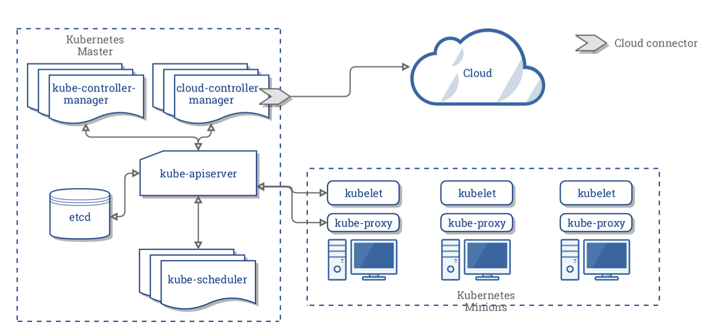

## K8s 系统架构



左侧虚线方框中，是 master 节点，运行着各种各样的组件，master 节点负责控制整个集群，当然在很大的集群中也可以有多个 master 节点；而右侧是三个工作节点，负责运行我们的容器应用。这种结构一般称为 master-slave 结构，因为某些原因，在 Kubernetes 中后来改称为 master-minions。工作节点挂了没关系，master 节点会将故障节点上的业务自动在另一个节点上部署。

工作节点比较简单，在工作节点中，我们看到有 kubelet 和 kube-proxy 两个组件，这两个组件在上一章中接触过了，kubelet 和 kube-proxy 都是跟 主节点的 kube-apiserver 进行通信的。kube-proxy 全称是 Kubenetes Service Proxy，负责组件之间的负载均衡网络流量。

在上图中，主节点由多个组件构成，结构比较复杂，主节点中记录了整个集群的工作数据，负责控制整个集群的运行。工作节点挂了没关系，但是 主节点挂了，整个集群就挂了。因此，有条件的情况下，也应该设置多个主节点。

一个 主节点中包含以下访问：

- 一个 API 服务(kube-apiserver)
- 一个调度器(kube-scheduler)
- 各种各样的控制器(上图有两个控制器)
- 一个存储系统(这个组件称为etcd)，存储集群的状态、容器的设置、网络配置等数据。

一个 kubernetes 集群是由一组被称为节点的机器或虚拟机组成，节点有 master、worker 两种类型。一个集群中至少有一个 master 节点，在没有 worker 节点的情况下， Pod 也可以部署到 master 节点上。如果集群中的节点数量非常多，则可考虑扩展 master 节点，使用多个 master 节点控制集群。


在上一小节中，我们看到 主节点中包含了比较多的组件，工作节点也包含了一些组件，这些组件可以分为两种，分别是 Control Plane Components(控制平面组件)、Node Components(节点组件)。

Control Plane Components 用于对集群做出全局决策，部署在 master 节点上；

Node Components 在 worker 节点中运行，为 Pod 提供 Kubernetes 环境。

## kubeadm 部署

在 kubernetes 中，主要有三个日常使用的工具，这些工具使用 kube 前缀命名，这三个工具如下：

- kubeadm：用来初始化集群的指令，能够创建集群已经添加新的节点。可用其它部署工具替代。
- kubelet：在集群中的每个节点上用来启动 Pod 和容器等，每个节点必须有，相对于节点与集群的网络代理。
- kubectl：用来与集群通信/交互的命令行工具，与 kubernetes API-Server 通讯，是我们操作集群的客户端。

```bash
#安装
sudo apt-get install -y kubelet kubeadm kubectl
# 初始化master节点
sudo kubeadm init --pod-network-cidr=10.244.0.0/16
# 安装网络插件
kubectl apply -f https://github.com/flannel-io/flannel/releases/latest/download/kube-flannel.yml
# work节点同意安装kubeadm
sudo kubeadm join 192.168.1.100:6443 \
  --token xxxxx.xxxxx \
  --discovery-token-ca-cert-hash sha256:xxxxx
```

## Node

Pod 是 Kubernetes 中最小的执行单元，而 Node 是 Kubernetes 中最小的计算硬件单元，节点可以是物理的本地服务器，也可以是虚拟机，节点即使宿主服务器，可以运行 Docker 的机器。

每个节点都运行着一个名为 kubelet 的组件，它是节点的主要组件，Kubernetes 与集群控制平面组件(API Server)通信，所有对节点有影响的操作都会通过 kubectl 控制此节点。kubelet 也是 master 节点跟 worker 节点之间直接通讯的唯一组件。

kubelet 的一些功能有：

- 在节点上创建、更新、删除容器；
- 参与调度 Pod；
- 为容器创建和挂载卷；
- 使用命令查看 Pod 、容器，例如 exec、log 等时，需要通过 kubelet；

## Container

Container (容器) 是一种沙盒技术。它是基于 Linux 中 Namespace / Cgroups / chroot 等技术结合而成。

自己实现一个容器 https://www.youtube.com/watch?v=8fi7uSYlOdc

## Pod

Pod 是我们将要创建的第一个 k8s 资源，也是可以在 Kubernetes 中创建和管理的、最小的可部署的计算单元。与Container的区别： container (容器) 的本质是进程，而 pod 是管理这一组进程的资源， pod 可以管理多个 container。

编写一个可以创建 nginx 的 Pod，其中：kind 表示要创建的资源的类型， metadata.name 表示要创建的 pod 的名字（唯一）， spec.containers 表示要运行的容器和镜像名称。

```yml
# nginx.yaml
apiVersion: v1
kind: Pod
metadata:
  name: nginx-pod
spec:
  containers:
    - name: nginx-container
      image: nginx
```

```bash

kubectl apply -f nginx.yaml # 创建pod
kubectl get pods -o wide # 查看pod
kubectl port-forward nginx-pod 4000:80 # 端口映射
kubectl exec -it nginx-pod -- /bin/bash # 进入pod
kubectl describe pod hellok8s-deployment-66799848c4-kpc6q # 
kubectl logs --follow nginx # 查看日志
kubectl exec nginx -- ls # 调用容器命令
kubectl delete pod nginx
kubectl delete -f nginx.yaml
```

```bash
NAME       READY   STATUS             RESTARTS   AGE
hellok8s   0/1     ImagePullBackOff   0          22m
```

## Deployment

在生产环境中，我们不会直接管理 pod，借助 Deployment 管理 pod，完成自动扩容或者自动升级版本。

扩容：

```yml
apiVersion: apps/v1
kind: Deployment
metadata:
  name: hellok8s-deployment
spec:
  replicas: 1
  selector:
    matchLabels:
      app: hellok8s
  template:
    metadata:
      labels:
        app: hellok8s
    spec:
      containers:
        - image: guangzhengli/hellok8s:v1
          name: hellok8s-container
```

selector 表示的是 deployment 资源和 pod 资源关联的方式，这里表示 deployment 会管理 (selector) 所有 labels=hellok8s 的 pod。

template 是用来定义 pod 资源的, metadata.labels 和上面的 selector.matchLabels 对应, 表明 pod 是被 deployment 管理，不用在template 里面加上 metadata.name 是因为 deployment 会主动为我们创建 pod 的唯一 name。

```bash
kubectl apply -f deployment.yaml
kubectl get deployments
kubectl get pods             
kubectl delete pod hellok8s-deployment-77bffb88c5-qlxss 
kubectl describe pod hellok8s-deployment-66799848c4-kpc6q
kubectl rollout undo deployment hellok8s-deployment
kubectl rollout history deployment hellok8s-deployment
kubectl rollout undo deployment/hellok8s-deployment --to-revision=2
kubectl get pods
kubectl delete deployment,service --all
```

自动扩容：要想将 hellok8s:v1 扩容到 3 个副本，只需将 replicas 的值设为 3，重新执行 `kubectl apply -f deployment.yaml`。

升级版本：只需要更改 `spec.containers.image` 的镜像的版本号。

滚动更新：在 deployment 的资源定义中, spec.strategy.type 有两种选择:

- RollingUpdate: 逐渐增加新版本的 pod，逐渐减少旧版本的 pod。
- Recreate: 在新版本的 pod 增加前，先将所有旧版本 pod 删除。

可以通过 maxSurge 和 maxUnavailable 字段来控制升级 pod 的速率。

- maxSurge: 最大峰值，用来指定可以创建的超出期望 Pod 个数的 Pod 数量。
- maxUnavailable: 最大不可用，用来指定更新过程中不可用的 Pod 的个数上限。

```yml
apiVersion: apps/v1
kind: Deployment
metadata:
  name: hellok8s-deployment
spec:
  strategy:
     rollingUpdate:
      maxSurge: 1
      maxUnavailable: 1
  replicas: 3
  selector:
    matchLabels:
      app: hellok8s
  template:
    metadata:
      labels:
        app: hellok8s
    spec:
      containers:
        - image: guangzhengli/hellok8s:liveness
          name: hellok8s-container
          livenessProbe:
            httpGet:
              path: /healthz
              port: 3000
            initialDelaySeconds: 3
            periodSeconds: 3
          readinessProbe:
            httpGet:
              path: /healthx
              port: 3000
            initialDelaySeconds: 1
            successThreshold: 5
```

存活探针 (livenessProb)：用来探测应用是否正常，确定是否重启。

就绪探针 (readiness)：kubelet 使用就绪探测器可以知道容器何时准备好接受请求流量，当一个 pod 升级后不能就绪，即不应该让流量进入该 pod，在配合 rollingUpate 的功能下，也不能允许升级版本继续下去，否则服务会出现全部升级完成，导致所有服务均不可用的情况。

## Service

Service 为 pod 提供一个稳定的 Endpoint。Service 位于 pod 的前面，负责接收请求并将它们传递给它后面的所有pod。一旦服务中的 Pod 集合发生更改，Endpoints 就会被更新，请求的重定向自然也会导向最新的 pod。

使用 ClusterIP 的方式定义 Service，通过 kubernetes 集群的内部 IP 暴露服务，当我们只需要让集群中运行的其他应用程序访问我们的 pod 时，就可以使用这种类型的Service。

ServiceTypes类型：

- ClusterIP：通过集群的内部 IP 暴露服务，选择该值时服务只能够在集群内部访问。  
- NodePort：通过每个节点上的 IP 和静态端口（NodePort）暴露服务。 NodePort 服务会路由到自动创建的 ClusterIP 服务。 通过请求 <节点 IP>:<节点端口>，你可以从集群的外部访问一个 NodePort 服务。
- LoadBalancer：使用云提供商的负载均衡器向外部暴露服务。 外部负载均衡器可以将流量路由到自动创建的 NodePort 服务和 ClusterIP 服务上。
- ExternalName：通过返回 CNAME 和对应值，可以将服务映射到 externalName 字段的内容（例如，foo.bar.example.com）。 无需创建任何类型代理。

```yml
apiVersion: v1
kind: Service
metadata:
  name: service-hellok8s-clusterip
spec:
  type: ClusterIP
  selector:
    app: hellok8s
  ports:
  - port: 3000
    targetPort: 3000
```

```bash
kubectl apply -f service-hellok8s-clusterip.yaml

kubectl get endpoints
# NAME                         ENDPOINTS                                          AGE
# service-hellok8s-clusterip   172.17.0.10:3000,172.17.0.2:3000,172.17.0.3:3000   10s

kubectl get pod -o wide
# NAME                                   READY   STATUS    RESTARTS   AGE    IP           NODE 
# hellok8s-deployment-5d5545b69c-24lw5   1/1     Running   0          112s   172.17.0.7   minikube 
# hellok8s-deployment-5d5545b69c-9g94t   1/1     Running   0          112s   172.17.0.3   minikube
# hellok8s-deployment-5d5545b69c-9gm8r   1/1     Running   0          112s   172.17.0.2   minikube
# nginx                                  1/1     Running   0          112s   172.17.0.9   minikube

kubectl get service
# NAME                         TYPE        CLUSTER-IP      EXTERNAL-IP   PORT(S)    AGE
# service-hellok8s-clusterip   ClusterIP   10.104.96.153   <none>        3000/TCP   10s
```

NodePort：k8s 集群并不是单机运行，它管理着多台节点（服务器）即 Node，可以通过每个节点上的 IP 和静态端口（NodePort）暴露服务。

```yml
apiVersion: v1
kind: Service
metadata:
  name: service-hellok8s-nodeport
spec:
  type: NodePort
  selector:
    app: hellok8s
  ports:
  - port: 3000
    nodePort: 30000
```

LoadBalancer 是使用云提供商的负载均衡器向外部暴露服务。 外部负载均衡器可以将流量路由到自动创建的 NodePort 服务和 ClusterIP 服务上，假如你在 AWS 的 EKS 集群上创建一个 Type 为 LoadBalancer 的 Service。它会自动创建一个 ELB (Elastic Load Balancer) ，并可以根据配置的 IP 池中自动分配一个独立的 IP 地址，可以供外部访问。

## Ingress

Ingress 可以“简单理解”为服务的网关 Gateway，它是所有流量的入口，经过配置的路由规则，将流量重定向到后端的服务。

Ingress 公开从集群外部到集群内服务的 HTTP 和 HTTPS 路由。 流量路由由 Ingress 资源上定义的规则控制。Ingress 可为 Service 提供外部可访问的 URL、负载均衡流量、 SSL/TLS，以及基于名称的虚拟托管。你必须拥有一个 Ingress 控制器 才能满足 Ingress 的要求。 仅创建 Ingress 资源本身没有任何效果。 Ingress 控制器 通常负责通过负载均衡器来实现 Ingress，例如 minikube 默认使用的是 nginx-ingress，目前 minikube 也支持 Kong-Ingress。

```yml
apiVersion: v1
kind: Service
metadata:
  name: service-hellok8s-clusterip
spec:
  type: ClusterIP
  selector:
    app: hellok8s
  ports:
  - port: 3000
    targetPort: 3000

---

apiVersion: apps/v1
kind: Deployment
metadata:
  name: hellok8s-deployment
spec:
  replicas: 3
  selector:
    matchLabels:
      app: hellok8s
  template:
    metadata:
      labels:
        app: hellok8s
    spec:
      containers:
        - image: guangzhengli/hellok8s:v3
          name: hellok8s-container
```

```yml
apiVersion: v1
kind: Service
metadata:
  name: service-nginx-clusterip
spec:
  type: ClusterIP
  selector:
    app: nginx
  ports:
  - port: 4000
    targetPort: 80

---

apiVersion: apps/v1
kind: Deployment
metadata:
  name: nginx-deployment
spec:
  replicas: 2
  selector:
    matchLabels:
      app: nginx
  template:
    metadata:
      labels:
        app: nginx
    spec:
      containers:
      - image: nginx
        name: nginx-container
```

```bash
kubectl apply -f hellok8s.yaml                 
# service/service-hellok8s-clusterip created
# deployment.apps/hellok8s-deployment created

kubectl apply -f nginx.yaml   
# service/service-nginx-clusterip created
# deployment.apps/nginx-deployment created

kubectl get pods            
# NAME                                   READY   STATUS    RESTARTS   AGE
# hellok8s-deployment-5d5545b69c-4wvmf   1/1     Running   0          55s
# hellok8s-deployment-5d5545b69c-qcszp   1/1     Running   0          55s
# hellok8s-deployment-5d5545b69c-sn7mn   1/1     Running   0          55s
# nginx-deployment-d47fd7f66-d9r7x       1/1     Running   0          34s
# nginx-deployment-d47fd7f66-hp5nf       1/1     Running   0          34s

kubectl get service
# NAME                         TYPE        CLUSTER-IP       EXTERNAL-IP   PORT(S)    AGE
# service-hellok8s-clusterip   ClusterIP   10.97.88.18      <none>        3000/TCP   77s
# service-nginx-clusterip      ClusterIP   10.103.161.247   <none>        4000/TCP   56s
```

这样在 k8s 集群中，就有 3 个 hellok8s:v3 的 pod，2 个 nginx 的 pod。并且hellok8s:v3 的端口映射为 3000:3000，nginx 的端口映射为 4000:80。在这个基础上，接下来编写 Ingress 资源的定义，nginx.ingress.kubernetes.io/ssl-redirect: "false" 的意思是这里关闭 https 连接，只使用 http 连接。

匹配前缀为 /hello 的路由规则，重定向到 hellok8s:v3 服务，匹配前缀为 / 的跟路径重定向到 nginx。

```yml
apiVersion: networking.k8s.io/v1
kind: Ingress
metadata:
  name: hello-ingress
  annotations:
    # We are defining this annotation to prevent nginx
    # from redirecting requests to `https` for now
    nginx.ingress.kubernetes.io/ssl-redirect: "false"
spec:
  rules:
    - http:
        paths:
          - path: /hello
            pathType: Prefix
            backend:
              service:
                name: service-hellok8s-clusterip
                port:
                  number: 3000
          - path: /
            pathType: Prefix
            backend:
              service:
                name: service-nginx-clusterip
                port:
                  number: 4000
```

```bash
kubectl apply -f ingress.yaml
# ingress.extensions/hello-ingress created

kubectl get ingress          
# NAME            CLASS   HOSTS   ADDRESS   PORTS   AGE
# hello-ingress   nginx   *                 80      16s

# replace 192.168.59.100 by your minikube ip
curl http://192.168.59.100/hello
# [v3] Hello, Kubernetes!, From host: hellok8s-deployment-5d5545b69c-sn7mn

curl http://192.168.59.100/
# (....Thank you for using nginx.....)
```

## Namespace

在实际的开发当中，有时候我们需要不同的环境来做开发和测试，例如 dev 环境给开发使用，test 环境给 QA 使用，那么 k8s 能不能在不同环境 dev test uat prod 中区分资源，让不同环境的资源独立互相不影响呢，答案是肯定的，k8s 提供了名为 Namespace 的资源来帮助隔离资源。

名字空间（Namespace） 提供一种机制，将同一集群中的资源划分为相互隔离的组。 同一名字空间内的资源名称要唯一，但跨名字空间时没有这个要求。 名字空间作用域仅针对带有名字空间的对象，例如 Deployment、Service 等。

```yml
apiVersion: v1
kind: Namespace
metadata:
  name: dev
  
---

apiVersion: v1
kind: Namespace
metadata:
  name: test
```

可以通过kubectl apply -f namespaces.yaml 创建两个新的 namespace，分别是 dev 和 test。

```bash
kubectl apply -f namespaces.yaml    
# namespace/dev created
# namespace/test created


kubectl get namespaces          
# NAME              STATUS   AGE
# default           Active   215d
# dev               Active   2m44s
# ingress-nginx     Active   110d
# kube-node-lease   Active   215d
# kube-public       Active   215d
# kube-system       Active   215d
# test              Active   2m44s
```

如何在新的 namespace 下创建资源和获取资源呢？只需要在命令后面加上 -n namespace 即可。例如根据上面教程中，在名为 dev 的 namespace 下创建 hellok8s:v3 的 deployment 资源。

```yml
kubectl apply -f deployment.yaml -n dev
kubectl get pods -n dev
```

## ConfigMap

K8S 使用 ConfigMap 来将你的配置数据和应用程序代码分开，将非机密性的数据保存到键值对中。ConfigMap 在设计上不是用来保存大量数据的。在 ConfigMap 中保存的数据不可超过 1 MiB。如果你需要保存超出此尺寸限制的数据，你可能考虑挂载存储卷。

创建 hellok8s-config-dev.yaml 文件

```yml
apiVersion: v1
kind: ConfigMap
metadata:
  name: hellok8s-config
data:
  DB_URL: "http://DB_ADDRESS_DEV"
```

创建 hellok8s-config-test.yaml 文件

```yml
apiVersion: v1
kind: ConfigMap
metadata:
  name: hellok8s-config
data:
  DB_URL: "http://DB_ADDRESS_TEST"
```

分别在 dev test 两个 namespace 下创建相同的 ConfigMap，名字都叫 hellok8s-config，但是存放的 Pair 对中 Value 值不一样。

```bash
kubectl apply -f hellok8s-config-dev.yaml -n dev
# configmap/hellok8s-config created

kubectl apply -f hellok8s-config-test.yaml -n test 
# configmap/hellok8s-config created

kubectl get configmap --all-namespaces
NAMESPACE         NAME                                 DATA   AGE
dev               hellok8s-config                      1      3m12s
test              hellok8s-config                      1      2m1s
```

接着使用 POD 的方式来部署 hellok8s:v4，其中 env.name 表示的是将 configmap 中的值写进环境变量，这样代码从环境变量中获取 DB_URL，这个 KEY 名称必须保持一致。valueFrom 代表从哪里读取，configMapKeyRef 这里表示从名为 hellok8s-config 的 configMap 中读取 KEY=DB_URL 的 Value。

```yml
apiVersion: v1
kind: Pod
metadata:
  name: hellok8s-pod
spec:
  containers:
    - name: hellok8s-container
      image: guangzhengli/hellok8s:v4
      env:
        - name: DB_URL
          valueFrom:
            configMapKeyRef:
              name: hellok8s-config
              key: DB_URL
```

## Secret

上面以 configmap 的方式挂载配置信息，但是当我们的配置信息需要加密的时候， configmap 就无法满足这个要求。

Secret 的资源定义和 ConfigMap 结构基本一致，唯一区别在于 kind 是 Secret，还有 Value 需要 Base64 编码，你可以通过下面命令快速 Base64 编解码。当然 Secret 也提供了一种 stringData，可以不需要 Base64 编码。

```yml
# hellok8s-secret.yaml
apiVersion: v1
kind: Secret
metadata:
  name: hellok8s-secret
data:
  DB_PASSWORD: "ZGJfcGFzc3dvcmQK"
```

```yml
# hellok8s.yaml
apiVersion: v1
kind: Pod
metadata:
  name: hellok8s-pod
spec:
  containers:
    - name: hellok8s-container
      image: guangzhengli/hellok8s:v5
      env:
        - name: DB_PASSWORD
          valueFrom:
            secretKeyRef:
              name: hellok8s-secret
              key: DB_PASSWORD
```


## Job

在实际的开发过程中，还有一类任务是之前的资源不能满足的，即一次性任务。例如常见的计算任务，只需要拿到相关数据计算后得出结果即可，无需一直运行。而处理这一类任务的资源就是 Job。

> Job 会创建一个或者多个 Pod，并将继续重试 Pod 的执行，直到指定数量的 Pod 成功终止。 随着 Pod 成功结束，Job 跟踪记录成功完成的 Pod 个数。 当数量达到指定的成功个数阈值时，任务（即 Job）结束。 删除 Job 的操作会清除所创建的全部 Pod。 挂起 Job 的操作会删除 Job 的所有活跃 Pod，直到 Job 被再次恢复执行。
>
> 一种简单的使用场景下，你会创建一个 Job 对象以便以一种可靠的方式运行某 Pod 直到完成。 当第一个 Pod 失败或者被删除（比如因为节点硬件失效或者重启）时，Job 对象会启动一个新的 Pod。

下面来看一个 Job 的资源定义，completions 指的是会创建 Pod 的数量，每个 pod 都会完成下面的任务。parallelism 指的是并发执行最大数量，例如下面就会先创建 3 个 pod 并发执行任务，一旦某个 pod 执行完成，就会再创建新的 pod 来执行，直到 5 个 pod 执行完成，Job 才会被标记为完成。

restartPolicy = "OnFailure 的含义和 Pod 生命周期相关，Pod 中的容器可能因为退出时返回值非零， 或者容器因为超出内存约束而被杀死等等。 如果发生这类事件，并且 .spec.template.spec.restartPolicy = "OnFailure"， Pod 则继续留在当前节点，但容器会被重新运行。因此，你的程序需要能够处理在本地被重启的情况，或者要设置 .spec.template.spec.restartPolicy = "Never"。

```yml
apiVersion: batch/v1
kind: Job
metadata:
  name: hello-job
spec:
  parallelism: 3
  completions: 5
  template:
    spec:
      restartPolicy: OnFailure
      containers:
        - name: echo
          image: busybox
          command:
            - "/bin/sh"
          args:
            - "-c"
            - "for i in 9 8 7 6 5 4 3 2 1 ; do echo $i ; done"
```

```bash
kubectl apply -f hello-job.yaml

kubectl get jobs                  
# NAME        COMPLETIONS   DURATION   AGE
# hello-job   5/5           19s        83s

kubectl get pods                      
# NAME                                   READY   STATUS      RESTARTS   AGE
# hello-job--1-5gjjr                     0/1     Completed   0          34s
# hello-job--1-8ffmn                     0/1     Completed   0          26s
# hello-job--1-ltsvm                     0/1     Completed   0          34s
# hello-job--1-mttwv                     0/1     Completed   0          29s
# hello-job--1-ww2qp                     0/1     Completed   0          34s

kubectl logs -f hello-job--1-5gjjr 
# 1
# ...
```

Job 完成时不会再创建新的 Pod，不过已有的 Pod 通常也不会被删除。 保留这些 Pod 使得你可以查看已完成的 Pod 的日志输出，以便检查错误、警告或者其它诊断性输出。 可以使用 kubectl 来删除 Job（例如 kubectl delete -f hello-job.yaml)。当使用 kubectl 来删除 Job 时，该 Job 所创建的 Pod 也会被删除。

CronJob：可以理解为定时任务，创建基于 Cron 时间调度的 Jobs。

```yml
apiVersion: batch/v1
kind: CronJob
metadata:
  name: hello-cronjob
spec:
  schedule: "* * * * *" # Every minute
  jobTemplate:
    spec:
      template:
        spec:
          restartPolicy: OnFailure
          containers:
            - name: echo
              image: busybox
              command:
                - "/bin/sh"
              args:
                - "-c"
                - "for i in 9 8 7 6 5 4 3 2 1 ; do echo $i ; done"
```

## Helm

假设你要部署一个 Nginx，项目可能要写一大队配置

```
Deployment
Service
ConfigMap
Secret
Ingress
ServiceAccount
PVC
```

Helm 把这些 Kubernetes YAML 打包成一个 Chart，然后可以用一条命令安装：

```bash
helm install my-nginx bitnami/nginx
```

Chart 是一个遵循 Helm 规范的目录/打包文件结构

```
mychart/
├── Chart.yaml          # Chart 的基本信息
├── values.yaml         # 默认配置参数
├── templates/          # Kubernetes YAML 模板
│   ├── deployment.yaml
│   ├── service.yaml
│   └── ingress.yaml
└── charts/             # 依赖的其他 Chart
```