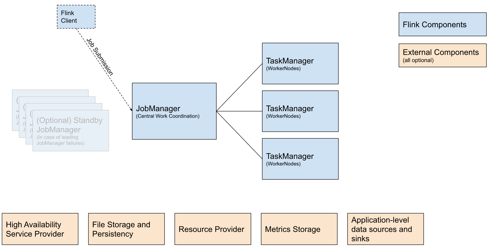

```text
                    Flink Cluster
                         │
          ┌──────────────┴──────────────┐
          │                             │
      JobManager                    TaskManager
          │                             │
          │                    ┌────────┼────────┐
          │                    │        │        │
       JobGraph              Task     Task     Task
          │                    │        │        │
          └────────────────────┴────────┴────────┘
                                   │
                              State / Checkpoint
```

## Job Manager

obManager 是 Flink 集群的大脑，主要负责：

- 接收 Job
- 解析 Job Graph
- 调度 Task
- 管理 Checkpoint
- 故障恢复
- 管理 TaskManager
- 管理作业生命周期

现代 Flink 中，JobManager 内部又可以理解为几个职责：ResourceManager、Dispatcher、JobMaster

- ResourceManager 负责 **我要多少计算资源?**
- Dispatcher 负责 **作业提交到哪里？**
- JobMaster 负责 **某一个具体 Job 的管理和调度。**

## TaskManager

TaskManager 是 Flink 真正干活的机器/进程，TaskManager 负责：

- 执行 Operator
- 执行 Task
- 数据传输
- State 管理
- 网络 Buffer
- Slot 管理

### Task Slot

这是学习 Flink 时非常重要的概念，一个 TaskManager 可以有多个 Slot，Slot 可以理解成：

> TaskManager 提供给 Flink Job 的计算资源配额。

JobGraph

StreamGraph

ExecutionGraph


## Operator

常见 Operator：

- Source
- Map
- FlatMap
- Filter
- KeyBy
- Reduce
- Aggregate
- Window
- ProcessFunction
- Sink

Source 负责数据进入Flink，可以从kafka、mqtt、数据库等。

Transformation：Source 进入 Flink 后，需要处理数据，Map、Filter、FlatMap、KeyBy、Window、Process 等这些都是 Transformation。

## State

这是 Flink 最核心的能力之一，例如：*温度连续 3 次超过 80℃才报警*，Flink 必须记住之前的数据：

```text
第一次 → 85 → count = 1
第二次 → 86 → count = 2
第三次 → 88 → count = 3 → Alarm
```

这个 count 就是 State，常见的State：

```text
ValueState
ListState
MapState
ReducingState
AggregatingState
```

IoT 规则引擎中经常会大量使用：

```text
Keyed State
+
Timer
```

## Timer

Timer 是 Flink 做实时规则特别好用的组件。例如：温度超过 80℃持续 30 秒才报警。

收到：
```
10:00:00
temperature = 85
```
注册 Timer：`10:00:30`，30s后：
```
如果仍然 > 80
    ↓
   报警
```

State + Timer 基本就是实时规则引擎的核心武器。

## Window

Window 用于时间范围内的数据计算,例如：最近 5 分钟平均温度 > 80℃。

```text
D001
 │
 ├── 10:00 75
 ├── 10:01 82
 ├── 10:02 85
 ├── 10:03 88
 └── 10:04 90
          ↓
       AVG = ...
```

常见：

```
Tumbling Window
Sliding Window
Session Window
```

## Event Time

Flink 实时计算中另一个非常重要的概念，IoT 数据可能是：

```text
设备产生时间：10:00:01
Kafka 到达时间：10:00:05
Flink 处理时间：10:00:06
```

如果使用 Processing Time： `10:00:06`，如果使用 Event Time：`10:00:01`，IoT 场景通常更关心设备真正产生数据的时间，所以 Event Time 非常重要。

Event Time 必然带来一个问题：**数据可能迟到**。

```text
10:00:01
10:00:02
10:00:05
10:00:03 ← 迟到
```

Flink 用 **Watermark** 判断：我大概可以认为 10:00:xx 之前的数据已经基本到齐了，`Watermark = 10:05:00` 表示 Flink 可以推进某些基于 Event Time 的计算。

IoT 场景中：**Event Time + Watermark + Window** 是非常重要的一组概念。

## Checkpoint

Checkpoint 是 Flink 实现 **故障恢复和 Exactly-Once** 的重要机制。

例如：
```
10:00
      Checkpoint
10:01
      Checkpoint
10:02
      Checkpoint
```

如果 TaskManager 挂了：

```
TaskManager 崩溃
      ↓
从最近 Checkpoint 恢复
      ↓
   继续处理
```

对于 IoT 告警系统尤其重要。否则可能出现：

```
设备报警
 ↓
Flink 崩溃
 ↓
状态丢失
 ↓
重复报警 / 漏报警
```

## Savepoint

Savepoint 和 Checkpoint 很像，但用途不完全一样。

- Checkpoint → Flink 自动做 → 故障恢复
- Savepoint → 用户主动触发 → 升级/迁移/变更 Job

例如：

> 旧版本 Rule Engine -> Savepoint -> 部署新版本 -> 从 Savepoint 恢复

## Sink

Sink 就是：数据处理完以后送到哪里。


把这些东西整体串起来

```
                    Flink
                      │
       ┌──────────────┴──────────────┐
       │                             │
     Source                         Rules
       │                             │
     Kafka                    Broadcast State
       │                             │
       └──────────────┬──────────────┘
                      ↓
                   KeyBy
                      ↓
               ┌─────────────┐
               │ Rule Engine │
               └──────┬──────┘
                      │
        ┌─────────────┼─────────────┐
        ↓             ↓             ↓
      State         Timer         Window
        │             │             │
        └─────────────┼─────────────┘
                      ↓
                    CEP
                      ↓
                   Action
                      ↓
                    Sink
```

## 应用提交方式 / 作业部署模式

Application Mode / Session Mode / Per-Job Mode

- Session Mode：会话模式
- Per-Job Mode：按作业模式
- Application Mode：应用模式，Application 可以包含多个 Job

| 对比          | Session Mode       | Per-Job Mode | Application Mode     |
| ----------- | ------------------ | ------------ | -------------------- |
| 集群关系        | 多个 Job 共用一个集群      | 一个 Job 一个集群  | 一个 Application 一个集群  |
| JobManager  | 共享                 | 每个 Job 独立    | 每个 Application 独立    |
| TaskManager | 共享                 | 每个 Job 独立    | 每个 Application 独立    |
| 资源隔离        | 较差                 | 好            | 好                    |
| Job 之间影响    | 可能互相影响             | 基本不会         | 基本不会                 |
| 集群启动        | 先启动集群，再提交 Job      | 提交 Job 时创建集群 | 提交 Application 时创建集群 |
| 适合          | 开发、测试、多 Job 共享     | Job 隔离场景     | **生产环境推荐**           |
| 典型场景        | 一个长期 Flink 集群跑很多任务 | 一个任务一个集群     | 一个业务应用一个 Flink 集群    |

Per-Job 模式下，提交一个 Job，为这个 Job 创建一套独立的 Flink 集群， Job 结束后，这套集群也随之释放。

比如你有 100 个 Job：

```text
Job 1  → Cluster 1
Job 2  → Cluster 2
Job 3  → Cluster 3
...
Job 100 → Cluster 100
```

所以如果 100 个 Job 同时运行，理论上就可能同时存在 100 套 Flink 集群，每套集群通常至少包含：

```text
Cluster 1
├── JobManager
├── TaskManager
└── TaskManager

Cluster 2
├── JobManager
├── TaskManager
└── TaskManager

Cluster 3
├── JobManager
├── TaskManager
└── TaskManager
```

## 4种级别API

- SQL API
- Table API（声明式DSL）
- DataStream API（核心API）
- 有状态流处理API（高级API）

